# Actor-Critic算法

迈克尔·乔丹作为NBA 史上最伟大的篮球运动员之一，其辉煌的职业生涯中最令人津津乐道的两场赛事，一是1997年6月11日NBA总决赛的第5场比赛，乔丹率领的公牛队对阵持续巅峰了十年的犹他爵士队，乔丹在最后1分钟那记决定胜负的三分球使得公牛队最终以90比88艰难取胜。另外一场发生在1998年6月14日，还是公牛对战爵士，在比赛时间只有30秒的时候，爵士队以86比83领先。乔丹先是上篮得手，将差距缩小到1分，在最后5.2秒时打进了关键球，使得公牛队再次捧起NBA冠军奖杯。乔丹一生进过无数个球，但是能被人们深刻记住的却只是这几次在比赛逆势下靠一己之力扭转乾坤的进球。这说明了在恶劣情况下做出的翻转局势的行为才具有非凡的价值，值得我们铭记。

在使用策略梯度进行学习的时候，很多学习的样例可能并不是最好的，甚至可以说是盲目的，僵化的。一局棋不可能每一步都是好的下法，对于赢棋一方落子的评价，只能说好的下法占据了特别有利的形势使得差的下法不能够对局势产生大的影响，对于输棋一方的着法其实也是一样的道理。我们希望智能AI能够多学习一点好的下法，少学习一点差的下法。AC算法就是在这种思想下诞生的。通过结合梯度策略与价值网络这两种结构，实现了对样本标签的效力判定。

就和乔丹那几场让人难以忘记的比赛一样，AC算法会鼓励智能体对于扭转局势的行动多学习一些，但是那些对局势没有什么影响的行为就少学习一些。使用AC算法学习的智能体需要两个网络，分别对应AC算法中的演员（策略网络）和评论家（价值网络）。策略网络负责根据当前棋局给出建议下法，而价值网络则负责对当前棋局对落子方是否有利进行判断。其中，策略网络和前章中的梯度策略里使用的网络概念没有什么区别。价值网络则稍微有些不同，这里的价值网络不再对落子点的预期价值进行评估，而是仅评估当前局面的胜负预期。换个角度来看，前章DQN中的价值网络是对落子后的胜负概率进行评价，而这里的价值网络是对落子前的胜负概率进行评价。我们人类有一种称作直觉的能力，通过这种能力，我们无需真的去演算一局棋剩下的所有可能走法，只需要看一眼棋局，就能够给出双方胜负大致的概率。AC算法中，我们希望智能体的神经网络也能够具备这种直觉，依靠这个直觉就能够帮助智能体更好地学习历史样本，从而更高效的提升策略网络的棋力。

在行棋的过程中，价值网络在每一步落子前对当前局势给出一个关于胜负的评估，告诉棋手当前局面是处于优势还是劣势。从图中的短跳线可以看出，一开始棋手的着法不是很好，使自己陷入了非常被动的局面。在随着对弈的发展，棋手逐渐扳回了劣势的局面并最后获得了胜利。与胜负预期相比，棋手每一手的价值却是反方向运动的。在胜负预期最差的情况下，棋手的着法却获得了最大的价值，这显然是合理的，因为

