# 第十章 AlphaGo

在1997年5月11日之前，计算机想要在国际象棋上战胜人类还被认为是一件遥不可及的事情。深蓝第一次和卡斯帕罗夫对战是在1996年，当时深蓝以2比4落败。即便是在1997年深蓝击败卡斯帕罗夫之后，卡斯帕罗夫本人还是不愿意相信自己是被一台计算机击败的，他声称电脑进行了作弊，有人在背后帮助了电脑下棋。深蓝当时使用了专用的计算机芯片，那是为国际象棋游戏而专门设计的硬件设备，随着计算机技术的发展，现在任何一台计算机上都可以运行国际象棋程序并轻易地击败大师级选手。即便计算机已经能够击败人类象棋选手，但是围棋游戏一度被认为是计算机难以超越的。国际象棋的智能程序主要依靠α-β剪枝算法，再加上一些启发性下法和残局库便可以达到大师级的棋力。围棋的智能程序也曾试图仿照国际象棋的方法，但是由于围棋的搜索广度和深度远远超过了国际象棋，仅仅依赖α-β剪枝目前还没有办法在有限的时间内完成搜索。国际象棋那一套方法在围棋上行不通，有人便开始尝试使用蒙特卡洛树搜索的方法来逼近围棋的最优解。 2008年，使用蒙特卡洛树搜索算法的MoGo软件在九路围棋中可以达到段位水平，同时Fuego程序可以在九路围棋中战胜实力强劲的业余棋手。2012年1月，Zen程序在19路围棋上以3：1击败了二段棋手约翰·特朗普。但是这些成绩和深蓝当初设立下的里程碑还差的很远，特别是在19路围棋的表现上，计算机智能程序在职业选手面前的表现还是显得非常幼稚与低能。虽然在AlphaGo战胜李世石之前已经有人在尝试使用神经网络来提升围棋的棋力，但是一直到AlphaGo出现之后才打破了一个普遍的观点，当时人们认为能够战胜人类9段水平的职业棋手的智能算法至少在10年内不会出现。在AlphaGo之前，由Facebook开发的Darkforest是采用神经网络算法来实现围棋程序中的佼佼者。Darkforest采用了深度卷积网络来提取围棋棋局的特征，并结合蒙特卡洛树搜索方法来进一步提升棋力。如果把Darkforest拿来和AlphaGo比较一下的话，明显的差异仅在于AlphaGo使用强化学习得来的策略网络要比直接通过监督学习得到的策略网络要高效的多的多。我们在前面介绍监督学习时候也提到过，通过监督学习得到的策略网络仅仅学到了下围棋的形，由于学习样本中几乎很少有吃子的情况，网络在故意吃子的下法前将会表现的非常无知。

从蒙特卡洛树搜索的经验来看，使用这种方法还是非常有潜力的，当时最大的问题主要是由于围棋的状态复杂度实在是太大，随机搜索有极大的概率将算能浪费在了显然无用的落子搜索上。虽然可以通过加入启发式的算法来解决这个问题，但是什么是好的启发算法呢，人工编辑的特征总是有限的，并且是主观的。AlphaGo主要是解决了如何提高蒙特卡洛树搜索有效搜索的问题。它通过引入可靠的策略网络来指导算法进行落子选择，依靠现代先进的硬件设备，这种方法克服了计算速度上的不足，能够有效地从统计的角度来提取围棋的各类特征。

我们人类选手在下任何棋的时候总是会尽可能地多考虑一些可选项，并且在一种选择下会尽可能的多思考几步。当思考的达到一定深度，脑子开始变得一片糊涂的时候，就凭感觉对思考的结果下一个判断。高手和初学者的区别仅在于对可选项的思考广度与深度不同，高手可能可以计算到10步以后的情况，而初学者可能仅仅只能判断3到4步后的棋局形势。高手在广度选取上也会与初学者不同，初学者可能只能够专注于某几个可选项，而大师级选手可能会计算到所有的可选项。

人类具有直觉这项特殊的超能力，它使人类不需要经过复杂的过程计算就能对事件的结果给出一个八九不离十的判断。围棋中，当选手思考到一定的深度时就会凭直觉和经验对棋局的结果给出判断。初学者的直觉可能不是那么准确，但是职业选手总是能够信任自己的直觉，并且最终事实呈现的结果也与直觉相差不远。我们在之前的DQN网络中介绍的价值判断着法就有点类似于模拟人类的直觉。AlphaGo进一步增强了这种计算机形式的直觉，使得智能程序有能够拥有超越人类的“直觉”。

AlphaGo由三个深度卷积神经网络组成，分别是一个复杂的策略网络、一个简单的策略网络和一个价值评价网络。复杂策略网络会根据当前的棋局给出着法建议，但是和策略梯度选择着法的方式不同，AlphaGo并不是仅仅依赖策略网络来进行着法的选择，它还需要结合价值网络来综合评估潜在的着法选择。这就像人类棋手一样，会综合评判各种可行的下法所带来的收益再从中挑选合适的选项。当使用复杂策略网络计算到一定深度后，AlphaGo就不再使用价值网络和策略网络相结合的方式来进行着法选择了，而是对高置信度的着法进行多轮蒙特卡洛仿真，并将仿真的结果用于回溯并更新之前所有路径上的节点。这种下棋方法和人类棋手的思考过程非常相似。它利用复杂策略网络和价值网络对棋局的有效着法进行筛选，这样可以避免把计算能力浪费在许多无意义的着法上。AlphaGo通过复杂策略网络和价值网络相结合对棋局进行演算，这一点同人类棋手对棋盘落子进行选择和演算的过程是一样的。人类大师级棋手能够演算的深度达到10回合以上，AlphaGo对这个深度并没有限制，但是由于复杂网络规模庞大，在计算速度上没有什么优势，采用复杂网络来进行整个蒙特卡洛仿真过程是极其不经济的，而且也是没有必要的。如果复杂网络存在策略偏差，还会导致智能程序下出错误的着法。因此，一般由复杂网络指导的演算深度在10层到20层左右，作为一个超参，读者可以自己选择适合于自己计算机算能的深度，毕竟正式下围棋的每一步都有时间限制，不能把时间都花在复杂网络的计算上。为了解决计算速度的难题，AlphaGo采用一个简单策略网络用于指导蒙特卡洛仿真时的落子。简单策略网络顾名思义就是网络结构简单，可以实现快速落子。利用简单网络进行蒙特卡洛仿真得到对落子后的形势判断，这个过程就像人类选手在棋局的演算达到了自己的极限后再把剩下的一切交给自己的直觉是一样的。目前的科学技术还没有办法解决直觉这个东西，计算机也没有直觉这个概念，我们用蒙特卡洛方法来多次模拟棋局，以此期望它对后续形势有一个准确的判断，这和直觉达到的效果是一样的，甚至比人类的直觉更加准确。

对比AlphaGo的下棋策略和我们使用梯度策略的方式来下棋，至少从AlphaGo的角度来看，仅仅使用神经网络来拟合围棋游戏的着法函数是相当困难的一件事情。可能永远也无法找到一个合适的网络来拟合它，或许是这个网络太过庞大，以目前的技术和能力无法在有限的时间内完成训练和学习。但是无论怎么说，使用蒙特卡洛方法来逼近围棋的着法函数是不得已才为之的选择，就像人类现在还造不出和鸟的翅膀一样的仿生装备，只能求助于飞机这种粗旷的飞行形式一样。另外，使用简单网络而不是复杂网络来做仿真模拟，不仅是因为简单网络比复杂网络运行速度快，因为运行速度这件事情可以通过并行计算解决，AlphaGo在每次落子前才仿真1600局对弈，用1600台计算机来做并行计算对于一家商业公司来说并不是一件什么大不了的事情。使用简单网络的主要目的是为了避免仿真时由于复杂网络在策略上的傲慢，从而导致对棋局的结果判断产生偏差。采用简单策略网络仅仅是为了避免下一些无意义的落子而已，如果计算能力足够，使用随机落子法也是可以的，但是从以前那些采用蒙特卡洛方法的围棋软件的经验来看，随机落子的效果要差一点。AlphaGo选择使用简单策略，应该也从侧面反应了简单策略会比随机策略要高效。说这些的目的，是为了提醒读者，没有必要对简单网络做过多的训练或者让它学习复杂的内容。另外，在用简单网络做仿真模拟时可以以一定概率引入随机策略，目的也是为了进一步降低由于简单策略网络的局部最优特性而引起对棋局结果评估的偏差。

AlphaGo使用三个网络，两个策略网络和一个价值网络。策略网络中一个简单一个复杂，复杂的用于给出置信度高的着法，简答的用于蒙特卡罗仿真。我们可以使用AC网络来训练两套策略网络和价值网络，也可以单独地训练两个策略网络和一个价值网络。AlphaGo将网络训练分成了两步，首先是用监督学习分别训练复杂策略网络与简单策略网络。AlphaGo训练的智能程序工作在标准19路棋盘上，它的学习样本来源于Kiseido Go Server（KGS）上7段以上棋手的对局。我在前面的章节已经介绍过了如何获取这些数据。考虑到读者可能没有强大的计算机处理能力来学习那么多的棋局，所以源码中另外提供了五万多局的9路围棋对弈棋谱，其中五万局来自于Gnugo的对弈记录，三千局对弈记录来自于Fuego的自弈（`myGO\sgf_parser\sgfs.7z`）。用来快速下棋的简单策略网络学到这里也就差不多了，但是从学习的角度来说再多进行几轮的强化学习也未尝不可。复杂策略网络在完成监督学习后还需要使用强化学习来进一步加强网络的棋力，训练方法用策略梯度也好，用AC方式也好，这些方式在之前的章节中都已经有了比较详细的介绍。价值网络的结构可以参照复杂策略网络的结构，训练方式也和前面章节介绍的DQN是一样的。如果读者在前面的章节已经训练了相关的网络，完全可以迁移到本章来直接使用。

讲道理，整个AlphaGo的策略选择过程就是蒙特卡洛树搜索过程，我们从细节上来看一下AlphaGo的蒙特卡洛树搜索具体的实现方法。

1. 初始化全局模拟蒙特卡洛随机过程为L次，采用简单网络模拟盘面直觉时使用蒙特卡洛仿真m次，采用复杂网络计算的深度为D，采用简单网络计算的深度为SD。把当前局面设置为根节点，并以这个节点为起始，开始按照下列顺序展开蒙特卡洛搜索树。
2. 检查当前节点是否已经存在子节点，如果没有就利用深度策略网络计算一下所有节点的落子概率P，初始化该落子点的价值Q和该节点被访问次数N等于零，并为每个合法的落子点生成节点。为每个节点计算公式T=Q+P/\(1+N\)；
3. 选择其中绝对值T最大的节点作为着法，更新其访问次数N，并利用价值网络得到该着法的价值q；
4. 重复第2步，直到达到深度D；
5. 标记深度D这个位置的节点M；
6. 利用简单策略网络选取下一步着法；
7. 重复第6步直到到达深度SD或者棋局结束；
8. 记录棋局结果r。如果仿真是由于到达深度SD而停止的话，这一局仿真结果判定为平局，否则便记录胜负方；
9. 回到第5步被标记的节点M，更新其N值并重新开始第6步，直到重复次数达到n次；
10. 从深度为D的节点开始逆向回溯，逐个更新所有访问过的节点：
    1. 计算单次简单网络仿真后对所有节点的价值更新V=λ\*q+\(1-λ\)\*r，并暂时保存；
    2. 计算每个节点的平均价值Q=\(ΣV\)/N；
    3. 更新T=Q+P/\(1+N\)。
11. 回到第1步根节点，重新开始，直到整个过程重复L次；
12. 完成蒙特卡洛树搜索后，看一下根节点的邻近子节点中哪个节点被访问到的次数（N）最多就以那个节点代表的动作作为AlphaGo的着法。

第2步在计算P值时需要注意，由于仿真时我们不仅仿真自己的落子判断，还要仿真对方的下法。当仿真对方的落子时计算的P值就要记成负的。第10步和第2步的情况类似，在计算r值的时候需要注意，如果仿真的结果是己方黑棋赢，那么对于黑棋的节点r值等于1，但是在更新对方白棋的节点时，这个r值时等于-1的。所以r值在搜索树回溯的时候，它的值是随着树的层级轮番在1和-1之间交替的。

在介绍传统围棋算法时我曾经提到，传统算法附着了太多人为定义的痕迹，由于人为主观想法的限制，算法无法提取主观想法之外的特征，这也是传统方法的围棋AI在棋力上一直无法超过人类水平的原因之一。不过AlphaGo在实现上与我们之前提到的全部依赖样本学习围棋特征信息有所不同，算法中也引入了一些人为的定义，不过这些定义是对棋盘信息的扩充，理论上来说不会使最后的结果变得更差。 

AlphaGo在网络上使用的主要是卷积网络，通过卷积核的卷积操作，神经网络每一层的结果都会是上一层网络数据的一部分特征。AlphaGo人为引入的知识部分是对棋盘局势归纳出的49种特征，可以理解为人为手工计算了49个虚拟卷积核卷积后的数据平面。AlphaGo的策略网络只需要使用前48个特征平面，最后一个特征平面是价值网络需要使用到的。

| 特征名 | 平面数 | 描述 |
| :--- | :--- | :--- |
| 棋子颜色 | 3 | 3个平面分别表示游戏的当前棋手颜色，对手颜色以及棋盘上的空子位 |
| 全1 | 1 | 用1填充全部平面 |
| 全0 | 1 | 用0填充全部平面 |
| 合法性 | 1 | 如果棋盘上的空子位落子合法就设置为1，否则为0。注意自杀和堵死眼位也是非法的 |
| 什么时候落的子 | 8 | 8个平面分别指代棋盘上的子是多少步以前的落子 |
| 气 | 8 | 指明当前子位所归属的棋串有多少气，用8个平面分别表示剩余1口气到8口气以上 |
| 落子后的气 | 8 | 如果在当前合法子位落子，那么会使它所归属的串棋有多少气，用8个平面分别表示剩余1口气到8口气以上 |
| 吃子数 | 8 | 如果在当前合法子位落子，能够吃掉对方多少子，用8个平面分别表示能吃掉1到8个以上对方的子 |
| 陷入被对方吃 | 8 | 如果在当前合法子位落子，下一步会被对方落子吃掉的子数，用8个平面分别表示能被对方吃掉1到8个以上的子 |
| 征吃 | 1 | 如果在当前合法子位落子，会被对方征吃吗，1表会，0表示不会 |
| 征逃 | 1 | 如果在当前合法子位落子，能逃出对方的征吃吗，1表是能，0表示不能 |
| 当前落子方的颜色 | 1 | 这一层的值是固定的，黑棋用1表示，白棋用0表示 |

我们不在这里详细描述应该如何用代码实现这些特征，除了关于征的部分，其它的特征实现起来都很简单。读者在练习时不一定要实现上述的全部特征，仅使用一部分也已经能够训练出具有相当实力的智能程序了。读者也可以尝试根据自己的围棋经验生成一些手工特征，也许会比AlphaGo更强也说不定。

