# 第十一章 AlphaZero

AlphaGo解决了如何更有效地利用蒙特卡洛搜索树来逼近围棋的最优解，并证明了利用蒙特卡洛搜索树来逼近围棋游戏的最优解是完全具有可行性的。既然蒙特卡洛方法是有效地，那么一个自然而然能想到的问题就摆在了眼前，与其让神经网络学习如何下围棋，干嘛不直接用神经网络来学习这棵搜索树呢。AlphaZero就这么诞生了。

从最初的随机落子到上一章我们学习的AlphaGo，我们设计的智能程序都只会不停的下棋，不管落子是不是必须的，有没有意义。显然由于这是之前的算法中我们并没有给程序展示过虚着的样本。人类选手不会在围棋结束前虚着。因此没有可以参考的样例，我们也就没有办法通过监督学习使计算机来学习可以虚着的棋盘特征。

AlphaZero克服了向人类棋手学习的过程，它直接从零开始，除了外部设置的游戏规则，AlphaZero不需要借助人类的其它先验知识。通过自己跟自己下棋，AlphaZero可以不断地提升自己的棋力。在这个过程中，我们允许AlphaZero使用虚着，它从一开始下棋的时候虚着和实着就是同时存在的。

我们使用AC结构的网络来提升AlphaZero的学习效率。AlphaZero没有采用类似AlphaGo使用的通过简单网络来实现快速落子的方式。AlphaGo需要三个神经网络，而AlphaZero仅使用AC结构的神经网络，在蒙特卡洛仿真的整个过程中都使用这个网络。

由于AlphaZero需要学会虚着，面对19路棋盘时，网络在策略输出时的一维数组长度不再是361位，而是361+1位，最末一位输出代表虚着。同AlphaGo一样，AlphaZero把当前棋盘面作为根节点，并以此为基础展开博弈树，一次完整的仿真过程描述如下：

1. 从根节点出发，当前节点表示的棋局是否已经结束，如果结束了，就跳到第6步；
2. 当前节点是否存在子节点，如果没有子节点，就计算AC网络的策略输出，并初始化所有输出子节点的Q，P，N和n值。Q表示棋局仿真得到的价值，初始由于还没有开始仿真，设置为0。P表示AC网络的策略输出值。N表示父节点被访问的次数，n表示当前节点被访问到的次数，n初始时为零，子节点的N就是父节点的n；
3. AlphaZero也是基于蒙特卡洛方法的，它采用UCT公式作为博弈树分支选择的依据；
4. 更新当前通过UCT公式选择的节点的n值；
5. 重复第1步直到一局仿真结束；
6. 评估棋局的胜负，并逆向更新Q值。

第3步的UCT公式如下：

$$
T=Q+cP\sqrt \frac{N}{1+n}
$$

和几乎所有的UCT公式一样，我们需要c这个超参来平衡AC网络的输出与仿真结果对最终T值的影响。

第6步更新Q值的公式如下：

$$
Q=\frac{\sum_{i=1}^n V_i}{n}
$$

其中V表示每一次仿真的结果，我们用1表示己方胜利，-1表示对方胜利，如果在限定的深度内没有结束棋局则用0表示平局。在模拟对方落子时，V值和P值都要记成与己方相反的方向，而且在选择节点时T值也要取最小值，而不是最大值。

在有限的时间内我们希望仿真的局数越多越好。当多次仿真完成后，和所有的UCT算法一样，我们选择根节点下被访问次数最多的节点作为最终智能程序的着法输出。

有了智能程序的下法，AlphaZero的网络在结构上又和AC网络类似，差异仅仅体现在学习内容含义上的不同，接下去要解决的问题是如何训练这个AC网络。根据之前的介绍我们知道，强化学习最终也是需要通过监督训练来实现智能程序水平的提高，而且它又是通过算法来实现自己提供自己学习的样本，这样的样本到底有多可靠令人难以判断。并且在实际使用时，我们并不采信强化学习得到的网络输出，而是以蒙特卡洛仿真结果为最终判断依据，因此自然而然地，我们希望AlphaZero学习的不是围棋的着法，而是蒙特卡洛博弈树的仿真结果，这就是AlphaZero的核心思想。当智能程序完成一步落子前的仿真后，我们提取的样本不是最终的着法，而是根节点下一层的所有节点的被访问次数。以前其它算法提取的样本都是当前局面与着法的对应关系，而AlphaZero则是提取当前局面与子节点上被访问的n值的关系。另外由于AC的策略网络的输出节点使用的是softmax激活函数，每个节点的输出范围在0到1之间，因此我们还需要把样本标签进行归一化处理。 剩下的一切内容就和AC网络的训练和学习过程一模一样了。

由于我们允许智能体AI下出虚着，仿真过程中，如果存在合法的落子，但是博弈树连续两次给出虚着结果时我们不应该结束棋局，提前结束单局仿真将导致计算机无法准确判定胜负。如果将提前结束的仿真判定为平局倒是可以，但这会使得单次仿真前的几回合计算都白白浪费了。对于仿真出现连续两次虚着而棋局并没有结束的情况，需要做一下特殊处理。

如图11-4，连续虚着的处理方式也不复杂，当出现两次虚着而棋局并没有结束时，就把状态回退到连续虚着前的那个状态。根据AlphaZero的UCT公式可知，随着节点n访问的次数越来越多，对应的T值也将越来越小，因此即使发生多轮连续虚着的情况，最终还是会选择其它节点并将棋局仿真结束。

上述的情况仅针对于棋局整体仿真时说的，对于实际被仿真的那局棋来说，可能最终选择的下法就是虚着，并且在棋局没有下完前双方都落了虚着，导致棋局提前结束。这个情况是允许的，因为当棋局没有结束时，我们的棋局胜负判断函数会偏向将胜负结果判定为白棋胜，这是由于黑棋先手需要对白棋贴子。对于黑棋而言，如果虚着太多，棋局提前结束会使得网络在样本训练时避免选择虚着，从而在围棋结束前就落虚着的情况越来越少，而白棋如果多次下虚着的话，就会输掉棋局，这样也倒逼白棋越来越少地在棋局结束前下出虚着。

处理围棋的传统算法非常复杂，要考虑的要素也相当多，这全都要怪算法中引入了太多人类的主观意见。但是AlphaGo和AlphaZero所代表的方法则要简单很多，简单的反而战胜了复杂的，这就说明技术在进步。回望过去，我们可以发现，过去的很多东西在工程上实现起来很费时费力，但是现在新的方式就要简单许多。这不仅仅体现在计算机编程上，其它领域也是如此。我们可以如此深切地体会到时代与技术发展的同时也可以提炼出一条信念，如果时代进步了，如果社会进步了，那么生活就应该变得简单，如果没有，那所谓的进步就是谎言。

