# 第八章 DQN

这一章节，我会使用Pytorch来实现神经网络的机器学习。之所以换个框架工具，一是由于从代码上，上一章学到的Keras已经足够使用了，读者完全可以自己轻松地使使用Keras来实现本章的内容。二是由于Pytorch的使用越来越广泛，特别是学术界。也许某一天Pytorch会超过Tensorflow成为业界首选。三是我的旧电脑已经没有办法使用TensorFlow1.8以上的版本了，即便使用了非官方编译的版本，但是我的AMD X2 550芯片在使用时偶尔还会报一些奇怪的错误。Pytorch则在老AMD芯片上运行的相当好，当我的新电脑在没日没夜劳作的时候还可以使用老旧电脑运行一些其它的深度学习程序。四是我觉得多学一点东西对读者总是好的，即使读者想一直使用Keras，开拓一下眼界也无伤大雅。虽然我不得不承认第三点是导致我采用Pytorch来演示本章最主要的原因。不过当我使用了Pytorch以后，我觉得它比TensorFlow更方便一些，如果没有Keras这个高级API，我会一直选择使用Pytorch来实现原型搭建，而如果我有自己想实现的特别算法，并且没有现成的Keras模型可以使用时，我也会选择Pytorch。当然，对初学者而言，Keras作为TensorFlow的高级API相比Pytorch会更加方便也更加好用一些。

我们在策略梯度里提到过强化学习的学习标签不再是分类概率的概念，而是引入了价值评估的概念。但是策略梯度算法的核心并不是价值驱动的，它还是有概率的影子在里面，比如我们在智能程序互弈的过程中没有按照策略提供的最大价值来采取行动，而是把价值看做是采取不同行动可能的概率来对待。这一章我们使用Q-Learning的算法，以价值为驱动来指导智能程序下围棋。

## 传统的Q-Learning算法

### 原始版Q-Learning

我们通过一个实例来引入Q-Learning的介绍。假设我们有7个小格子，在小格子的最右边尽头有一面旗帜，第二个小格子上有一个小人，每次我们可以向左或向右移动小人一格，如果小人走到了旗帜上游戏就胜利结束，否则就要一直移动下去。这个游戏对人类来说很简单，我们从感官上就能知道只需要不停地把小人向右移动就可以了，但是我们的智能程序就没有这么智能了。它对外界的情况几乎一无所知，只知道小人可以左右移动以及拿到旗帜就能得到奖励并且结束游戏这个目标。



谈到Q-Learning，一个躲避不开的事情就是奖励机制。为了鼓励智能程序控制小人去拿到旗帜，我们把移动小人得到旗帜这件事情设置为奖励给智能程序1分，如果移动小人后什么也没有发生就不得分。我们的智能程序在最开始的时候其实并没有什么智能，所以它能做的只是随机的左右移动。这个游戏本质上就是一个一维的随机漫步，根据随机游走的理论，只要我们的智能程序随机的左右移动小人，就一定能在某个时刻拿到旗帜。拿到旗帜后，我们的智能程序显然会发现这样一个事实：当小人处在编号为6的格子上，只要向右移动就能得到奖励1。于是智能程序就在自己的小本本上记上了这么一笔：6走右得1。之后只要走到6这个格子上，我们的智能程序就知道一要定让小人往右走，因为一切都记录在了它的小本本上。随后它又发现，如果小人在5这个格子，只要往右走，就能走到格子6，而走在格子6上下一步就会赢，于是它又在自己的小本本上记了一笔：5走右得1。显然要不了多久我们的智能程序就会知道从起点开始，只要不停地往右移动小人就能拿到旗帜。再看一下我们智能程序的小本本，它记录了如下内容：

| 格子 | 往右 | 往左 |
| :--- | :--- | :--- |
| 1 | 0 | 0 |
| 2 | 1 | 0 |
| 3 | 1 | 0 |
| 4 | 1 | 0 |
| 5 | 1 | 0 |
| 6 | 1 | 0 |

上表就是Q-Learning的策略表。一开始它的所有记录都是0，随着随机仿真获得了或正或负的价值，这张表就会被逐渐填上适当的值。策略表记录的内容就是在各个不同的情境下智能程序做出各种不同动作能得到的相应价值。

完整Q-Learning算法会比刚才说的简化版本还要再复杂一些。首先我要引入“现实的价值”与“估计的价值”两个概念。所谓现实的价值就是指我们的智能程序在游戏中每操作一步小人后这个游戏反馈回来的价值。第一轮小人不管怎么移动，只要没有走到第7格，游戏反馈的价值都会是零。当第一轮游戏结束后，我们会得到关于第六格的信息：

| 格子 | 往右 | 往左 |
| :--- | :--- | :--- |
| 6 | 1 | 0 |

这个在第六格往右得到的1，就是现实的价值，是游戏反馈我们的。所谓估计的价值，指得是智能体对采取的行动可能得到的后果的一个估计。比如从第二轮开始，当智能体移动到第六格时，它查了一下自己的小本本，发现往右走能得到1分，所以它就会对自己在第六格走出下一步可能获得的价值有一个期待值，即1。给出“现实价值”的主体是我们的这个游戏，而给出“估计价值”的主体是我们的智能体。

细心的读者可能已经发现了一个问题，现实的价值似乎不是时时都有的，游戏可能并不会对智能程序的每个行为都给出反馈，这在其它游戏也是一样。打飞机游戏不可能每操作一次摇杆都会打落一架敌机。即便我们的生活也不是每付出一次努力都能得到相应的回报。于是为了高效地更新现实价值，我们引入“折现”的概念。“折现”这个概念在策略梯度中有提到过，它来源于经济学，是很多金融产品定价的基础。我们这里不谈它的金融意义，仅借用其数学含义来提高学习的效率。我们把现实的价值定义为“即时的回报加上未来回报的折现”。只要游戏没有结束，未来的回报总是存在的。谈到折现，就得引入折现率，在金融的背景下，折现率P等于：

$$
P=\frac{1}{(1+r)^n}
$$

其中$$r$$表示一次计量间隔单位的利率，一般以年为单位。$$n$$表示往前折现多久，$$n=1$$表示下一年的金额在当前的价值。假设年利率是3%，以复利计息，两年后我凭手上的国债债券可以到银行兑换11000元现金，那么这张国债债券现在卖出可以值多少钱呢？根据刚才的公式，我们把$$r=0.03$$和$$n=2$$带入公式，得到$$P=0.9426$$。将11000乘以折现率P，得到现值10368.56，即当前我手上的国债券可以以10368.56的价格出让。换一种说法，读者可以认为如果我现在手上有10368.56元现金，我把它存在银行2年，银行给我的年利率是3%，以复利计息，两年后我从银行连本带息地取出时，一共可以拿到11000元现金。在Q-Learning的算法里，我们借用了折现率的概念，目的是类似的，我想知道未来状态能获取的价值在当前状态的价值。通常我们直接设$$P=0.9$$或者$$P=0.99$$这样，在Q-Learning里不用考虑利率$$r$$，后面的阐述中，假定$$P=0.9$$，这也是一个超参，读者可以尝试为其赋予不同的值。

回到游戏中，当第一轮游戏结束后，我们知道第六格能够预期得到的最大价值等于1。假设在二轮游戏时智能程序已经把小人移动到了第5格上，它看了一下自己的小本本，除了第六格有记录，其它格子的记录都是0，于是智能程序随机地把小人向右移动了一格。移动后小人到了第六格，由于没有到达终点第七格，游戏给出的即时回报是零，但是小本本上记录着第六格的下一步能得到的最大价值是1，这就是未来的回报，再引入我们折现的概念，这样我们得到未来第7格的回报折现到第六格的奖励值等于0.9。于是综合现实价值的定义：

$$
现实价值 = 即时的回报+未来回报的折现
$$

这样就有了我们从第五格走到第六格能够获取的全部现实价值等于$$0+0.9=0.9$$。

再来看一下期望价值，智能体查了一下小本本关于第五格的记录，上面记录如下：

| 格子 | 往右 | 往左 |
| :--- | :--- | :--- |
| 5 | 0 | 0 |

当智能体最终选择往右走的时候，它对未来获取价值的估计是零。

现实的价值是客观存在的，是外部环境对智能体的行为给出的反馈，我们无法改变现实的价值，只能不断地优化自己估计价值的能力。不过需要注意，任何改变都不应一蹴而就，循序渐进方是上策。这个道理拿到我们现在的Q-Learning学习也是一样，在更新估计值的时候，我们不当一次性就拿现实值去替换估计值，道理很简单，在复杂场景下，现实值也是会动态变化的，我们获取到的一次现实值并不能真实反应事实的全部面貌，因此我们宁愿多尝试几次，每次只学一点点。于是和所有的机器学习一样，我们需要一个学习率参数L，一般可以设置参数L等于0.1或者0.01，这也是一个超参。有了现实值，有了旧的估计值，新的估计值也就呼之欲出了。新的估计值等于旧的估计值加上学习率乘以旧的估计值与实际值之间的差异。用文字描述真的很费劲，用公式来解释就显得直观许多了：

$$
Q_{s,a}^R\\'=R_{s+1}+P*max(Q_{s+1,a'}^p)\quad\quad\quad\quad(1)\\
Q_{s,a}^P\\'=Q_{s,a}^P+L*(Q_{s,a}^P-Q_{s,a}^R\\')\quad \ \ \ \quad\quad\quad(2) \\ \ \\ 
其中Q_{s,a}^R\\'表示在状态s时选择行动a得到的现实价值   
\\Q_{s,a}^P表示在状态s时选择行动a的预测价值
$$

公式中，旧的估计值只要查一下智能体的小本本就能知道。Q-Learning算法就是不断迭代上面的公式\(1\)和\(2\)并更新智能体自己的策略小本本，用不了几轮迭代，我们的智能体就能掌握迅速完成这个小游戏的窍门了。


```python
def dl(state,newState,action,reward):
    q_predict=vTable.loc[state,action]    #1
    if states.index(newState) != numState-1:
        q_real=reward+dis_r*vTable.loc[newState].max()    #2
    else:    #3
        q_real=reward    #3
    vTable.loc[state,action]=q_predict+lr*(q_real-q_predict)    #4
```


1. 在状态s并使用行动a后通过查表获取旧的估计价值，旧得估计价值本质上就是智能体对采取行动a后所能获取的现实价值的最佳估计；
2. 采用行动a后，外界反馈了现实价值reward。为了更加高效地更新现实价值，我们同时对下一状态的最佳估计进行折现。这一步对应前面的公式\(1\)；
3. 在游戏结束时，只有外界奖励的现实价值。不再存在未来，也就没有未来现实价值的折现了；
4. 根据实际情况和预计情况的对比，更新状态s采取行动a后的估计值，并替换原来的旧估计值。这一步对应前面的公式\(2\)。

在Q-Learning的学习过程中，由于外界的反馈是不确定的，在智能体真正地实施行为后才能得到外部的反馈，于是智能体只能根据自己的小本本来选择合适的动作行为。但是为了避免陷入局部最优，在学习时，我们需要为智能体引入一定比例的随机行为。即使智能体的小本本上说往右走能得到好的结果，但是一旦满足随机条件，我们就让智能体不遵照小本本的指导，随性地做出一个不负责任的选择。通常这个比例是1%，不过也可以动态地设置这个比例，可以一开始比较高，随着学习获取的知识逐渐增多，这个比例就慢慢地下降到零。


```python
def chooseAction(state):
    policy=vTable.loc[state]
    if np.random.rand()<=epsilon or 
        policy.all()==0 or policy.left==policy.right :    #1
        action=np.random.choice(actionG)    #1
    else:
        action=policy.idxmax()    #2
    return action
```


1. 当策略中没有显著建议或者满足随机比例时，无论智能体处于什么状态，都随机的执行一步行动；
2. 如果没有满足随机选择的条件，就取状态s下能带来最好估计价值的行为。

### 原始版Q-Learning计算时的优化

在游戏的一开始，我们的Q表里没有任何东西（全是0），我们的智能体对外界环境一无所知，它只能不停的采用随机尝试，期盼着突然在某个时刻得到上帝或者菩萨的悲悯，让它得到游戏的奖励，结束这看似无尽又痛苦的尝试。对我们上述那个小游戏而言，这种慈悲是很快就能得到的，因为它实在是简单到令人发指。可是如果这样一个迷宫呢：



采用随机的方法，从起点出发，粗略地算了一下（不精准），找到终点的概率大概只有1.19861E-06，翻译成人类语言的意思就是说需要尝试将近834300次才能由起点走到终点，这还是最理想的情况。虽然834300这个数字对现代计算机而言不是什么大不了的事情，但是我们的原始版Q-Learning一次只能更新一个状态，在第一轮游戏时，由于大部分情况小人是没有得到过任何奖励的，所以现实的奖励值。同理对于估计值来说也一样是几乎是没有任何更新了。

Q-Learning的更新趋势是从奖励点（终点）开始往起点方向逐步更新，如果我们把起点设置在紧挨着终点的左边呢（图示×的位置）？显然这时候有25%的概率可以立即走到终点。我们不需要尝试834300次，而是有25%的可能1次就得到奖励。之后我们再把起点放置于靠近×的地方（图示〇的位置），显然如果从〇出发，由于Q表已经有了×点的记录，只需走到×点就能知道走到终点得到奖励的走法，我们以此往复逐点更新Q表，知道更新到起点处的Q表对应的值。用这种方法将大大减少我们使用随机策略尝试的次数，除了开头的几步可能走到无记录的位置上，一旦走到Q表存在记录的位置，就能迅速找到走到终点夺取奖励的方法。而且随着更新的深入，Q表上无记录的位置将会越来越少，我们尝试的时间和次数也是会越来越少。



不过有些时候，我们即使有能力可以虚拟出游戏环境，但是我们可能并不知道“起点”应该在哪里。比如围棋游戏，我们甚至连终点应该长什么样子都不知道。另外手工编辑各个场景的意义也不大，现实中我们需要更加普适的方法。一种可行的方式是我们随机地创建场景，具体到上面这个例子，我们就不再控制×点或者〇点的位置了，而是采用随机的方法，将起始点随机地落在整个迷宫里。最差情况下这种方法可能依然摆脱不了大量无用的尝试动作，但是从数学期望上来说，至少可以将随机尝试的次数减少一半，而且第一次随机就随机到最差情况的可能性不来就不高。


```python
for episode in range(episodes):
    step=1
    isOver=False
    #state=states[np.random.randint(numState-1)]    #1
    while not isOver:
        #state=states[np.random.randint(numState-1)]    #2
        action=chooseAction(state)
        state_,reward=env_resp(state,action)
        dl(state,state_,action,reward)    #3
        state=state_
        if states.index(state) == numState-1:
            isOver=True
        step+=1
        showS(state,numState,episode,step)
```


1. 随机的方式一是每一轮完整的游戏都从一个随机的状态开始；
2. 随机的学习方式二是每一步都从一个随机的状态开始；
3. 有一点没有在前面说明，更新的动作是智能体每做一次行动都要有的。虽然从表面上看，真正有数字变化的更新是在获取实际价值以后，但是实际上只要游戏没有结束更新的动作是从来没有间断过的。随着学习的次数越来越多，即使当前行为不会立刻带来实际的奖励价值，但是可以把未来预期的价值逐渐折现到当前的状态下，使得智能体可以沿着折现值的轨迹更快地找到最优解。

根据经验来说，随机方式一更具有普适性，但是方式二学习的效率更高，更快。具体使用哪一种优化方式，或者由于条件限制可能无法使用优化方案，这些都要根据实际情况来判断，不同的问题可能有不同的处理方案，条件允许的情况下，建议总是采用优化方案以加快学习的速度。

### Q-Learning的变种Sarsa

读者如果自己尝试使用一下Q-learnning的话，可能会发现一个问题：我们在折现未来的预期收益时使用的是未来能预见的最大收益，但是智能体在进入下一状态后有一定概率并不按照小本本上记录的最大收益来行动，而是采取了随机的一步行动，导致实际行为和估计算法出现了不一致。Sarsa则是调整了这里的不一致，它的估计总是更实际行动相匹配的。我们稍微调整一下Q-Learning现实价值的公式\(1\)就能得到Sarsa的算法：

$$
Q_{s,a}^R\\'=R_{s+1}+P*Q_{s+1,a'}^p\quad\quad\quad\quad(1)\\
Q_{s,a}^P\\'=Q_{s,a}^P+L*(Q_{s,a}^P-Q_{s,a}^R\\')\quad \ \ \ \quad\quad\quad(2) \\ \ \\
$$


```python
def dl(self,action,location,newLocation,how,env,isOver,reward):
    if how=="Q":    #1
        ...
    elif how=="S":    #2
        q_predict=self.vTable[tuple(location)]
            [self.actions.index(action)]    #3
        if isOver != True:    #4
            q_real=reward+
                self.lamda*
                self.vTable[tuple(newLocation)]
                [self.actions.index(self.locationNextMove)]    
        else:    #5
            q_real=reward
        self.vTable[tuple(location)]
            [self.actions.index(action)]+=
            self.lr*(q_real-q_predict)    #6
```


1. Q-Learning算法，这部分和我们前面提到的没有什么差别；
2. Sarsa算法
3. 查一下小本本，获取当前状态s做出行为a的估计值；
4. 按照公式\(1\)计算获取状态s时做出行为a获取到的实际价值；
5. 如果游戏结束，就不对未来折现了，因为已经没有未来了；
6. 按照公式\(2\)来更新小本本上状态s做出行为a的估计值。

与Q-Learning一样，为了避免陷入局部最优，Sarsa也会以一定的比例做出随机的行为。所不同的是，智能体如果使用Sarsa算法，在查表获取未来价值前会先确定好下一状态采取什么行为，也就是说使用Sarsa算法的智能体一次好久考虑两步行为。

| 格子 | 往右 | 往左 |
| :--- | :--- | :--- |
| 5 | 0.6 | 0.4 |
| 6 | 0.8 | 0.7 |

如果当前小人在第五格，智能体查了一下表，往右走的预估价值比较高，于是它选择了往右走的行动，但是为了按照Sarsa算法更新，它还要看一下在第六格时，它会采取什么行动，安理它同样应该选择继续往右走，但是由于随机到一个比较小的数字，它不得已随机选择了往左走。此时在更新第五格的行为表的时候，对未来第六格能获取价值的折现取的就是0.7，而不能是0.8了，而Q-Learning算法中，我们取的是MAX\(第六格\)，所以一定会取0.8。


```python
action=self.locationNextMove    #1
beforeAction=self.location[:]    #2
isOver,reward=env.actionResp(action)
afterAction=env.getAgentLoc()[:]
self.location=afterAction[:]    #3
self.locationNextMove=self.chooseAction()    #4
self.dl(action,beforeAction,afterAction,how,env,isOver,reward)    #5
```


1. 获取当前状态下的行为a；
2. 获取当前状态s；
3. 获取s状态执行行为a后的下一状态s+1；
4. 获取s+1状态下的行动a’；
5. 使用Sarsa算法学习。

Q-Learning和Sarsa两者很难判定孰优孰劣。他们都是单步更新，算法也仅在更新估计值的细节上略有差异。在具体的问题中使用哪种方法读者可以根据喜好或者实验结果来决定。从定性的角度来说，Q-Learning更具侵略性，更贪婪一些，这使得它在决策树的选择上更倾向于深入挖掘。而Sarsa则更倾向于横向拓展。当学习到一个可行的策略后，Q-Learning就很难再有新的发现了，因为它在拓展能力上不足。Sarsa由于会随机走动，就还会能够发现新的东西，可能学到更好的策略。Q-Learning的收敛速度比Sarsa要快，而且一旦收敛后，每次学习后的结果偏差不大，而Sarsa的偏差会大很多，有时候我们根本不知道Sarsa是否已经找到了最优解。

### Sarsa的进化，Sarsa-Lambda

Q-Learning和Sarsa都是单步更新，而且两者在使用的效果上几乎没有差别。之所以要把Q-Learning修改成Sarsa的目的，是为了引出我们接着要解决的一个问题，单步更新的效率太低。

之前的算法中，如果学习没有深入到一定的程度，智能体每次开头的很长一段时间都只能不停地随机游走，这是因为我们Q-Learning的算法更新总是逆向的，而且每次还只能更新一个状态。如果完成游戏本身的最短路径很长，那么即使是最理想的更新过程也需要很久。但是在第一轮学习时获取价值以后，我们可以肯定一点，不管是正向的还是负面的价值，起码这条行为路径上的每个状态都和最后获取的价值或多或少的有一些关系。从这个角度出发，很自然的就可以想到，我们是不是可以在获取到价值后一次性更新整条行为路径上的状态估计值呢？前面提到，智能体在使用Q-Learning或者Sarsa算法的过程中一直在更新自己的预期值小本本，即使不能获得立即的价值回报，但是通过多轮学习，算法能够将未来的期望收益折现到当前的状态下来作为当前状态对未来行为的估计值。这个过程其实就是我们一次性批量更新价值的雏形，如果智能体能够记录下一轮学习过程中的行为，显然只要反向逆着状态记录做更新就可以一次性更新掉行为链上的所有值。


上图这个走迷宫的游戏，智能体控制物体走到终点前很可能会反复经过某个状态，这就又引出了两个问题：

* 反复经过的状态s是否要重复更新？
* 反复经过的状态s之前经历的状态可能各不相同，是应该都纳入计算还是应该只获取最近的状态路径？

为了一次性解决上面两个问题，我们首先需要智能体增加行为记录的小本本，通过这个小本本上的记录，我们可以知道某个状态是否重复进入过。有两种记录进入下一个状态的方式:

* 每进入一个状态，就把这个状态设置为1；
* 每进入一个状态，就在这个状态上加上1。

具体选择哪种方式需要根据实际的问题来判断。如果我们认为状态无论重复过多少次，带来的结果都是相同的，那么我们可以选择第一种方式，如果我们认为一个状态重复的次数越多，表明这个状态对最后得到的结果越重要的话，就可以选择第二种方式。


```python
def updateSarsaLamda(self,location,action):
    if self.sarsaLamda.get(tuple(location))==None:
        self.sarsaLamda[tuple(location)]=[0,0,0,0]
    index=self.actions.index(action)
    self.sarsaLamda[tuple(location)][index]=1    #1
    #self.sarsaLamda[tuple(location)][index]+=1    #2
```


1. 方式一，重置策略。多次进入同一状态视作reset，而不是叠加；
2. 方式二，叠加策略。但是选择方式一还是方式二应该根据实际情况来确定。

接着我们为Sarsa算法引入lambda参数，这个参数作为一个衰减比例，是Sarsa优化算法的核心，所以我们为这个优化算法命名为Sarsa-Lambda，至于为什么不叫Q-Learning-Lambda的原因后面再解释。现在，架设我们使用方式一，每当智能体进入一个状态，智能体记录小本本上要把这个状态重置成1，然后之前的所有状态都乘上lambda衰减。这样越新的状态保存的值越大，越旧的状态保存的值越小。这和我们人类的记忆也有些类似的，愈近的事情我们记得越牢，愈是以前的事情记忆就愈是模糊。lambda的取值我们限定在闭区间\[0,1\]内，当lambda等于0时，那么算法就等同与Sarsa了，因为智能体不会保留之前的状态记录，如果lambda等于1，表示所有历史的状态和当前状态对结果的贡献是相同的。如果是lambda在\(0,1\)中取值，就表示越是过去的状态对现在的结果贡献越小，越是靠近眼前的状态则贡献越大。

现在，智能体需要做好每一次行为的记录，然后每一次行为完成后就立即更新自己的小本本，同时把这个行为记录表上的行为也都按照算法更新一遍。原来智能体只需要一本小本本用来记录每个状态下不同行为的预估值，现在还需要多加一本小本本，作用是记录每一次行为的历史记录，这个小本本看上去是这样子的：

| 状态 | 行为 | 衰减 |
| :--- | :--- | :--- |
| s1 | a1 | 0.6561 |
| s3 | a3 | 0.729 |
| s4 | a4 | 0.81 |
| s2 | a2 | 0.9 |
| s5 | a5 | 1 |

Sarsa-Lambda的更新公式和Sarsa很相似，我们稍微改写一下Sarsa的形式，但是并不改变其内容：

$$
Q_{s,a}^R\\'=R_{s+1}+P*Q_{s+1,a'}^p \quad (1)\\
\delta=Q_{s,a}^P-Q_{s,a}^R\\'   \quad (2)\\
Q_{s,a}^P\\'=Q_{s,a}^P+L*\delta  \quad (3)
$$

Sarsa-Lambda中我们要额外再多记一个历史行为的小本本，小本本上的值用字母E来表示，于是公式\(3\)就调整为：

$$
Q_{s,a}^P\\'=Q_{s,a}^P+L*\delta*E_{s,a}\quad(4)
$$

前面提到过，智能体每执行一次行为，小本本上的历史记录就要衰减λ，于是再增加一步迭代：

$$
E_{s,a}'=P*\lambda*E_{s,a} \quad(5)
$$

在更新历史记录的小本本的时候，我们不仅乘上了衰减因子λ，而且还给它乘上了折现的比例。这么做的原因是由于智能体没做出一个选择后所有的历史记录都要更新一次，λ参数的作用是记录历史的行为距离现在有多远，这是空间上的，但是如果每次要拿这个数据来使用，我们需要再区别过去的行为值和现在的行为值，所以还要对它进行折现，这是时间上的。由于λ仅在这里的迭代更新时使用，我们可以把P\*λ合并成一个参数，如此做可以节省一步乘法，虽不会改变结果，但是在概念上却是缺了一步逻辑。

结合前述的所有要素，我们就能得到Sarsa的优化算法Sarsa-Lambda。现在我们来看看算法的一个完整的流程。

1. 初始化智能体的策略小本本和历史记录小本本；
2. 根据当前的状态s选择行为a，并执行行为a进入状态s+1；
3. 按照公式1~4更新自己的策略小本本和历史记录小本本。注意：只要是历史记录小本本上经历过的状态，策略小本本上都要更新一遍这个状态的最新值；
4. 如果游戏没有结束，就再从第二点开始。


```python
def dl(self,action,location,newLocation,how,env,isOver,reward):
    ...            
    if how=="Q":
        ...
    elif how=="S":
        ...
    elif how=="SarsaLamda":
        q_predict=
            self.vTable[tuple(location)][self.actions.index(action)]    #1
        if isOver != True:
            q_real=reward
                +self.lamda*self.vTable[tuple(newLocation)]
                [self.actions.index(self.locationNextMove)]    #2
        else:
            q_real=reward    #2
        delt=q_real-q_predict    #3
        self.updateSarsaLamda(location,action)    #4
        for i in self.sarsaLamda:    #5
            self.vTable[i]=
                (np.array(self.vTable[i])
                +self.lr*delt
                *np.array(self.sarsaLamda[i])).tolist()    #6
            self.sarsaLamda[i]=
                (self.lamda*self.sarsaLamdaparam
                *np.array(self.sarsaLamda[i])).tolist()    #7
```


1. 智能体查一下小本本，拿到对当前行为能获取价值的估计；
2. 执行公式\(1\) ，如果游戏结束了，就只获取现实的奖励，不再对未来可能获取到的价值折现;
3. 执行公式\(2\) ；
4. 把智能体在当前状态选择的行为加入历史行为记录的小本本；
5. 只要是历史记录小本本上经历过的状态，策略小本本上都要更新一遍这个状态的最新值；
6. 执行公式\(4\) ;
7. 执行公式\(5\) 。

之前提到为了加速Q-Learning算法收敛，可以采用的随机创造外部场景的方法，但是这有点作弊了，我们从上帝视角来给智能体创造一些不同的”现实“，然后让智能体汇总起这些虚假”现实“中的经验。这让我想到了漫威和DC漫画中的各种时间线、各种平行宇宙的设定。Sarsa-Lambda让智能体能一次完成行进路线上的所有值，在实现上比随机场景法更简单，而且更新效率更高。一个显而易见的问题是为什么我们只对Sarsa算法进行历史追溯，Q-Learning算法也加上历史追溯，是不是就是Q-Learning-Lambda了呢？答案会稍稍令人沮丧，Q-Learning在更新的过程中，并没有完全按照智能体的策略小本本来行事，回顾一下它更新的公式，我们在获取未来预期的价值时，使用的是未来状态的最大值（MAX函数），但是对未来行为的选择，我们并不一定会遵循这个最大值来行事，因为我们引入了一定概率执行随机行为。Sarsa虽然也有随机行为，但是我们更新预期价值时，是先确定好未来的行为，再根据这个行为来确定未来预期价值的折现的。所以Q-Learning在策略选择上是不连贯的，我们没有办法像Sarsa算法那样可以进行连贯的追溯。所以在很多强化学习的教材里我们能看到有人认为Q-Learning是离线的（off-policy）,而Sarsa算法是在线（on-policy）学习的。

## DQN

传统Q-Learning算法在状态值有限的情况下可以工作的很好。但是像围棋这种虽然存在有限状态值，但是状态却非常多，多到无法做记录的情况就不能很好的工作了。另外对于连续的状态值，传统Q-Learning也没有办法处理。为此我们引入了神经网络，神经网络对于拟合连续函数或者连续的概率分布都是十分拿手的。通常，我们把神经网络构成的Q-Learning算法称作Deep Q Network\(DQN\)，Deep表示深度学习，也就是现在流行的深度神经网络。对于初学者，为了学习的方便，可以不采用深度网络，所以可以把名称中的这个字母D去掉，我们简称其为价值网络。

传统Q-Learning的核心是我们记录策略的小本本，我们根据当前状态查询小本本得到不同行为可能带来的价值，并依据最高价值的路径来指导智能体的行为。DQN中神经网络就充当这个小本本的角色，我们把当前状态和不同的行为选项输入神经网络，期盼网络输出一个对输入的价值估计。有人会注意到，Q-Learning中，初始的状态下，策略记录里的所有可能的行为选项预期值都被设置成了零，在神经网络是否也要这么做？但是神经网络如果所有参数都设置成了零，网络就不能学习了，这两者似乎是矛盾的。其实即使在Q-Learning中初始的行为预期值也没有必要全部设置为零。因为当策略记录里什么都没有的时候，我们只能随机的采取行动，这和随机的设置策略记录里的值并没有本质上的区别，所以对于使用神经网络来做Q-Learning算法的策略记录，我们也没有必要将参数设置成零，网络在初始参数下得到的价值预期完全可以看作是随机策略的输出。

具体到围棋游戏，我们有两种策略网络结构供选择。一种是输入当前状态，然后输出各个着法能够带来的预期价值。另外一种是输入当前状态与对应的着法，输出则是一维的预期价值。



结构一和我们在介绍传统Q-Learning算法中的价值记录小本本很类似，我们输入当前状态，然后看一下各个可选行为可能带来的预期价值，并从中选取最大预期价值的行为。我们下围棋的时候，每一回合只会落子一步，所以在智能体学习的过程中，如果采用结构一，每一次只会有一个行为的输出能够被学习更新，而且由于围棋的棋局千变万化，几乎不可能在两局棋局中下出完全一下的棋面，我们就没有办法更新到其它落子点的预期价值，所以结构一的训练效率是极度低下的。结构二在网络的训练方面就更具可行性，我们可以做到手头有什么就训练什么。一局棋中的每个回合都可以用来训练并输出对应的价值。不过结构二也有缺点，就是要消耗更多的时间用于训练。理想情况下，结构一只需要计算一次，就能够得到所有落子点的价值，而结构二则需要在同一状态下每个落子点逐个输入，逐个确认预期价值，计算的次数就要比结构一多得多了。但是考虑到实际操作的可行性，多做一些计算也是值得的。


```python
class Net(nn.Module):
    def __init__(self):    #1
        super(Net, self).__init__()    #2
        self.conv1 = nn.Conv2d(1, 81, 2)    
        self.conv2 = nn.Conv2d(81, 64, 2)   
        self.conv3 = nn.Conv2d(64, 32, 2)   
        self.fc1 = nn.Linear(32 * 6 * 6+9*9+1, 1024*4)
        self.fc2 = nn.Linear(1024*4, 512*6)
        self.fc3 = nn.Linear(512*6, 512*2)
        self.fc4 = nn.Linear(512*2, 1)
    def forward(self, x1,x2,x3):    #1
        x1=torch.from_numpy(x1)    #3
        x1 = torch.tanh(self.conv1(x1))
        x1 = torch.tanh(self.conv2(x1))
        x1 = torch.tanh(self.conv3(x1))
        x1 = x1.view(-1,self.num_flat_features(x1))
        x2=torch.from_numpy(x2)    #3
        x3=torch.from_numpy(x3)    #3
        x=torch.cat((x1,x2,x3),-1)    #4
        x = torch.tanh(self.fc1(x))
        x = F.relu(self.fc2(x))
        x = F.relu(self.fc3(x))
        x = torch.sigmoid(self.fc4(x))    #4
        return x
```


1. Pytorch在定义网络结构时比Keras麻烦一些，我们需要单独定义网络里每一层的具体结构和层与层的连接方式。标准的流程是在初始化时定义单层的结构，在前向计算的函数中定义层与层之间如何连接。虽然不像Keras中我们只需要顺序定义网络的结构并指明对应的输入，框架会自动为我们计算其余的一切事情，Pytorch需要自己手工明确指明网络里的每一处细节，但也正得益于此，使得Pytorch在定义神经网络的结构时也更灵活；
2. 继承Pytorch里已定义好的类结构，我们只需要填充其中我们需要自己定义的网络部分就好了，省时省力的同时也让使用者可以充分了解整个运作过程。示例中的网络结构读者可以自己调整，但是由于Pytorch不会自动计算层和层之间的关系，需要小心计算好每一层输入与输出的数字，如果匹配不上就会报错；
3. Pytorch里使用自己的数据结构，不像Keras或者Tensorflow可以兼容Numpy，所以在使用外部输入数据时要先将外部的Numpy数据转为Pytorch的数据格式；
4. 整个神经网络的输入由三部分组成：围棋的当前局面，当前下棋的颜色以及可选的落子点。网络只有一个输出值，取值范围是\(-1,1\)，我们用来表示对正面或者负面价值的预期估值。

训练网络的过程和上一章使用梯度策略的过程类似，我们这里再累述一遍：

1. 初始化两个相互对抗的智能体A和B，智能体采用一样的价值网络结构；
2. 让智能体A和B对抗N局，保存N局的棋谱；
3. 评估智能体A是否显著强于智能体B，如果A显著强于B，则让B装载A的网络参数；
4. 从N局棋谱中提取样本，对智能体A的网络进行训练；
5. 回到第二步，重复循环步骤2到步骤5的过程。

整个过程中采用价值网络的智能体和采用策略梯度的智能体只有两个地方有些许不同，一是如何下棋，也就是智能体如何根据价值网络选择落子点。二是如何对智能体A的网络进行训练。


我们的价值网络采用前面介绍的结构二的形式，面对任一局面，要做的就是把所有可行的落子点逐一输入价值网络，然后取其中能使得网络输出最大值的着法作为对未来获取最大价值的最佳估计。初始的时候，网络会随机输出不同着法的价值，虽然我们好像是评估了各个落子点的期望价值，其实就是随机落子。但是随着智能体对弈的棋局越来越多，学习到的棋局知识也越来越多，网络给出的价值估计值就会逐渐往最佳估计收敛。


```python
moves=self.getLegalMoves(board,player)    #1
if len(moves)==0:    #1
    return Move(is_pass=True)
choices=[]
for i in moves:    #2
    npout=np.zeros((boardSize,boardSize))    #3
    npout[i]=1    #3
    npout=np.array(npout.flatten(), dtype=np.float32).reshape(1,-1)
    npplayer=[1] if player==Player.black else [-1]    #3
    npplayer=np.array(npplayer,dtype=np.float32).reshape(1,1)
    npboard=board.print_board(isprint=False)    #3
    npboard=np.array(npboard,dtype=np.float32).reshape(1,1,boardSize,boardSize)
    with torch.no_grad():    #4
        output=self.net(npboard,npplayer,npout)    #4
    output=output.numpy().flatten()
    choices.append(output)    #5
choices=np.array(choices).flatten()
move_idx=random.choices
    (range(choices.size),weights=choices)  #6
```


1. 从当前局面里挑出所有可行的着法，如果没有可行的着法就弃掉这一手；
2. 评估所有可行的落子点的预期价值；
3. 网络的输入由三部分组成：落子点，落子方颜色和当前的棋局；
4. Pytorch如果只用来预测的话，我们不用考虑使用梯度下降来更新参数，为了节约资源，可以手工关闭梯度跟踪；
5. 我们要比较每个落子点的预期价值，从中挑能使网络输出最大值的落子点作为着法，所以需要先保存每个落子点的输出；
6. 网络训练时，可以和策略网络一样，按比例随机取出落子点作为着法。这么做的目的是为了使得智能体的互弈可以进行多局而不重复，训练价值网络时就可以有比较多的样本。读者也可以直接取最大价值的着法，然后每对弈一局训练一次，这么做到缺点是网络在训练时会变得不稳定，难以收敛。具体采用哪种方案，读者可以自己通过实验来斟酌比较。

我们使用基于Sarsa-Lambda算法的思想来训练智能体的价值网络。Sarsa-Lambda和Q-Learning以及Sarsa之间最大的区别是它可以对最终获取的价值进行回溯更新。对于每一局棋局我们会保存下每一步落子，然后根据棋局的结果进行回溯。围棋里我们设置Sarsa-Lambda公式里的λ等于1，折现虑P也等于1。在棋局分出胜负前，每一步落子能够得到的即时回报都是零，只有胜负判定后对于获胜的一方得到的价值是1，而输棋的一方得到价值就是-1，我们把这个最终价值用字母R来表示。围棋有全局禁同的规定，所以无所谓我们对记录行棋历史采用重置法或者叠加法，并且由于折现虑和衰减因子都是1，历史记录里的所有记录的值也就都是1了。据此，Sarsa-Lambda算法的公式可以简化为：

$$
\delta=Q_{s,a}^P-R   \quad (1)\\
Q_{s,a}^P\\'=Q_{s,a}^P+L*\delta\quad(2)\\
$$

简化后的公式看上去好像是Sarsa，而不是Sarsa-Lambda，这很正常，因为Sarsa-Lambda本来就是对Sarsa的扩展与优化。需要知道，简化后的公式是获取棋局结果后对所有的历史落子记录进行的一次批量更新。Sarsa只能走一步更新一步，不能进行批量更新，因为它不对行棋的过程做历史记录。对比神经网络的梯度下降方法，公式1就是计算计算样本与估计之间的误差，公式2则是根据学习率更新网络中的参数。


```python
criterion = nn.MSELoss()    #1
for i in range(5000):    #2
    bot1_win,bot2_win=play_against_the_other(dq,bot1,bot2,20)    #3
    total=bot1_win+bot2_win
    if binom_test(bot1_win, total, 0.5)<.05 and bot1_win/total>.5:    #4
        torch.save(bot1.net.state_dict(), model_old)
        bot2.net.load_state_dict(torch.load(model_old))
    else:
        None
    make_tran_data(games_doc,data_file)    #5
    games=HDF5(data_file,mode='r')    #6
    x_,y_=games.get_dl_dset()    #7
    train_size=y_.shape[0]
    x_train_1=x_[:,:-2]    #8
    x_train_2=x_[:,-2]    #8
    x_train_3=y_    #7
    y_train=np.zeros(x_train_2.shape)    #8
    winner=x_[:,-1]
    for  i,y in enumerate(x_train_2==winner):
        if y==False:
            y_train[i]=0    #9
        else:
            y_train[i]=1    #9
    indexes=[i for i in range(train_size)]    #10
    random.shuffle(indexes)    #10
    for i in indexes:    #10
        optimizer.zero_grad()    #11
        output=bot1.net(x_train_1[i:i+1],
            x_train_2[i:i+1],x_train_3[i:i+1])    #11
        loss = criterion(output, y_train[i:i+1])    #11
        loss.backward()    #11
        optimizer.step()    #11
    torch.save(bot1.net.state_dict(), model_current)    #12
torch.save(bot1.net.state_dict(), model_file)    #13
```


1. DQN网络只有一个输出，我们用均方误差作为损失函数；
2. 学习5000轮，读者设置成无限循环也可以；
3. 让两个智能体互弈20局，至于是20还是50局读者可以自己决定，这个参数主要是影响显著性指标的可信度；
4. 如果智能体A显著强于智能体B，就把A的价值网络参数同步给智能体B。显著性指标设置成0.05，如果要提高显著性的精度，第二步对弈的局数也要相应提高；
5. 把对弈的棋局保存成SGF棋谱；
6. 把棋谱转译成HDF5格式文件，方便取出训练样本；
7. 从HDF5文件里取出训练样本；
8. 对训练样本进一步解析与构造，获得符合价值网络训练用的输入与样本标签格式；
9. 对样本标签进一步加工，将标签值转译为价值，如果是输棋方的落子，就认为这步棋的价值等于零，赢棋方的落子就认为具有价值1；
10. Pytorch在使用多批次训练时得手工构造训练过程，一批次训练多少样本由参数train\_size来控制。同时加入了打乱样本的步骤以进一步降低样本之间的相关性；
11. Pytorch的标准梯度下降更新网络参数的流程；
12. 每学习完一轮，我们就保存一下智能体A的网络参数，以免万一非预料内的异常情况发生，白白浪费了我们的训练过程与时间；
13. 整个训练过程（5000轮）完成后保存智能体的网络参数。

一局棋结束后，棋局中发生的每一步都被认为能够获取到相同的价值。虽然一局棋中每一步都能导致未来相同的价值期望这听上去有点荒谬，但是把这个行为放到一百万、一千万局对弈里来看，意义不大的落子在有胜有负的棋局中学习的效果必将会相互抵消，从而能让网络输出明确高价值或者明确低价值的落子点必定是对棋局的结果起到显著影响的那些着法。这一点和策略网络里的算法思想是一致的。

