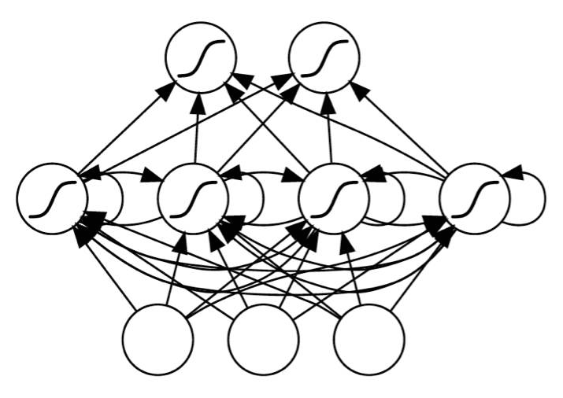

# 第四章 机器学习入门

人工智能简称AI，它表示由人类制造出来的机器所表现出来的智能。现阶段人工智能是指通过普通计算机程序来呈现人类智能的技术。人工智能的核心问题包括建构能够跟人类似甚至超卓的推理、知识、规划、学习、交流、感知、移物、使用工具和操控机械的能力。机器学习是人工智能的一个分支，是一类从数据中自动分析获得规律，并利用规律对未知数据进行预测的算法。它是人工智能的核心，是实现人工智能的一个途径。机器学习又可以分为监督学习、无监督学习和强化学习。其中无监督学习针对没有给定事先标记过的训练示例，自动对输入的数据进行分类或分群。这种方式主要是应对那些人类缺乏足够的先验知识的问题，这类问题要么难以人工标注类别，要么进行人工类别标注的成本太高。很自然地，我们希望计算机能代我们完成这些工作，或至少提供一些帮助。根据现有的知识来看，这个领域暂时对我们设计围棋智能程序帮助不大，我们对这个领域仅进行简单的介绍。强化学习作为实现围棋智能程序超越人类的核心算法，将单独开立章节论述。监督学习的方法有许多，我不愿意逐一例举以充篇幅，本章将着重介绍目前最优前途的方法----人工神经网络，而其它方法也将和无监督学习类似，仅作简单介绍。

## 人工神经网络

人工神经网络并不是一个新的概念，

### 多层感知机器

### 卷积神经网络

火影忍者里漩涡鸣人的老师旗木卡卡西由于历史原因拥有一只写轮眼，写轮眼的瞳孔与普通眼睛不同，导致他为了隐藏这只眼睛，一只半边脸绑着绷带。我们知道，忍者都是易容术高手，但是不管怎么改变服装外貌，眼睛的瞳孔是没有办法改变的，不然卡卡西也就不用整天绑着绷带装酷了。如果在火影的世界有基于照相机的二维人脸识别系统，要识别伪装后的卡卡西老师，就需要能够检测出他的眼睛与别人不同。

理论上，我们需要这个人脸识别系统首先要能识别出人，而人的特征就是得有两只眼睛，一个鼻子，一张嘴这些最基本的特征。由于我们需要识别的是卡卡西，而他的特征在眼睛的瞳孔上，所以我们还要这个系统在识别出人的眼睛后，能够继续识别眼睛的细节特征并区分出写轮眼和普通眼睛。宇智波佐助也有写轮眼，如果单单只以写轮眼来辨识卡卡西显然是不够的，所以我们还需要系统能够进行逻辑判断，只有一个写轮眼的人是卡卡西，有两个的可能是佐助或者是其他什么人。之前介绍的全连接神经网络虽然也能够用来实现这个系统，但是根据之前的实验，即便是简单的手写数字识别，它的精度也是极低的，主要原因就是图片是二维的，全连接网络需要将二维图片展开成一维后才能处理，这步展开的动作损失掉了重要的空间信息。这一节要介绍的卷积神经网络它和全连接网络的最大区别就是它是基于被识别对象的空间特征而设计的，卷积网络可以看作是全连接网络的拓展，在满足一定的条件下，卷积网络可以退化成全连接网络。在主流的应用中，卷积神经网络常用来提取被检测对象的空间特征，而全连接网络则用来做逻辑判断。

全连接网络的输入是一串一维的数据，而卷积网络则直接将高维度数据作为输入，比如处理图片就直接输入二维的图像数据。这个时候输入连接的就不是单个神经元了，而是一种称作为卷积核的算子。卷积核的数据形状一般小于被处理图片的形状，而且总是等边的。比如图像的尺寸是32_32，卷积核一般会使用2_2、3_3或者4_4的形状。和而且和全连接网络不同，卷积核之间的连接不再是交叉互联，而是每一层的卷积核只和上一层自己相关的父卷积核相连。

卷积的计算过程非常简单，分成两个过程。首先是矩阵的内积乘法，用卷积核在被处理的图像内抽取与卷积核相同尺寸的数据进行内积。第二步就是把这些内积值进行相加得到一个值作为卷积的结果。一般内积时，卷积核按照从左至右，从上到下的顺序从图像中取值和计算。卷积核在图像内滑动，就涉及到一个参数，我们称之为“滑动步长”。滑动步长是指卷积核每次内积前在图像内滑动的距离，大部分情况下这个步长会取值为1，以最大限度地保留信息。

### 循环神经网络

## 优化我们的神经网络

### 欠拟合与过拟合

所谓过拟合是指我们的模型在训练数据上能够比其它假设模型更好的拟合，但是在训练数据外的数据集上却不能很好地拟合数据，此时认为这个假设出现了过拟合的现象。

上图是一个线性回归的样例，虚线部分是我们希望模型学习到的简单一次函数，但是由于设计的不恰当，模型反而学到了实线展示的分段函数，过拟合导致模型在泛化时表现的不好，产生了交大的误差。

有很多原因可能会产生过拟合的现象，主要有：

1. 训练集质量不高，训练集本身包含大量的标签错误；
2. 训练集、测试集以及验证集的数据来源并不是独立同分布的；
3. 训练样本的噪声太大；
4. 模型设计不合理。

如果训练集本身就包含了大量的错误，再好的模型也没有办法施展。这个问题通常是很容易发现的，只需通过一些简单的采样工作再加上一点人工判断。如果数据量很大或者数据很复杂，可能会花去一些时间。训练前，模型的设计者应该对自己的学习样本有一些了解，比如在后面的章节里，我们会从围棋网站上下载一些人类对弈的棋谱，我们需要意识到，很多时候这些网络对弈的棋谱中记录的落子未必都是认真思考过的，或许下棋的人只是想随便点点。另外，网络对弈的棋谱中棋局的胜负可能也未必完全可信，执白方可能在占据优势的时候赶着去吃饭就选择了主动投降。为了提高样本的质量，在后面的章节还会提到如何生成我们自己的样本，通过机器下棋得到的棋谱总是比人类选手在网络服务器上下棋产生的棋谱可靠的多。

我们在训练时，会把整个数据集人为的分成训练集、测试集和验证集。有的模型设计者在模型定型前，还会把数据集拆分成多个交叉验证集，用来判断哪种模型结构会更好一些。为了有效地评价我们的模型，这三个集合必须是独立同分布的。假设我们要做一个人脸识别的分类模型，如果训练集只包含成年人的照片，而测试集里含有大量的老年人，验证集合却只有女性，我们就很难根据这类有偏差的数据运行出的结果来判断模型是否有效。要改善这个问题，数据集的使用者可以通过随机采样来对数据进行划分，而不是按比例地把数据集顺序切割成三部分。

样本是否包含大量的噪声比较难以发现，特别是一些复杂结构的数据集。数据集的使用者如果不能自行采集数据，只能寄希望于数据采集者尽量地提高其采集技术与手段。大部分付费数据应该不存在这个问题，或者使用网络上被大量使用和验证过的数据都会是相对安全的做法。所幸这个问题不会对我们围棋智能程序的设计造成困扰，后面的章节中我们会介绍生成围棋数据集的方法，这种方法也是我们不断提高围棋软件下棋水平的技术手段之一。

有些人觉得复杂的问题就应该对应一个复杂的模型，因为复杂问题必定对应一个复杂抽象函数。人工神经网络在理论上可以拟合任意函数，越是复杂的函数就需要越复杂的网络结构。网络一定越复杂越好吗？后面我们会看到，复杂的模型容易发生过拟合，我们需要通过一些技术手段来缓解这种现象。可是太过简单的模型又不能发现样本中的模式规律，导致训练过程没有进展，变成了欠拟合。这样的讨论似乎形成了一种矛盾，逼的我们不得不必须巧妙地设计我们的模型，使得这两种情况都不发生。但是相比于考虑欠拟合还是过拟合，我们其实更关心的是模型的泛化能力，而不是尽量好的去拟合样本，泛化能力强的模型才是好模型。

前面三种原因都是样本集采集时的问题，按照书中的建议，可以最大化避免发生问题。

Accurcy的值表示训练样本当前可以拟合的精度。Val\_accuracy是把模型当前训练的结果在验证集上进行验证。

对于一个分类任务，如果人类能够达到99%的准确度，我们期望我们的模型可以达到这个精度，这样才有用模型来代替人类工作的价值。

当accurcy的精度只有70%，和99%的目标差距较大，我们认为模型存在较大偏差。而Val\_accuracy只有70%时，我们认为当前模型的方差较大。偏差和方差可以同时存在。我们列出下表

| 训练偏差 | 大 | 大 | 小 | 小 |
| :--- | :--- | :--- | :--- | :--- |
| 验证方差 | 大 | 小 | 大 | 小 |
| 存在问题 | 欠拟合 | 欠拟合和过拟合同时存在 | 过拟合 | 理想模型 |

偏差大原因主要是：

1：训练不足

2：设计的模型和实际情况不匹配

偏差小而方差大的主要原因是：

3：训练集太小，不能体现实际问题的全部特征

4：模型设计的不合理，与实际情况不匹配

在训练的过程中，如果损失函数loss还在下降的话，可以判断出当前模型还有进步的空间，一般不应该停止训练。存在训练偏差大而验证方差小的情况，这种情况发生很有可能在模型内部针对某一类型的数据发生了过拟合。欠拟合与过拟合不是矛盾的，训练偏差和验证方差是两个同时存在的指标，我们通过这个指标来判断我们训练模型可能存在的问题。针对模型在训练集上的大偏差和在验证集上的大方差，我们都可以通过调整模型来缓解这两个问题。人工神经网络可以增加隐藏层中的神经元或者直接增加隐藏层来降低训练偏差。对于图像识别类的应用问题，我们可以使用卷积网络来代替全连接网络，这也是一种降低训练偏差的方法，从实际应用效果来看，这种方法也可以同时降低验证方差。针对偏差小而方差大的情况，我们还可以增加训练的样本，从而尽可能多的学习到实际应用问题的有效特征。

当我们设计的模型没有达到预期时，对上述两个指标进行分析是非常必要的，这两个指标可以指导设计者当前设计可能存在的问题，设计者依据指标对可能存在问题的部分进行调整和优化，而不仅仅盲目地期望通过增加训练样本使得模型可以有好的预期效果。

### 动态调整学习率

学习率是个超参，一开始使用学习率设置的大一些，如果没有发散，就会迅速收敛，之后再变小一些。不过可能不容易跳出局部最小，选择时要小心。如果代价函数是凸函数，就无需担心这个问题。

正则化，drop，epoch保存，早停

## 监督学习的其它方法

监督学习是通过学习训练集中的数据，从而建立一个函数，并依此函数推测新的结果。其中，训练资料是由输入样本和预期输出的标签所组成。而函数的输出可以是一个连续的值或是预测一个分类。简单地来看，围棋游戏可以抽象为人工智能研究领域的分类问题。19路棋盘的361个落子位就是361种分类。在下一章中我们希望能够设计出一个智能体，它可以根据棋面的不同局势判定当前棋局应该归类为361个分类中的哪一个，从而给出落子建议。

### K邻近算法

K邻近算法又称最近邻居算法，是一种用于分类和回归的非参数统计方法。

