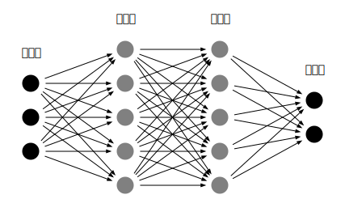

# 附录2：Keras入门指南

Keras严格来说不算机器学习软件，也不是机器学习框架，因为它本身并不提供机器学习库，它应该算是一个对用户友好的规范API调用接口。它和机器学习库的关系有点像linux的图形界面和后台shell命令。旧版的Keras支持的机器学习库后端有TensorFlow 1.x、CNTK和Theano。它们之间是相互独立的机器学习工具。只要读者愿意，抛开Keras，直接使用它们是完全可行的。但是随着机器学习技术的发展，TensorFlow 1.x、CNTK和Theano都已经开始跟不上时代的步伐。Keras 2.2.5 成了最后一个支持TensorFlow 1.x的版本。CNTK在2019年上半年已经停止了继续更新。Theano则更早，2017年9月29日就宣布了停止更新。现在随着TensorFlow 2.x的推出，Keras已经作为TensorFlow的高级API被集成在了TensorFlow里。现在机器学习领域的两大应用框架巨头就是TensorFlow和Pytorch。Tensorflow是工业界实际的霸主，而Pytorch则在学术界更加风靡。本书大部分的源码会使用Keras来实现，只有一章节采用了Pytorch。使用Pytorch的主要原因是那一章的所有编程代码在之前的章节实现中都已经有了，引入Pytorch也是为了鼓励读者两种技术都要会使用，而且他们本身并不复杂，仅仅是Python的一个库函数而已。

对大多数人而言，需要解决的问题只是使用神经网络来自学习某个具体问题模型的函数，至于其中到底要使用哪种优化算法来使得学习效率更高更快他们并不关心。而往往大部分问题并不是太复杂，已知的一些简单算法就足以应付。在这种情况下，直接去使用机器学习库，把简单问题当复杂问题一样来编程操作就显得多余。而且现在常见的机器学习库不下十余种，虽然它们解决的问题相类似，但是每个软件都有自己的使用规范，如果让用户逐个都学习一遍，那就太不人道了。Keras就是为了解决这个问题而诞生的，它提供了更高层面的API，将机器学习库作为后端。用户只要调用统一的Keras接口，这大大方便了普通用户快速验证自己的创意，将想法迅速转换为应用模型，用最短的时间来验证自己的算法。有的人可能对Keras不屑一顾，认为应该掌握TensorFlow，只有掌握了后端机器学习框架才能更灵活的实现算法。这就好比有人对TensorFlow不屑一顾，认为应该用Python从头至尾自己实现神经网络的前向计算与反向传播一样的可笑。Keras可以实现几乎95%的TensorFlow功能，即便是开源了TensorFlow的谷歌团队，在他们的指南中也是鼓励大家使用Keras，只有在万不得已的情况下才手工调用TensorFlow的函数。

Keras的核心编程结构是“模型”，模型指神经网络的组织结构。对于模型的编程，Keras有两种方式，一种是序列化编程，还有一种是函数式编程。序列化编程适合简单的，系统里自带已有的模型，函数式编程的模型则可以实现自定义的复杂模型。由于函数式更灵活而且实现起来也简单，我们这里仅介绍函数式的方法，本书所有的实现均采用Keras函数式编程方法。读者如果想了解其它内容，可以参阅Keras的相关书籍或者官方指南。



图示是一个典型的3输入2输出的全连接神经网络，网络内部设置了两层隐藏层，每个隐藏层分别有5个神经元组成。我们试着用Keras代码来实现这个简单的网络结构定义。实例代码用函数来封装这个神经网络结构，方便未来在程序中使用与调用。

```python
from tensorflow import keras    #1
def Model():
    inp=keras.layers.Input(shape=(3,))    #2
    x=keras.layers.Dense(5)(inp)    #3
    x=keras.layers.Dense(5)(x)    #3
    outp=keras.layers.Dense(2)(x)    #3
    return keras.models.Model(inputs=inp, outputs=outp)    #4
```

1. Keras被集成在了TensorFlow里，调用时需要从TensorFlow的子模块里装载。不过Keras毕竟还是一个独立的组织，所以也可以单独通过pip工具来安装，但是比从TensorFlow模块里直接调用还要多一步，同时单独安装Keras还会需要TensorFlow的版本相匹配，如果不匹配还得重新更换版本，比较麻烦；
2. 在定义神经网络的组织结构时，对于网络的输入需要专门用`Input`方法来指定当前定义的网络层是输入层。Keras的一个方便之处是我们只需要定义每一层自己的形状，而不用关心这一层的输入和输出的形状，Keras会自动替我们做好计算。这个优势在卷积层上体现的更加明显，如果使用Pytorch来实现卷基层的互联，需要手工做好每一层输入与输出的计算；
3. 神经网络的中间层以及隐藏层都采用`输出=层的类型函数(输入)`这样的形式来定义，Keras中的全连接层用Dense函数来表示。；
4. 整个网络结构定义完之后要用Model方法把神经网络的输入与输出包裹起来，即指明之前定义的这个数据流向是用在神经网络的模型里。

代码例子中的Input和Dense方法都还有很多参数可选，像演示代码中这样不指明具体参数的话，函数就会使用默认的参数。具体各种网络层中包含哪些参数以及这些参数的用法读者可以参考[Keras.io](https://keras.io)官方网站，如果一一列示这本书的厚度就要成倍的上升了。Keras官网上有中文版的链接，中文版本的说明文档可能很难做到与最新版本的内容完全一致，但是大部分的说明都是有效的，建议参阅英文档说明。

可见所谓Keras函数式编程，就是定义好每一层的网络结构和该层的输入与输出。这样做的好处是我们可以控制每个神经元的数据流走向，在后面更复杂的例子中就会看到其中的好处。

除了全连接网络，卷积网络也会在本书中使用到，示例代码演示一个使用卷积的图片分类神经网络，网络内部先采用卷积层提取图片的特征，然后再接入一个全连接层用作逻辑分类。

```python
def Model(28,28,3):    #1
    inp=keras.layers.Input(shape=(28,28,3))    #2
    x=keras.layers.Conv2D(8, 2)(inp)    #3
    x=keras.layers.Conv2D(4, 2)(x)    #3
    x=keras.layers.MaxPooling2D()(x)    #4
    #x=keras.layers.Conv2D(64, 26)(x)    #5
    x=keras.layers.Flatten()(x)    #6
    x=keras.layers.Dense(128)(x)    #7
    outp=keras.layers.Dense(10)(x)    #7
    return keras.models.Model(inputs=inp, outputs=outp)
```

1. 模型用来处理一个28\*28尺寸的彩色三通道照片；
2. 神经网络结构需要使用Input方法来专门指定网络的输入尺寸；
3. 卷积网络使用Conv方法，Conv1D、Conv2D、Conv3D分别指一维卷积、二维卷积和三维卷积。卷积函数的第一个参数是卷积核的个数，第二个参数是卷积核的尺寸。卷积核的个数可以简单理解为卷积后的数据有多少个通道；
4. 在卷积后紧接一个池化层是很常见的操作，示例中在卷积后接入一个最大池化的操作用来提取卷积窗口中最显著的数值；
5. 当Conv2D方法的第二个参数（卷积核尺寸）和数据大小一致时，二维的数据卷积后将会塌缩成一维。这是一种平滑连接卷积网络和全连接网络的技术，但是为了尽量多的保存上一层网络输出的信息，这种技术需要引入非常多的卷积核，这会增加CPU的计算量，所以很多实际的应用场合不太会使用这个技术；
6. 图像卷积网络处理的是二维数据，要和专门处理全连接的一维网络相连接，需要将二维网络展开成一维网络。FLatten方法是展开维度数据的常用方法；
7. 我们先连接一个128个神经元的隐藏层，然后再连接十种分类的输出神经元，构成一个完整的逻辑判断结构。

利用Keras实现完整的AI智能体是十分简单，主要步骤如下：

1. 定义神经网络的结构；
2. 为神经网络的训练准备好样本与标签；
3. 利用Keras的compile方法定义好神经网络的损失函数以及反向传播时的优化算法；
4. 调用Keras的fit方法实现样本与标签的匹配；
5. 使用Keras的predict方法来验证网络参数训练后泛化的效果。

在实际的生产环境中，数据往往是海量的，比如视频，图片，语音等应用的训练数据都在几十个G以上，有的甚至要上T，一次性将这些数据全部载入内存不切实际，采用数据流水线（dataset）的方式可以有效解决这个问题。Keras支持直接接入数据流水线来抽取训练时的样本和标签，数据流水线的好处是我们不用一次载入全部的训练样本，而是需要多少就取多少。本质上数据流水线是利用Python的yeild关键字构建一个迭代器，数据流水线作为数据生成器让Keras可以自动从中获取数据。下面的代码演示如何制作一个数据流水线，这个数据发生器能够输出一个\(10,10\)大小的二维数组和一个数据标签，如果这个数组中的偶数多于奇数标签就为1，如果奇数多于偶数标签就设置为-1，如果一样多那么标签为0。

```python
import numpy as np  
import tensorflow as tf  #1

def data_set(stop):  #2
  i=0  #2
  while i<stop:  #2
    x=np.random.randint(-1,2,size=(10,10))
    if x.sum()>0:
      y=1
    elif x.sum()<0:
      y=-1
    else:
      y=0
    i+=1
    x=x[:,:,np.newaxis]  #3
    yield x,y  #4

ds_counter=tf.data.Dataset.from_generator(  #5
            data_set, 
            args=[100], 
            output_types=(tf.int32,tf.int32),
            output_shapes=([10,10], ())
            )
for x,y in ds_counter.repeat(2).batch(10).take(5):  #6
    print('x:',x)
    print('y:',y)
```

1. 数据流水线是TensorFlow的工具，所以要引入TensorFlow库来生成数据流水线。除了TensorFLow，Pytorch和百度的Paddle等机器学习的框架都有类似数据流水线的工具；
2. 由于我们的数据发生器是随机生成数据，参数stop用来限制迭代器的数据规模，否则迭代可以无休无止的进行下去。用参数i来记录迭代次数，作为判断限制数据发生器规模的依据；
3. 由于二维数据一般我们会使用到卷积网络，而通道是卷积网络必须的一个维度，所以在二维数据后再增加一个通道维度。老版本的Keras由于还支持Theano等其它后端，所以卷积方法的参数里会有一个 data\_format参数用以指定通道维度是在张量的第一维度还是最末维度。最新版本的Keras只能用TensorFlow来作为后端，这个参数也基本成为了历史。TensorFlow的默认约定是通道必须放在张量的最后一个维度；
4. 产出的顺序为样本、标签。Keras在读取数流水线时默认是这个顺序，这也符合我们的直觉；
5. 数据发生器和机器学习的数据流水线还不是一个东西，需要调用Dataset的from\_generator方法来生成数据流水线。参数顺序依次为数据发生器、数据发生器的参数、数据发生器输出的数据类型和输出的数据格式。数据格式不是一个必选参数，但是强烈建议补足这个参数；
6. 测试数据流水线工作是否正常。数据流水线的输出可以用repeat、batch和take等方法来获取批量的数据。这些方法我们后面不会用到，但是读者可以尝试看看他们的使用效果，也许在一些本书之外的情况下会使用到。

神经网络训练后能否达到预期的效果，很大程度上与我们定义的代价函数是息息相关的。好的代价函数能使得网络在训练的过程中朝着对设计目标有利的方向收敛。神经网络的训练方法主要是依赖于反向传播，反向传播不是什么新的技术，但是这几年才火热起来靠的还是硬件水平的发展，使得计算机的算能能够满足大规模神经网络的逆向梯度计算。但是单纯的梯度下降算法在收敛速度上还是存在一些不足，因此后来又发展出了许多别的基于梯度下降的优化算法，比如Adam算法等。Keras的compile方法就是专门为神经网络模型指定代价函数与反向传播时使用的梯度下降优化算法的。有了这两个参数，Keras就可以为我们自动来训练神经网络了。触发Keras来计算神经网络的方法叫fit。fit方法的核心参数就是神经网络训练时需要的输入样本和样本对应的标签。还有一些其它参数，读者可以查询Keras官网上的API手册，这里就不再多费文字了。

神经网络训练完成后，我们可以调用Keras的predict方法来看看网络的实际泛化效果，predict方法的输入主要就是待评估的数据，这个方法应该是神经网络框架里最简单的一个了。下面我们将通过一个卷积网络加全连接网络来实现对刚才设计的数据发生器产出的数据进行预测。读者需要意识到，这个例子仅仅是为了演示完整的Keras使用过程，在神经网络中引入卷积网络的意义几乎是没有的，因为我们的二维数据是随机产生的，并不会有什么图形排列上的特征，在实际解决问题的过程中需要根据问题的类型来选择神经网络的结构。


```python
from tensorflow import keras    #1
def model():    #2
    inp=keras.layers.Input(shape=(10,10,1))
    x=keras.layers.Conv2D(100, 10)(inp)    #3
    x=keras.layers.Flatten()(x)    #4
    x=keras.layers.Dense(128)(x)
    outp=keras.layers.Dense(1,activation='tanh')(x)
    return keras.models.Model(inputs=inp, outputs=outp)

class example:
    def __init__(self):
        self.model=model()
        self.dset=tf.data.Dataset.from_generator(
                data_set,
                args=[1000],
                output_types=(tf.int32,tf.int32),
                output_shapes=([10,10,1], ())
                )
    def ex_compile(self):
        self.model.compile(    #5
            optimizer=keras.optimizers.Adam(learning_rate=0.001),
            loss=keras.losses.MeanSquaredError(),
            metrics=['mse'])
    def ex_fit(self,batchSize,epochs):
        dst=self.dset.batch(batchSize,drop_remainder=True)    #6
        self.model.fit(dst,epochs=epochs)    #6
    def ex_predict(self,examples):
        return self.model.predict(examples)    #7

test=example()    #8
test.ex_compile()    #8
test.ex_fit(100,200)    #8

testSet=tf.data.Dataset.from_generator(    #9
            data_set,
            args=[100],
            output_types=(tf.int32,tf.int32),
            output_shapes=([10,10,1], ())
            )

test_set=[]    #9
test_y=[]    #9
for x,y in testSet.take(50):    #9
    test_set.append(x)    
    test_y.append(y)
test_set=np.array(test_set)    #9
test_y=np.array(test_y)    #9

y_=test.ex_predict(test_set)    #10
y_[y_<-0.3]=-1    #11
y_[y_>0.3]=1    #11
y_[abs(y_)!=1]=0    #11
y_=np.array(y_,dtype=int).flatten()    #11

print(y_==test_y)    #12

```


1. 要使用Keras现在需要从TensorFlow中利用，也可以直接通过pip工具安装Keras，但是不推荐；
2. 神经网络的架构由卷积网络和全连接网络组成；
3. 这个示例要解决的问题与数据在空间上的结构没什么关系，所以我们直接将包含一个通道的二维数据\(10,10,1\)通过卷积变成一维数据\(1,1,100\)；
4. 上一步的数据虽然内容是一维的，但是形式上还是包含一百个通道的二维数据\(1,1,100\)。高维到一维还需要通过Flatten方法降维度\(100,\)；
5. 为这个应用问题选择均方差代价函数，反向传播使用Adam梯度下降优化方法，训练过程的数据展现采用均方差的方法；
6. 当我们使用数据流水线作为训练的输入样本来源时，小批量的训练数据量可以由数据流水线直接控制，fit方法中只需要指定训练回合数即可；
7. Keras的预测方法只需要输入待评估的数据即可；
8. 实例化一个Keras训练对量并调用compile方法完成模型的初始化。训练时调用fit方法，Keras就会自动为我们完成神经网络的学习过程；
9. 模型的验证数据需要和训练样本的数据分布一致，这里用数据发生器产生验证数据，并做一些numpy格式的转换；
10. 调用predict方法来查看模型的泛化效果；
11. 模型的训练次数是有限的，导致预测和实际情况存在一定的误差，我们通过对数据后处理，使其满足与样本标签一样的整数形式；
12. 基本上预测数据与实际的标签是一致的，在实践过程中，泛化精度可以达到98%以上，如果训练批次足够长，达到99.9999%也是完全可以的。

任何事情都是有利有弊，使用Keras直接接入数据流水线也限制了我们的灵活性。Keras只支持从数据流水线里获取一个输入和一个输出。如果神经网络的结构需要两类或者两类以上的数据源作为输入时，从一个数据流水线里获取样本就会遇到困难。这里我们介绍两种方法来克服多个数据源输入的问题。 

方法一是把多个数据源整合为一个数据源。



但是把多个样本合并在一起会产生一个问题，多个数据源的格式可能并不相同。以围棋为例，我们的数据源包括棋盘局面和落子方颜色。标准的19路棋盘局面是一个`[19,19]`的二维数组，落子方颜色是个一维的标量。为了使发生器能够输出被Keras识别的数据，还需要对不同数据源做格式转换，并将转换完的数据拼接在一起，作为发生器的样本输出。



上一种方法的缺点是很明显的，如果要使用卷积网络来提取围棋的形状特征，我们不得不在网络内部增加一个格式转换层以还原围棋棋盘的二维形状。仔细看一下Keras的源码可以发现它在解析迭代形数据时，是可以支持数据发生器输出字典类型的数据，这样我们就能够将不同的数据源数据塞入单独的字段，从而完美做到让数据泵在一个输出变量里存放不同格式的数据源数据。


有时候神经网络会需要多个输入数据来源，又有时候我们有多类标签需要神经网络去匹配，或者两者同时兼而有之。 



代码。。。 

1. 对于多个输入接口，我们只需要在网络模型中指定多个Input方法和其对应的输入变量；
2. 对于多个输出接口，我们只要在return的时候为模型的outputs指明一个输出数组结构。同理，如果inputs也有多个，除了用Input方法对接多个输入源之外，在模型里也要指明输入的数组结构。


Keras中一个数据源只能对应一套输入与输出。因此在做神经网络的fit操作时，我们不必显示地指出fit的输入x和标签y与数据发生器的对应关系，只需要指定数据发生器就可以了。fit默认接收数据发生器的第一个输出项作为样本输入x，第二个输出项作为样本标签，如果我们将多个数据源的数据依次作为发生器的输出，Keras的fit方法是识别不了的。


## 安装

首先要安装Keras的后端学习库，Keras本身只是这些机器学习库的顶层API。推荐使用TensorFlow，当然使用其它的库并不会给机器学习的结果带来影响。使用[pip](https://pip.pypa.io/en/stable/)工具来安装Python是非常方便的，为了使得安装更稳定，这里额外使用Python的镜像源来安装TensorFlow。国内能稳定访问的镜像源如下（只列出支持https协议的镜像源）：

> 清华大学：[https://pypi.tuna.tsinghua.edu.cn/simple](https://pypi.tuna.tsinghua.edu.cn/simple)
>
> 阿里云：[https://mirrors.aliyun.com/pypi/simple/](https://mirrors.aliyun.com/pypi/simple/)
>
> 加利福尼亚大学：[https://www.lfd.uci.edu/~gohlke/pythonlibs/](https://www.lfd.uci.edu/~gohlke/pythonlibs/)
>
> 中国科技大学 [https://pypi.mirrors.ustc.edu.cn/simple/](https://pypi.mirrors.ustc.edu.cn/simple/)
>
> 豆瓣：[https://pypi.douban.com/simple/](https://pypi.douban.com/simple/)

安装TensorFlow：

```text
pip install -i https://pypi.tuna.tsinghua.edu.cn/simple tensorflow
```

需要小心，最新版本的TensorFlow不支持32位的Python，如果读者的Python是32位的话，会遇到异常，需要重新安装64位的Python版本。如果用户拥有NVIDIA的显卡，可以安装TensoFlow-GPU版，这个版本可以使用显卡来加速运算。需要注意，不是所有的显卡都支持GPU加速（需要显卡支持CUDA），请安装前先确认自己的显卡是否在[支持列表](https://developer.nvidia.com/cuda-gpus)中。TensoFlow-GPU的安装更多的是涉及显卡的驱动安装与配置，与本书关系不大，不再花费篇幅累述，读者如有兴趣可以参考TensorFlow中文社区的[安装指南](http://www.tensorfly.cn/tfdoc/get_started/os_setup.html)。

安装Keras：

```text
pip install -i https://pypi.tuna.tsinghua.edu.cn/simple keras
```

## 验证

打开python环境，输入：

```text
import keras
```

显示`Using TensorFlow backend.`表示安装成功。

## 基本操作：

_**案例1**_ **\*\*\_**使用前馈网络实现线性回归（函数拟合）\*\*\_

_**案例2**_ **\*\*\_**使用前馈网络实现数据分类\*\*\_

_**案例3 使用卷积网络实现图像分类**_

