# 附录4：厉害的象棋游戏AI

## 象棋的GUI界面和下棋规则控制

棋盘和象棋规则判断是实现象棋游戏最基本的两个要素。其中棋盘虽然必不可少，而且又实现复杂，但是与本文内容不甚相关，故不着重墨加以详述。读者可以使用C++或者Java做出一个客户端软件，也可以用HTML5和JavaScript把棋盘做在网页上。开源网站[github](https://github.com/)和国产开源[gitee](https://gitee.com/)上都有人开放了相关的代码，可以直接参考。

象棋规则的实现上与围棋规则稍有不同，由于围棋规则简单，只要不下入对方的眼位，几乎下哪里都是合法的。象棋则不然。每个独立的棋子都有它规定的下法。比如马不能直走，兵只能每次走一步。为了方便判断每个子的走法是否合法，我们需要一个统一的走法生成器。中国象棋的棋盘大小是9\*10，我们的走法生成器是一个16\*16大小的棋盘，中国象棋的棋盘是生成器棋盘的一个子集。

我们把棋盘的左下角定义成坐标的原点`(0,0)`。我们用灰色格子表示中国象棋的棋盘大小，并为灰色格子赋值1，其余剩下的白色空格赋值0。我们以棋子马为例，红色点标出了当前马可以落子的格子。但是有四个格子的值是0，我们可以判定，这4个格子的落子是不符合象棋规则的。

为了让马能够知道红点位子是它可以落子的点，我们还要为马这个子设计一套走子的偏移规则。定义数组\[`(1,2),(-1,2),(-1,-2),(1,-2),(2,1),(-2,1),(-2,-1),(2,-1)]`。我们用马的坐标去和这个数组进行相加，就可以得到全部8个可以落子的地方。有时候，我们可能需要为一个子定义两套走子规则，比如兵在过河界前只能直走，过了河界后则还可以左右移动。但是无论是一套还是两套，方式还是相同的。

## 局面评价函数

我们在第三章有谈到过围棋的局面评价函数。由于围棋规则简单，传统手工编制的评价方法不是工作的很好。但是根据象棋智能软件的现状来看，人工定义的标准还是非常行之有效的。象棋的每个子作用不同，价值也不同，我们谁也不会愿意拿一个车去和一个兵来调换。如果一方的子剩下1个车，1个炮，另一方剩下一个兵和一个炮，我们可以相信剩下车和炮的一方更有可能赢得最后的胜利。据此，我们为每个棋子定义不同的价值，比如车=9，炮=5，马=7，兵=1。最粗糙的评价函数在评估时可以忽略这些子在棋盘上的位置，直接计算双方剩余棋子的价值总和来进行当前局势评估。大部分情况下，这种简单的做法可以工作的很好。

我们还可以更进一步，考虑棋子间的相对位置，比如兵在没过河界时，价值很低，只有1分，但是一旦过了河界，兵的作用就大大的提升，我们可以给他3分的价值，随着兵距离帅越来越近，它的威胁也就越来越大，当兵在九宫格以内，我们甚至可以给它7分，它的威力相当与一个炮或者一个马。

采用相对位置对棋子进行评价带有主观性，我们可以通过机器学习来最大程度地抛弃主观偏见，不过与手工编制规则相比，这样的做法成本较高，目前看起来可能也不是必须的，如果想战胜其它围棋智能体，可能才会需要让自己的智能体在各项判断上尽可能的最优。

## 进一步提升棋力

### 开局库：下起来更像人

优秀的开局是赢得一盘棋的基础，如果开局不利，往往导致全局的被动乃至输棋。通常中国象棋开局第一步大家都会走中炮、进三兵、飞相等。一般没有人会走进中兵，上帅等棋，如果走了往往意味这局将会输棋。但是如果我们的象棋智能体第一步永远只会下当头炮的话似乎是一件很傻的事情，即使它的实力再强，对战者也会逐渐失去兴趣。为了使象棋智能体更逼真，大部分象棋软件都会引入开局库。就象人们记住开局谱一样，象棋程序也可以使用一个数据库，里面储存了开局谱和局面，当开局中的棋步在开局库中能找到时，它就可以立即取出来走，不用计算。不管你是否喜欢，开局库在很多棋类中都是非常重要的。

很多棋类已经被人类积累了大量知识\(例如象棋、西洋跳棋等\)。对于人类非常精通的棋类，建立开局库有个非常简单的办法，即手工产生，选择高手走的棋。但是这种方法效率低，利用价值不高。我们这里介绍一种没有人工干预的生成开局库的方法。对于中国象棋，这个算法不是一定要自己实现的，网络上有很多现成的象棋开局库，可以直接下载下来使用。如果需要处理一些新诞生的对弈游戏，知道其背后的原理总是有益处的。开局库和后面要谈到的残局库都是利用计算机的大容量记忆优势，事先储存好可能遇到的对战解法，这是人类选手无法做到的。一个强大的开局库的大小大概在6G左右，后面谈到的残局库可能要占到10G。有些象棋的残局库甚至达到了50G。面对如此庞大的存储量，一旦进入残局，人类选手是没有任何希望的。

要生成开局库，有个简单的方法就是搜集足够的对局，如果是高手对局更好。我们可以用佐布里斯特散列找出比如前10回合的公共局面，取出其中的着子法，通过如下的公式计算后记录开局着法的评分。其中，修正指数是个超惨，根据收集到的对局数量进行动态调整。

$$
着法得分 = 胜率 \times 权重 \times 修正指数 \\
胜率 =(胜局数 + 和局数)\div 此着法局数\\
权重 = 此着法局数 \div 当前局面总数
$$

如果收集不到足够的对局，就需要用称为“博弈树”的图来主动计算获取开局库。图上的每个结点代表一个局面。对于每个局面，需要计算所有可能着法的值，因此每个候选着法都要扩展。跟这个图表相应，还必须找到一个方法来决定哪些结点是需要展开的，也就是说，图表上的哪个叶子结点需要再添加结点。这个时候，采用相对位置计算的局面评价函数可能就可以起到作用。博弈树的算法再第三章已经有所介绍，这里不再多说，需要注意，采用博弈树对计算机的算能要求很高，读者可以尝试使用集群并行计算以缓解算能不足的问题。一种称为DOE（脱离棋谱的扩展）的方法可以帮助算法优先对有潜力的叶子结点进行扩展。这个优先函数会使对手的好的着法搜索得深一些，对手犯错误的着法搜索得浅一些。读者可以在优先级的计算中加入其他因素，例如衡量结点重要性的因素，这个算法的发明者Thomas Lincke在他的优先函数中使用过“策略数”。我们也可以自己增加判断，当最好和次好的着法差距很大时，对路线就搜索得深一些。

### 残局库：不可战胜

残局数据库是储存了经回溯分析计算过的残局局面的数据库文件，它使用在棋弈程序上，当进入残局时只要适合使用的残局数据库文件存在，程序将走得非常完美。残局库在很多棋类游戏中扮演着非常重要的角色，例如象棋。通常只有在盘面上棋子数量很少的情况下，残局库才能发挥作用，但是并不一定要到达残局库所涵盖的局面时才使用残局库。例如，在到达如此局面之前几步，引擎计算一系列交换之后直接进入残局库里存有的局面。引擎于是搜索探查残局库并取得那个设想局面的结果。

残局库有确切的棋子数量的界限，它取决于棋类的复杂性。有些棋类随着对局的进行，棋子数量是减少的，残局库才时可行的；而有些棋类的棋子数量是增加的或者不变的，那么残局库就是无法计算的\(例如围棋\)。无论如何残局库取决于具体的棋类。对于中国象棋，只剩下4子、5子或者6子的残局经常出现的，因此残局库对棋力的影响非常大，这就意味着在有吃必吃的规则下，很多算法会很快地走到有残局库的局面中，因此残局库使得中国象棋的棋力有了很大的提高。

需要认识到，残局库并一定都会带来正面的影响，主要是当前局面并没有出现在残局库内，这时候算法既要探索最佳策略，同时又要在残局库里进行搜索。如果我们只在那些光靠算法的常规搜索和内建知识还不能很好处理的局面时使用残局库，以及指定局面到了哪个阶段才去探测残局库那就太好了。

残局库有不同的类型，而它们都可以知道残局库中某个特定的局面是赢棋、是输棋还是和棋。如果这就是残局库包含的所有信息，就称为“胜负和”残局库；如果知道多少步以后棋局会结束，就称为“杀棋步数”残局库；如果只知道多少步以后会转换为另一种类型的局面，就称为“转换步数”残局库。“胜负和”残局库有个问题，即便程序处于胜利局面，也未必能赢下棋局。尽管残局库知道某个局面已经是胜利局面，并且知道走哪步能继续保持胜利局面，但是保持胜利局面的着法可能会距离杀棋更远，而程序又不知道该选择哪步保持胜利局面的着法。“杀棋步数”残局库显然在这个方面做得比较好，因为你只要选择杀棋步数最少的那个保持胜利局面的着法。“转换步数”残局库也能够在胜利局面下走出取得胜利的着法，但程序走的步数可能会比必要的步数多。至今还有人使用“胜负和”残局库，你可能很怀疑。原因很简单，储存胜负和的信息只需要很小的空间。如果残局库和计算机的内存差不多大，那么残局库有很多部分可以放入内存。从磁盘上读取残局库不是一个好的选择，因为磁盘跟内存比起来慢得多。

我们可以通过网络下载并使用已有的残局库，也可以通过一种叫做“后退式分析”的算法自己生成。在介绍后退式分析前，先需要了解如果索引象棋的棋局局面。我们在围棋中使用佐布里斯特散列来记录每一次局面。但是围棋只有黑白两子，生成的散列值不多，如果为象棋棋盘上的每个格子上的每个棋子都生成一个散列虽然是可以，但是未免有些繁复，我们可以采用一种更简单的方法来索引局面。

中国象棋一共有九十个格子，我们可以将其看作一个一维的数组。我们为每个棋子赋值后填入数组，并由此表示当前局面的索引。上图我们简化了棋盘，我们为黑棋的马赋值3，红棋的兵赋值-1，填入数组后，我们就能得到索引值。我们可以再对这个算法进行一些优化，比如考虑对称性，为这个数组计算数字签名等，但是基本的方法就是这样。我们把这个方法叫做“索引函数”。

我们以要生成“王车对王”的残局为例对后退式分析进行说明。首先，每个可能的王车对王局面都有一个索引。理想情况下，索引函数会把所有N个合理的王车对王局面映射为N个索引。后退式分析需要的内存空间跟索引号的数量成正比，因此如果构造了一个M比N大得多的索引函数，那么你会浪费很多内存空间。

一旦有了索引函数，后退式分析算法就只要做以下几件事：

1. 初始化：生成两个长度都为N的数组，分别存放结果\(胜、负、和\)和转换步数。把所有的结果都设成未知，所有的转换步数计数器都设成0。你会发现，你需要4个数来表示结果，因此数组的数据类型是4个值的数\(即2位\)。当然，还有些根本不存在的局面，你需要自行处理。
2. 杀棋遍历：逐一检查每个局面是否是杀棋局面，如果是的，就把这个局面的结果设成输棋，表示即将走的一方输了。如果棋类允许“逼和”的存在，也必须作逼和的检查，并赋值为平局。把每个未知局面的转换步数计数器加1。
3. 对每个未知的局面，生成所有后续局面并看它们都有哪些结果。只要其中有一个后续局面是输棋，就把这个局面设成胜利。如果所有后续局面都是胜利，就把这个局面设成输棋。如果你遍历了所有局面但没有一个局面能设赢棋或输棋的，就跳到第5步。
4. 把每个未知局面的转换步数计数器加1，并回到第3步。
5. 把每个未知局面设成和棋，算法就结束了。

这个算法显然是确保可以完成的。在第3步里当吃子发生时，你就要读取少一个子的残局库。很明显，没有王车对王的残局库，你无法独立地生成王车对王马的残局库。如果你只要生成“胜负和”残局库，就可以不要转换步数计数器。如果你需要生成“杀棋步数”残局库，你就需要在局面转换时传递杀棋步数的值。该算法总是从已知局面\(杀棋或能转换为低级别的残局库局面\)向后找，按照上述算法的第3和第4步，每次遍历就后退半步。

