# 结尾

接下去要做的事情 关于如何制作一款超过人类大师水平的围棋游戏到这里就差不多都介绍完了。如果您认真地读完本书，您可以完全自信地认为自己已经具备能力独立制作一款和AlphaGo或者AlphaZero相同水平的围棋游戏，您花在本书上的时间将使您收益终身。但是您必须意识到，即便您已经掌握了设计一个超强围棋智能体的全部知识，由于外部条件限制，您想通过自己已有的个人电脑设备训练出基于强化学习和蒙特卡洛树搜索方法的围棋AI几乎是不可能。如果读者有尝试运行本书的代码就会发现，在做模拟仿真时，通过还不是那么复杂的神经网络来判断一次落子输出在计算上都要花去好几秒的时间，如果采用更深的神经网络，这样的耗时还会增加。使用目前单个最好的商用GPU硬件，计算出和现有AlphaZero一样的棋力，大约需要1700年，当然，实际可能不需要那么久，因为1700这段时间内硬件肯定会老化损坏的，未来新的硬件在算力上必然会超过现有设备，而且新硬件的计算速度可能是成千上万倍的提升。人工智能的发展现在看起来还得依赖硬件的发展以及在算法上尽可能地实现并行计算。

如果读者中有人有足够的计算资源，可以继续在本书的基础上做一些附加工作，以使得基于本书的围棋智能体算法能够实用化。我仅简要地进行说明，其中所需要的一切技术，本书中都已尽力做了详细的说明。 要实现本书中的智能AI，最耗费时间的并不是深度神经网络的训练过程。Keras或者说TensorFlow是支持神经网络的分布式训练的。读者只要在程序中配置tf.distribute.Stratey或者tf.distribute.MirroredStrategy这两个API就可以让神经网络利用多个CPU单元或者多个GPU单元进行训练和梯度计算。真正耗费时间的是智能体在做相互对抗和蒙特卡洛仿真的过程。所幸这两件事情都是可以借用MapReduce的思想做到分布式计算。 在判断两个对抗的智能体哪个强一些的时候，我们引入了假设检验。为了得到高置信度的假设检验结果，我们不得不让两个智能体进行多次对局。围棋的每一次对局之间并没有关联性，彼此之间相互独立，这些对局首先就可以做到并行执行。如果原先我们要依赖100局对弈来确定强弱，依靠并行计算，就可以把对抗的计算耗时缩减将近100倍。 

如果仅使用单纯的蒙特卡洛仿真，每一次在节点上的仿真都可以派生出一个独立的并行计算，这种方法效率肯定是最高的，但是由于围棋博弈过于复杂，这种方式的高效率会被复杂度所抵消，只适合简单的博弈场景，比如井字棋之类的游戏。 如果采用基于UCT方法的蒙特卡洛仿真，对于AlphaGo或者AlphaZero的算法，节点的选取依赖于上次仿真的结果，所以在派生并行计算分支时可以先假设前一次仿真的结果再进行节点选取，当前一次仿真结果出来后，再剔除那些无效的分支选择。这种方法会产生至少一半的无用计算。AlphaGo每一步落子前需要仿真1600局对弈，如果采用了并行计算，这个耗时至少可以缩减1000倍。在单块硬件设备上训练AlphaGo需要耗时1700年，如果结合上述方法，配备足够的计算资源，完全可以将训练的耗时缩减到几个月以内，AlphaZero在配备足够计算资源的情况下，仅用了24小时的训练时间就击败了AlphaGo。

为了照顾到初学者，本书的代码实现全部都是采用基于Keras和TensorFlow的Python语言。考虑到Python语言在运行效率上并不占优势，我相信DeepMind团队在实现AlphaGo和AlphaZero时应该使用了一些其它效率更高的编程语言。采用C或者相似语言来实现围棋游戏在仿真上应该可以大幅提升程序的运行速度。 

最后虽然不情愿，但是我还是不得不在结尾部分非常遗憾地承认本书介绍到的人工智能算法只是当前蓬勃发展的人工智能领域中的冰山一角，其中一些部分由于写作时间上的关系可能在读者看来已经显得不合时宜。由于篇幅和个人时间的限制，我只能用到什么说什么，在能力范围内尽量介绍的透彻，有不对之处也请读者不吝赐教。未来如果时间允许，我想我会再写一本书专门介绍如何使用当前人工智能中的成熟技术来实现一些常见应用，以弥补本书在相关内容上的不足。再次感谢您能够认真读完本书，希望本书的内容能够在人工智能领域对您起到有益的帮助。

最后我想提一下[萨尔曼·可汗](https://baike.baidu.com/item/%E8%90%A8%E5%B0%94%E6%9B%BC%C2%B7%E5%8F%AF%E6%B1%97/12713394)对[伊隆马斯克](https://baike.baidu.com/item/%E5%9F%83%E9%9A%86%C2%B7%E9%A9%AC%E6%96%AF%E5%85%8B/3776526)的一个[采访](https://www.khanacademy.org/college-careers-more/entrepreneurship2/interviews-entrepreneurs/copy-of-khan-academy-living-room-chats/v/elon-musk)，采访中伊隆马斯克把传授知识和拍电影做了一个类比，并特意用[克里斯托弗·诺兰](https://baike.baidu.com/item/%E5%85%8B%E9%87%8C%E6%96%AF%E6%89%98%E5%BC%97%C2%B7%E8%AF%BA%E5%85%B0)拍摄的电影《[蝙蝠侠：黑暗骑士](https://baike.baidu.com/item/%E8%9D%99%E8%9D%A0%E4%BE%A0%EF%BC%9A%E9%BB%91%E6%9A%97%E9%AA%91%E5%A3%AB/2959564)》作为例子。他试图告诉我们，这部优秀的电影作品是由一群优秀的具备专业知识的人合作来完成的，教育也应该如此，否则再好的电影剧本也可能会成为一部糟糕舞台剧上由蹩脚演员演出的无聊故事。本书由于作者能力有限，很可能就像一部无聊且糟糕的舞台剧，所以我要再次感谢您能够认真读完本书，希望本书的内容能够在人工智能领域对您起到有益的帮助。

