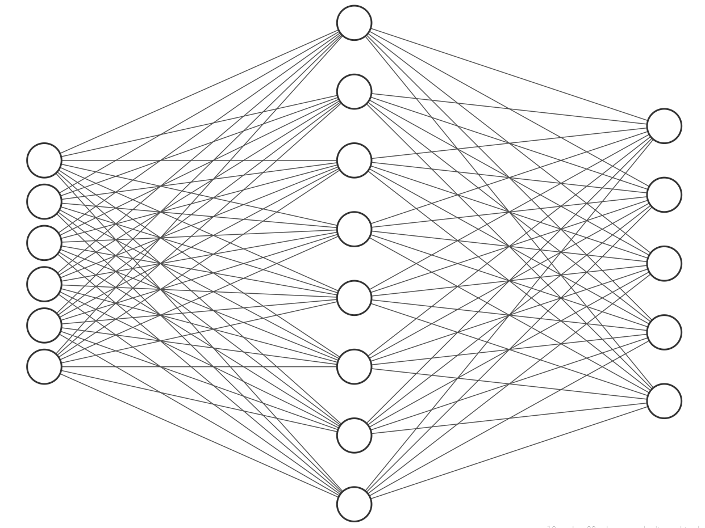

# Pytorch入门指南

对于经费不足的个人或者学术机构而言，Pytorch是有其优势的。TensorFlow总是会集成许多CPU和GPU的最新技术，所以一些老旧的CPU和GPU因为不支持这些新的技术特性，可能会无法运行TensorFlow，而Pytorch则几乎是来者不拒的。Pytorch比TensorFlow要轻量许多，这一点总是受到个人和非商业部门欢迎的，在有限的资源上，人们会倾向于更关心自己的想法能否快速实现，而不是把时间浪费在老旧机器的卡顿上。下表是将Pytorch和TensorFlow做了一个简单对比，供读者参考。

|  | Pytorch | TensorFlow |
| :--- | :--- | :--- |
| **主要面向** | 研究 | 工业界，商用 |
| **部署** | Torch Serve | TensorFlow Serve |
| **适用场景** | 个人开发或者科研 | 企业 |
| **可视化** | Visdom | Tensorboard |

本书的编程部分是倾向于偏袒编程初学者的，因此几乎所有的程序都是以windows平台为基础，如果读者是资深的程序员，将代码从windows迁移至其它平台应该不会存在困难。Pytorch的windows版本仅支持Python 3.x，读者在使用Pytorch前需要确定自己使用的是Python 3.x，很多情况是运行的服务器上同时安装了Python 3.x和Python 2.x。 

在开始介绍Pytorch使用方法前，读者需要知道GPU+CUDA的组合是目前为机器学习加速计算的最常见组合。如果你的计算平台装有一块显卡，并且支持Nvidia的CUDA，就可以在代码里加上下面这句话，使得神经网络在训练时能够利用CUDA特性使得训练速度有显著的提升。

```text
device = 'cuda' if torch.cuda.is_available() else 'cpu'
print('Using {} device'.format(device))
```


我们以一个3层神经网络网络为例，输入层是6个神经元（输入层∈$$R^6$$），隐藏层是8个神经元（隐藏层∈$$R^8$$），输出层是5个神经元（输出层∈$$R^5$$）。每个神经元采用Relu激活函数。



在一切开始以前，按Python编程的惯例，要引入一些必要的库。

```text
import torch
from torch import nn    #1
```

1. **nn里包含了所有的构成神经网络基础类，基础类都可以通过采用“nn.模块名”的方式来调用。**

接着我们先定义一个神经网络的类结构作为神经网络的模型抽象，方便后续调用。

```text
class NeuralNetwork(nn.Module):
    def __init__(self):
        super(NeuralNetwork, self).__init__()    #1
        self.flatten = nn.Flatten()    #2
        self.linear_relu_stack = nn.Sequential(
            nn.Linear(6, 8),    #3
            nn.ReLU(),    #3
            nn.Linear(8, 5),    #3
            nn.ReLU()    #3
        )
```

1. 使用NeuralNetwork的父类nn.Module来初始化我们自己的神经网络应用类；
2. 通常神经网络的输入可能是一张图片或者更高维度的数据，我们可以使用flatten方法把输入数据转成一维的数据。如果你的输入数据已经提前做了转换，这一步可以省略；
3. 层与层之间采用全连接的方法，并使用Relu作为神经元的激活函数。

有了网络，我们再为网络定义前向计算的方法。

```text
class NeuralNetwork(nn.Module):
    def __init__(self):
        ...

    def forward(self, x):
        x = self.flatten(x)    #1
        logits = self.linear_relu_stack(x)    #2
        return logits    #2
```

1. 前向运算前，先将数据打平，如果数据已经进行过了预处理，这一步便不会产生什么效果；
2. 采用之前定义好的网络结构进行计算，并对外输出结果。

有了抽象的模型，接着便是实例化这个抽象模型。

```text
model = NeuralNetwork()
```

接着就是为模型定义一下损失函数和采用什么优化算法来做反向梯度计算。

```text
loss_fn = nn.CrossEntropyLoss()    #1
optimizer = torch.optim.SGD(model.parameters(), lr=1e-3)    #2
```

1. 在例子中采用最常见的交叉熵作为损失函数；
2. 反向梯度算法也不做优化，采用最通用的反向传播算法。

接着就是要准备开始对网络进行训练了。监督训练是最基本的神经网络训练，这里使用Pytorch自带的数据集，实际应用时，读者需要自己实现与样例类似的方法。

```text
from torch.utils.data import DataLoader    #1
from torchvision import datasets    #2

training_data = datasets.FashionMNIST(
    root="data",
    train=True,    #3
    download=True,    #4
    transform=ToTensor()    
)

test_data = datasets.FashionMNIST(
    root="data",
    train=False,    #3
    download=True,    #4
    transform=ToTensor()    
)

batch_size = 64    #5
train_dataloader = DataLoader(training_data, batch_size=batch_size)    #6
test_dataloader = DataLoader(test_data, batch_size=batch_size)    #6
```

1. 引入数据装载工具，它的作用就是自动的装载训练用到的输入数据与样例标签；
2. Pytorch也自带了丰富的数据集，这里我们使用记录了手写数字的MNIST数据集；
3. datasets通过train参数来控制输出是训练集还是测试集；
4. datasets由于太大，并没有跟随库一起安装，一般都是使用到的时候才会下载；
5. 神经网络的训练基于大数据，实际应用场景中很难一次性装载全部数据，基本上全部都是采用批量训练的模式，batch\_size设置了一批次的数据规模。
6. 初始化训练神经网络时的数据装载器。

训练的方法基本上是模式固定的，如果没有特殊需求，基本上都可以套用下面这个训练函数写法。

```text
def train(dataloader, model, loss_fn, optimizer):
    size = len(dataloader.dataset)    #1
    for batch, (X, y) in enumerate(dataloader):    #2
        X, y = X.to(device), y.to(device)    #3

        pred = model(X)    #4
        loss = loss_fn(pred, y)    #5

        optimizer.zero_grad()    #6
        loss.backward()    #7
        optimizer.step()    #8

        if batch % 100 == 0:    #9
            loss, current = loss.item(), batch * len(X)
            print(f"loss: {loss:>7f}  [{current:>5d}/{size:>5d}]")
```

1. 获取训练集的大小，这个仅在展示信息时使用，不是必须的；
2. 小批量从dataloader中取数据出来训练；
3. 把数据塞入device里，需要注意，训练数据的大小不要超过device设备的内存；
4. 将训练集输入网络做前向计算；
5. 计算损失函数；
6. 对于小批量的训练，需要在每一批次训练时将上一批次的梯度清空，否则上一批次的梯度会被继承下来，通常这不会产生严重的影响，但是可能会降低训练学习的效率；
7. 反向传播计算梯度；
8. 根据反向梯度的计算结果更新神经网络的参数；
9. 每100次小批量训练后输出一次训练情况。


如果读者已经熟悉了Keras的用法，会发现Pytorch和Keras在使用上是十分相似的，所以在了解了基本用法后，在工具之间过渡将十分方便。

