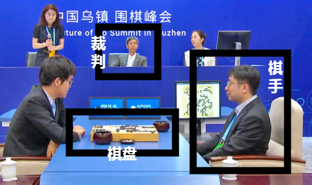
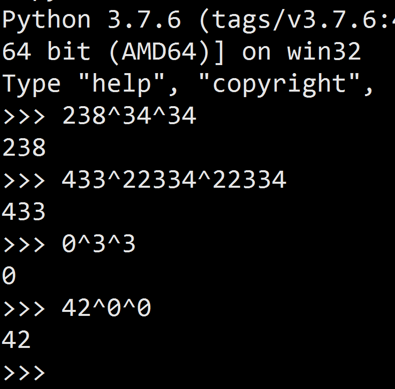

# 第二章 实现一个围棋软件

## 软件版本

考虑到Python在机器学习和人工智能领域使用的广泛性和便利性，我们在全文范围内也使用Python语言来实现智能算法。现代软件工程方法可以说是日新月异，有时候各个软件包或者程序库的版本不一致，会导致代码无法运行，所以在最开始先固定好我们使用的相关软件版本可以最大限度地避免由于版本混乱导致的一系列运行问题。考虑到示范和演示的方便，我们使用Windows操作系统来实现软件的编写，Python虽然支持多种操作系统，但是由于操作系统的差别，Python在个别函数上的表现也会不一样，这一点需要使用其它操作系统的读者留意。如果由于软件版本的问题，导致运行时报错，会需要读者自行进行调整。

考虑到Python在机器学习和人工智能领域使用的广泛性和便利性，我们在全文范围内也使用Python语言来实现智能算法。现代软件工程方法可以说是日新月异，有时候各个软件包或者程序库的版本不一致，会导致代码无法运行，所以在最开始先固定好我们使用软件的版本可以最大限度地避免由于版本混乱导致的一系列运行问题。考虑到示范和演示的方便，我们使用Windows操作系统来实现软件代码的编写，Python虽然支持多种操作系统，但是由于操作系统的差别，Python在个别函数上的表现会不一样，这一点需要使用其它操作系统的读者留意。如果由于软件版本的问题导致运行时报错，需要读者自行进行调整。

考虑到Python在机器学习和人工智能领域使用的广泛性和便利性，我们在全文范围内也使用Python语言来实现智能算法。现代软件工程方法可以说是日新月异，有时候各个软件包或者程序库的版本不一致，会导致代码无法运行，所以在最开始先固定好我们使用软件的版本可以最大限度地避免由于版本混乱导致的一系列运行问题。考虑到示范和演示的方便，我们使用Windows操作系统来实现软件代码的编写，Python虽然支持多种操作系统，但是由于操作系统的差别，Python在个别函数上的表现会不一样，这一点需要使用其它操作系统的读者留意。如果由于软件版本的问题导致运行时报错，需要读者自行进行调整。


如果读者同时在Windows下安装了Python 2.x和Python 3.x，可以使用py -2 或者py -3来指明自己是使用Python的哪个大版本。


关键软件版本清单：

* Windows 7 （64位）
* Python 3.7.6 （AMD 64）
* TensorFlow 2.1.0

推荐初学者安装与上面列表中相同的软件版本，我会尽量考虑到代码对不同软件版本的兼容性。推荐和鼓励读者使用其它计算机编程语言来复刻本书的全部内容。Python的运行速度不是太快，所以本书的代码只能起到演示和说明的作用，并不适合投入实际生产当中使用。当然Python也有其优势，特别是在矩阵运算上处理非常方便，这个优秀功能可能继承自Matlab或者R语言。

推荐初学者安装与上述列表一致的软件版本，我会尽量考虑到代码对不同软件版本的普适性，由于无法做到一一测试验证，所以并不能保证这一点。使用其它计算机编程语言来复现全部内容也是可以的，而且鼓励大家这么做。Python的运行速度不是太快，所以个别功能只能起到演示和说明的作用，并不适合投入实际的生产当中使用。当然Python也有其优势，特别是在矩阵运算上处理非常方便，这个优秀功能可能继承自Matlab或者R语言。

推荐初学者安装与上述列表一致的软件版本，我会尽量考虑到代码对不同软件版本的普适性，由于无法做到一一测试验证，所以并不能保证这一点。使用其它计算机编程语言来复现全部内容也是可以的，而且鼓励大家这么做。Python的运行速度不是太快，所以个别功能只能起到演示和说明的作用，并不适合投入实际的生产当中使用。当然Python也有其优势，特别是在矩阵运算上处理非常方便，这个优秀功能可能继承自Matlab或者R语言。

Keras已集成到了TensorFlow 2.x的版本中。还在使用TensorFlow 1.x版本的计算机上需要额外安装Keras。本文使用TensorFlow 2以上的版本，所以没有显示地表明Keras版本。如何为TensorFLow1.x安装Keras，可以参考附录“Keras入门指南”。

Windows下的Python 2.7版本的标准软件库里已经下载不到可以使用的TensorFlow了，但是Linux的2.7版本还不受影响，如果读者习惯在WIndows下使用Python 2.7版本，可以参考附录“Windows安装TensorFLow和TensorFLow-GPU”。

Keras已集成到了TensorFlow 2.x的版本中。还在使用TensorFlow 1.x版本的计算机上需要额外安装Keras。本文使用TensorFlow 2以上的版本，所以没有显示地表明Keras版本。

Keras已集成到了TensorFlow 2.x的版本中。还在使用TensorFlow 1.x版本的计算机上需要额外安装Keras。本文使用TensorFlow 2以上的版本，所以没有显示地表明Keras版本。

## 围棋软件建模

Python是面向对象的语言，为了体现出这种编程方式的优越性，先给下围棋这件事情抽象一下。



虽然柯洁输给了计算机，但是从中可以看出下围棋这件事情一共有三个参与方。他们分别是棋盘、棋手和裁判。于是我们可以抽象出三个类分别对应这三个参与方，这三个类是我们自制的围棋软件中最核心的。




```python
class GoBoard:
    def __init__(self,width=19,height=19):            #1
        self.width=width            #2
        self.height=height
        self.stones={}            #3
        self.zobrist=EMPTY_BOARD            #4
        self.move_records=[]            #5
        self.board_records=set()            #6
```


1. 棋盘默认采用标准的19路棋盘；
2. 把棋盘放入笛卡尔坐标系里来看，棋盘的左下角为原点`(0,0)`；
3. 记录棋盘上每个落子点属于哪一串棋。围棋的子要连在一起才能表现出威力，引入这个概念方便后续的逻辑判断，详细的内容会在后面再介绍；
4. 佐布里斯特哈希（zobrist hashing）散列，和MD5作用一样可以用来签名（特征值提取），因此也叫佐布里斯特签名。佐布里斯特散列常用在棋类游戏中，用以记录每一回合的棋盘面，后面还会详细讲述。很多棋类（不包括围棋）还使用这个散列辨识蒙特卡洛树搜索时棋盘的状态，以避免重复计算浪费计算资源；
5. 记录一局对战的落子记录；
6. 记录一局对战的棋面佐布里斯特散列记录。






```python
class GoAgent:            #1
    def __init__(self,who):
        self.player=who            #2
```


1. 用智能算法来代替下围棋的人，智能算法在这个类里实现；
2. 智能体的初始化很简单，只需要告诉它此局对战使用的是黑棋还是白棋。






```python
class GoJudge():            #1
    @classmethod
    def isLegalMove(cls,board,stone,player):
        ...
    @classmethod    
    def NextState(cls,player_current,move,board):
        ...
    @classmethod
    def getGameResult(cls,board):        
        ...
```


1. 对于计算机模拟下棋，裁判类并不是必须的。除了正规比赛，胜负的判断可以由下棋的双方自行商定。我们把裁判抽象出来作为一个工具类，方便判断棋局的胜负以及落子的合法性等等。读者也可以不实现这个类，而把其中的功能在另外连个类里实现也是可以的。



单个围棋棋子有4口气，两个棋子连在一起就有六口气，气多的子不容易被对方吃掉，所以围棋落子的策略之一就是尽可能地使已方的棋子连贯，免受对方的攻击。为了表示连接在一起的棋子，我们为棋盘类中引入了“棋串”的概念。关于棋串我们在第一章里已经有过介绍，就是把连在一起的棋子叫做“棋串”。棋串的最小单位是一个子。为了方便表示棋串，我们为它专门抽象出一个类来。




```python
class StoneString:
    def __init__(self,player,stones,liberties):
         self.becolgings=player            #1
         self.stones=set(stones)            #2
         self.liberties=set(liberties)            #3
    @classmethod
    def merge(cls,str1,str2):            #4
        assert str1.becolgings == str2.becolgings
        allstones=str1.stones|str2.stones
        liberties=(str1.liberties | str2.liberties)-allstones
        return StoneString(
            str1.becolgings,
            allstones,
            liberties
        )
```


1. 记录棋串属于白棋还是黑棋；
2. 棋串中每个子的位置；
3. 一组棋串的每个气的位置；
4. 为棋串建立合并的方法。比如围棋的“接”就是把原来断开的棋子连成不可分割的整体，每当下出“接”时，就应该调用这里的merge方法。



为了方便区分下棋的双方（执黑还是执白），额外引入一个表示棋子颜色的枚举类。这个类不是必须的，仅仅是为了使用上的方便。




```python
class Player(Enum):             #1
    black=0
    white=1

    def other(self):            #2
        return Player.white if self==Player.black else Player.black
```


1. 继承枚举类Enum。如果不使用枚举方法，可以简单的用-1表示执黑棋方，用1表示执白棋方；
2. 交换下棋方。



## 佐布里斯特散列

在谈佐布里斯特散列之前，先来看一下它背后的基本原理：数字a按位异或b再按位异或b得到的还是原来的数字a。

$$
a \bigoplus b \bigoplus b = a
$$



我们为棋盘的初始状态赋值之后，每落一子就做一次异或运算，如果悔棋，就再做一次原落子的异或运算就可以回到上一个棋盘状态。


我们希望每次异或后的值只在当前棋局中出现过一次，否则就会发生不同局面对应一样的散列值。一般佐布里斯特散列取60位以上长的二进制数值后就很难会发生重复现象。习惯上我们会用64位作为散列长度。如果手工为每一步落子生成一个散列值会相当麻烦，可以使用如下代码，一次性为19路棋盘生成全部散列值。




```python
import random
MAX63 = 2**63-1            #1
sets=set()            #2
while len(sets)<19*19+1:            
    code=random.randint(0,MAX63)            #3
    sets.add(code)
```


1. 最大二进制散列长度是64位；
2. 使用集合类型来保存生成的散列值。集合的好处是可以避免集合内的值重复；
3. 采用随机数来生成散列。



## 围棋智能体

这一章我们还要实现一个可以自动下围棋的智能体。暂时我们的智能体不具有任何智能，它只会随机的在棋盘的空点上落子。我们把这个机器人作为以后测试智能下棋机器人的基准。如果后续带有智能算法的围棋智能体不能下赢基准机器人，说明选择的智能算法是失败的。

我把智能体下棋的过程抽象成两个类函数。


```python
class GoAgent:
    ...
    def chooseMove(self,how,board):            #1
        ...

    def isPolicyLegal(self,move,board):            #2
        ...
```


1. 根据当前围棋局面选择如何落子。智能算法主要在这个函数里实现。
2. 为智能体定义一些内置的规则策略，比如我们不可以自己把自己的眼位堵死，虽然这是合法的下法，但是没有任何理由这么做。

有了上面列出的两个函数，我们的围棋智能体就能够和人类一样在棋盘上下棋了。我们再逐一看一下，这两个函数到底实现了一些什么功能。


```python
class GoAgent:
    ...
    def chooseMove(self,how,board):
        if how=='R':            #1
            episilon=.001            #2 
            if np.random.rand()<=episilon:
                return (-10,-10)
            for i in range(5):            #3
                row=np.random.randint(0,board.height)
                col=np.random.randint(0,board.width)
                if GoJudge.isLegalMove(board,(row,col),self.player) \
                and self.isPolicyLegal((row,col),board):            #4
                    return (row,col) #stone
            return (-5,-5)            #5
    ...
```


1. R表示使用纯随机的方法；
2. 为了使随机算法更逼真，有0.1%的概率投降。人为规定返回（-10,10）表示认输；
3. 尝试5次随机生成个落子点；
4. 判断一下随机生成的落子点是否符合游戏规则和我们自定义的一些内置策略；
5. 如果生成了5次都不满足要求，我们就弃走这一步。人为规定返回（-5，-5）表示弃权一手。


```python
class GoAgent:
    ...
    def isPolicyLegal(self,move,board):            #1
        neighbours=board.getStoneNeighbours(move)            #2
        is_eye=True
        for i in neighbours:
            if not board.isOnBoard(i):            #3
                continue
            if board.stones.get(i)==None:            #4
                is_eye=False
                break
            elif board.stones.get(i).becolgings != self.player:            #5
                is_eye=False
                break
            elif len(board.stones.get(i).liberties)<=1:            #6
                is_eye=False
                break
            else:
                pass
        if is_eye:
            return False
        return True
```


1. 目前自定义的规则里，只加入不堵死自己眼位的规则。读者也可以自己加入一些其它合理的规则。不过由于我们的目标不是采用传统方法来实现一个下棋软件，而是希望通过机器学习的方法，让智能体自己学会下棋，所以尽量避免人为干预，规则能够越简单越少约好；
2. 查找落子点周围的点；
3. 判断落子点是不是棋盘边缘；
4. 看看周围的点是不是没有被占用；
5. 看看是不是周围的点是属于自己的势力范围；
6. 周围的点没有气也不是眼。

## 围棋的棋盘

围棋的棋盘类负责记录每一回合双方的落子情况，另外我们还在棋盘类上实现了三个辅助功能，这三辅助功能也可以在另外两个核心类里实现，读者可以根据自己的情况自行斟酌。


```python
class GoBoard:
    ...
    def envUpdate(self,player,stone):            #1
        ...
    def getStoneNeighbours(self,stone):            #2
        ...
    def isOnBoard(self,stone):            #3
        ...
    def updateZobrist(self,player,stone):            #4
        ...
    def evaluate(self,player,stone):            #5
        ...
    def printBoard(self):            #6
        ...
```


1. 每当智能体执行一次`GoAgent.doMove()`操作，棋盘类就要执行一次更新，以保持棋盘的状态和实际对弈情况一致；
2. 辅助功能之一，获取落子点周围的那些子属于哪一串“串棋”；
3. 辅助功能二，判断落子点是不是在棋盘上；
4. 记录落子后棋盘的佐布里斯特散列；
5. 辅助功能三，预先判断落子后的情形。这个功能是为了辅助裁判类判断落子是否符合围棋规则；
6. 棋盘类对外展示的函数，目的是方便人类观看。

这些功能中，getStoneNeighbours\(\)、isOnBoard\(\)和updateZobrist\(\)非常简单，不再累述。evaluate\(\)大量复用了envUpdate\(\)中的代码，我们也省去这部分的说明。


```python
class GoBoard:
    ...
    def envUpdate(self,player,stone):
        if stone==(-5,-5):
            ...
        elif stone==(-10,-10):
            ...
        else:
            ...
            for i in uldr:            #1
                if not self.isOnBoard(i):
                    continue
                string=self.stones.get(i)            #2
                if string==None:            #3
                    liberties.append(i)
                elif string.becolgings==player:            #4
                    if string not in same_strings:
                        same_strings.append(string)
                else:            #5
                    if string not in opposite_strings:
                        opposite_strings.append(string)
            new_string=StoneString(player,[stone],liberties)            #6
            self.updateZobrist(player,stone)
            for i in same_strings:            #7
                new_string=StoneString.merge(new_string,i)
            for i in new_string.stones:            #8
                self.stones[i]=new_string
            for i in opposite_strings:            #9
                i.liberties.discard(stone)
                if len(i.liberties)==0:            #10
                    for j in i.stones: 
                       for k in self.getStoneNeighbours(j):            #11
                            if self.stones.get(k) is not None \
                            and self.stones.get(k).becolgings==player:
                                self.stones.get(k).liberties.add(j)
                        self.stones.pop(j)
                        self.updateZobrist(player.other(),j)
            self.board_records.add((player,self.zobrist))
            self.move_records.append((player,stone))
```


1. 先看看落子点四周都有哪些串棋；
2. 串棋也就三种情况，属于黑棋，属于白棋，或者是空着的；
3. 如果周边没有串棋，就加一口气；
4. 如果周边是自己势力范围的串棋，就先记录下来；
5. 如果是对方的串棋，就记在对方名下；
6. 先把自己这个落子看作一个独立的串棋；
7. 把相连的串棋连接起来，形成一个更强大的串棋；
8. 棋盘上的每个子都对应某串串棋，是点到链的映射关系。更新了串棋后就要更新这个映射关系；
9. 检查对方的子，看看己方落子后是不是要减掉对方的气；
10. 如果对方剩余的气是零，就要提掉对方的子；
11. 提掉对方的子前先为己方加上这口气。


```python
class GoBoard:
    ...
    def printBoard(self):
        COLS = 'ABCDEFGHJKLMNOPQRST'            #1
        STONE_TO_CHAR = {            #2
            None: ' . ',
            Player.black: ' x ',
            Player.white: ' o ',
        }
        for row in range(self.height):            #3
            bump = " " if row > 8 else ""
            line = []
            for col in range(self.width):
                player = self.stones.get((self.height-1-row, col))
                if player is not None:
                    player=player.becolgings
                line.append(STONE_TO_CHAR.get(player))
            print('%s%d %s' % (bump, self.height-1-row, ''.join(line)))
        print('    ' + '  '.join(COLS[:self.width]))
```


1. 我们采用国际习惯，将棋盘水平方向的坐标位用英语字母来命名；
2. 由于是在命令行下展现棋盘，我们用点表示空的落子点，x表示黑棋，o表示白棋；
3. 棋盘的水平方向坐标采用数字序号编码。我们的设计仅考虑标准19路棋盘，如果要调整棋盘的格式，需要增加额外的代码。

## 引入裁判

和正式比赛类似，我们的裁判类也负责判断落子的合法性，判断胜负以及判断轮到谁来下棋。针对每个功能我们都独立设计一个函数来对应。




```python
class GoJudge():
    @classmethod
    def isLegalMove(cls,board,stone,player):
        if stone==(-10,-10) or stone==(-5,-5):
            return True
        if not board.isOnBoard(stone):
            return False
        if not board.stones.get(stone)==None:
            return False
        [noLiberties,zobrist]=board.evaluate(player,stone)            #1
        if noLiberties==0 or (player,zobrist) \
        in board.board_records:            #2
            return False
        return True
```


1. 落子是否合法我们需要先模拟落子后才能知道，所以调用棋盘类中的evaluate方法；
2. 我们采用中国围棋规则，不允许重复己方已经下过的棋形，不允许自杀。关于各区域围棋规则的差异可以参考附录5：不同的围棋规则。






```python
class GoJudge():
    @classmethod    
    def NextState(cls,player_current,move,board):
        if move==(-10,-10):             #1
            return GameState.g_resign,player_current.other()
        elif move==(-5,-5):
            if board.move_records[-1][1]==(-5,-5):            #2
                return GameState.g_over,None      
            else:
                return GameState.g_continue,\
                player_current.other()            #3
        else:
            return GameState.g_continue,player_current.other()
```


1. 如果有人投降，则棋局结束，不用再判断该由谁下下一步；
2. 如果遇到弃权，需要判断上一步是否也是弃权。根据围棋规则，如果双方连续弃权一步，则棋局结束；
3. 交换下棋方。



人类下棋时，可以在围棋下到中盘时就做出胜负判断。围棋规则在定义胜负时，对于有争议的区域采用双方各自轮流占满公共点来决定归属。可是很少或者说没有谁会真的下到最后占满整个棋盘后才能搞清楚谁胜谁负。计算机则不行，我们不得不下到最后没有地方落子了才能判断胜负。在我们的智能体还不会判断局势，不会主动投降之前，程序只能通过连续两次弃权来判断当前游戏结束，才会进入胜负判定阶段。我们采用中国的数子法来得到胜负结果，因为这种方法在代码上实现更容易。




```python
class GoJudge():
    @classmethod
    def getGameResult(cls,board):        
        komi=7.5            #1
        ...
        for i in range(board.height):
            for j in range(board.width):
                if board.stones.get((i,j))==None:
                    if (i,j) in black_territory or (i,j) in \
                    white_territory or (i,j) in neutral_territory:
                        continue            #2
                    else:
                        visited_stones={(i,j)}
                        boarders=findBoarders(board,(i,j),visited_stones)
                        if len(boarders) !=1:
                            neutral_territory|=visited_stones        #3
                        else:            #4
                            if Player.black in boarders:
                                black_territory|=visited_stones
                            else:
                                white_territory|=visited_stones
                elif board.stones.get((i,j)).becolgings==Player.black:
                    blacks.append((i,j))
                elif board.stones.get((i,j)).becolgings==Player.white:
                    whites.append((i,j))
                else:
                    pass
        black_counts=len(blacks)+len(black_territory)
        white_counts=len(whites)+len(white_territory)
        return black_counts-(white_counts+komi)            #5
```


1. 采用中国规则，贴7.5目；
2. 跳过已知的势力范围和公共区域，我们的计算将忽略公共区域。不过如果机器一定要下到最后直到没有空可以填入，就不会存在公共区域；
3. 将空点加入公共区域，所谓公共区域，就是黑棋和白棋都可以下，不属于哪一方的势力范围；
4. 如果不是公共区域，就按实际情况记入对应的势力；
5. 如果结果是正的则是黑棋胜，否则白棋胜。



## 让智能体下棋

“欲破曹公，须用火攻，万事俱备，只欠东风”。赤壁之战前诸葛亮点破周瑜把一切准备工作都做好了，只差东风这最后一个重要条件。我们现在也已经有了实现围棋软件的全部素材，就差把它们拼装起来真正地下上一盘棋了。我们试着把散乱的积木拼起来，搭成一个能够自己下棋的围棋软件。


```python
def main():
    board=GoBoard()            #1
    agent_b=GoAgent(Player.black)            #2
    agent_w=GoAgent(Player.white)
    os.system('cls')
    board.printBoard()
    whosTurn=Player.black            #3
    player_next=whosTurn
    game_state=GameState.g_continue
    while game_state==GameState.g_continue:
        time.sleep(.3)            #4    
        if whosTurn==Player.black:
            move=agent_b.chooseMove('R',board)            #5
            '''人工输入            #6
            move=input('-- ') #A1
            move=to_stone(move.strip())
            if not GoJudge.isLegalMove(board,move,whosTurn):            #7
                continue
            '''

        else:
            move=agent_w.chooseMove('RM',board)        
        [game_state,player_next]=GoJudge.NextState(whosTurn,move,board)
        board.envUpdate(whosTurn,move)            #8
        if game_state!=GameState.g_over and game_state!=GameState.g_resign:
            os.system('cls')
            board.printBoard()
            #print(board.toNormalBoard())
            whosTurn=player_next
            print(whosTurn)
    if game_state==GameState.g_resign:            #9
        print(player_next,"wins!")
    if game_state==GameState.g_over:            #10
        result=GoJudge.getGameResult(board)
        if result>0:
            print("black wins")
        elif result<0:
            print("white wins")
        else:
            print("ties")

if __name__ == '__main__':
    main()
```


1. 实例化棋盘；
2. 为黑棋和白棋各实例化一个下棋机器人；
3. 按照围棋惯例，总是由黑棋先落子；
4. 没下一步都停0.3秒，目的是为了方便人眼观看；
5. 命令下棋机器人根据当前局面采用随机策略选一步棋；
6. 如果想尝试自己和机器对战，可以把这段注释去掉，手工与白棋对弈；
7. 为人工下棋增加一步落子合法性校验；
8. 每一步落子都更新一下棋盘状态；
9. 如果有人主动投降就直接判定胜负；
10. 如果没有人主动投降，就一直下到无子可落，利用数子法进行胜负判定。

鼓励读者尝试执行`gamePlay.py`来观察机器随机下棋的效果，看着浑然没有思维能力的机器下出有模有样的围棋还是很有意思的。

