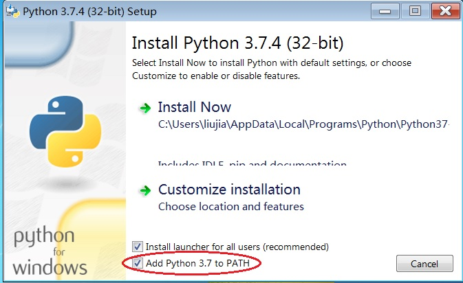

# Windows安装TensorFlow和TensorFlow-GPU

## 安装TensorFlow的特殊问题

不管是Windows或者是Linux，TensorFlow对他们的要求是相当宽容的。你可以使用Python 2或者Python 3来安装TensorFlow，而且不管是x86还是amd64的Python版本，都有已编译好的TensorFlow库供开发者使用，直接使用pip安装就可以了。TensorFlow-GPU则要复杂和特殊许多，这主要是由于NVIDIA在软件上的支持比较混乱，一个小版本的补丁也会引起TensorFlow调用动态链接库失败，导致编译好的TensorFlow-GPU库完全不能使用。在安装TensorFlow-GPU时要特别关注和NVIDIA相关的软件版本。TensorFlow从1.6版本开始使用AVX指令集进行预编译，大部分老旧的CPU并不支持AVX指令集，如果读者还在使用这类旧架构的CPU，需要面对三种选择，要么使用低版本的TensorFlow，要么使用特殊版本的TensorFlow或者自行编译。第二和第三种应对策略本质上是一样的，如果读者没有使用特殊设备，安装第三方已经编译完成的TensorFlow库将会更加方便，因为虽然TensorFlow开放了源码，理论上可以在各种平台上编译和运行，但这绝不是一件轻松的事情（一次完整的编译过程将耗费好几个小时）。尽管有上述种种的问题，读者也无需太过担心，本章的目的就是帮助读者摆脱这些麻烦。但是对于初学者，笔者建议使用安装Intel新架构CPU和NVIDIA最新GPU的电脑设备，以避免不必要的麻烦。

## 安装Python

[Python.org](https://www.python.org/)提供支持Windows的Python 2和Python 3的安装软件包，读者在下载时可以根据自己的操作系统选择X86和AMD64的版本。建议使用Python 2.7或者Python 3.4以上的版本。下载完成后，直接双击安装包，根据提示逐步操作即可完成安装。


安装Python时请记得勾选“将Python安装路径加入到系统环境变量“的选项。




Linux的大部分发行版本都自带Python 2.7版本。如果需要使用Python 3需要单独安装。系统里既有Python 2又有Python 3的时候，需要使用pip和pip3命令来分别指定安装依赖包的所属关系。不过由于维护Python的版本过多，这种方式并不推荐。


可以使用[Virtualenv](https://virtualenv.pypa.io/en/latest/)来虚拟Python环境，TensorFlow 2.0开始推荐以这种方式进行安装。


Python 2.7.9或者Python 3.4以后的版本都自带[pip软件](https://pypi.org/project/pip/)。如果读者有特别的理由需要使用更老的版本，还需要单独安装pip。一般安装完pip后，[setuptools](https://pypi.org/project/setuptools/)和[wheel](https://pypi.org/project/wheel/)这两个软件也会自动安装。如果pip安装完成后没有这两个软件，也需要单独安装。安装完成后，建议对pip和setuptools进行一次更新，这样可以避免安装TensorFlow时出现warning警告。

Windows下更新pip：

```text
python -m pip install -U pip
```

Linux或者MacOS下更新pip：

```text
pip install -U pip
```

更新setuptools：

```text
pip install setuptools --upgrade
```


在中国大陆，出于人为原因，直接使用pip的安装源速度会非常慢。为了避免漫长的耗时等待，可以使用国内的pip镜像源来进行依赖安装。国内目前pip的镜像源很多，但是支持https协议的却很少，推荐使用清华大学的镜像源。

要使用它，仅需要在安装时增加-i参数。

`pip install Django --upgrade -i https://pypi.tuna.tsinghua.edu.cn/simple`


## 安装TensorFlow

使用pip安装，如果是第一次安装，会有很多依赖包自动下载，安装过程如果中断，重新执行以下命令即可。

```text
pip install tensorflow    #安装最新的稳定版本
pip install tensorflow==1.13.1    #安装指定的1.13.1版本
```


TensorFlow从1.15版本开始不再区分CPU版和GPU版，如果要安装TensorFlow 1.15 就需要配套安装完整的NVIDIA工具，为了避免麻烦建议读者在安装时指明TensorFlow版本。


## 验证TensorFlow

```text
import tensorflow as tf;
print(tf.__version__)    #Python 2 执行 print tf.__version__ 
```

如果打印出了版本号则代表安装成功。但是正如前文提到的，老架构的CPU不支持AVX指令集，Windows 7 会抛出`ImportError: DLL load failed with error code -1073741795`的错，而Windows 10 会抛出`ImportError: DLL load failed: A dynamic link library (DLL) initialization routine failed`。Linux下，使用这类CPU的主机会直接报`Illegal instruction (core dump)`。

当遇到上述问题，最简单的方法是使用1.6之前的TensorFlow版本，不过目前通过pip已经无法安装1.13以前的版本。退而求其次，我们采用第三方已经编译完的whl来安装TensorFlow。

## 绕过AVX指令集

Github上已经[有人](https://github.com/fo40225/tensorflow-windows-wheel)为我们编译好了不使用AVX指令集的whl目标文件。下载时需要注意各版本对Python以及CPU指令集的要求。


Github的贡献者并没有提供X86的版本，建议使用32位老架构CPU的读者还是升级一下电脑吧。


根据贡献者列出的表格，可以得知，第一行的TensorFlow版本只专门针对CPU编译，不包含GPU支持,同时该版本指令集使用的是sse2，并且需要Python 3.7版本才能正常使用。第三行的TensorFlow增加了GPU支持，因此需要额外安装NVIDIA的CUDA10.1 和cuDNN7.6 版本。并且正如之前提到的原因，必须使用CUDA 10.1.168\_425.25 和cuDNN 7.6.0.64 。根据表格中的备注显示，硬件上还需要[GPU的计算力](https://developer.nvidia.com/cuda-gpus)（GPU Compute Capability）等于3.0。这相当于GTX650的水平。在实际使用中，高于这个水平的GPU芯片也能够被很好地支持。

| Path  | Compiler | CUDA/cuDNN | SIMD | Notes |
| :---: | :---: | :---: | :---: | :---: |
| 1.14.0\py37\CPU\sse2 | VS2019 16.1 | No | x86\_64 | Python 3.7 |
| 1.14.0\py37\CPU\avx2 | VS2019 16.1 | No | AVX2 | Python 3.7 |
| 1.14.0\py37\GPU\cuda101cudnn76sse2 | VS2019 16.1 | 10.1.168\_425.25/7.6.0.64 | x86\_64 | Python 3.7/Compute 3.0 |
| 1.14.0\py37\GPU\cuda101cudnn76avx2 | VS2019 16.1 | 10.1.168\_425.25/7.6.0.64 | AVX2 | Python 3.7/Compute 3.0,3.5,5.0,5.2,6.1,7.0,7.5 |

将符合自己要求的whl下载到本地后，安装whl文件是一件十分简单的事情。在当前目录下执行：

```text
pip install tensorflow-1.14.0-cp37-cp37m-win_amd64.whl    #安装“1.14.0\py37\CPU\sse2”
```

## 安装TensorFlow-GPU

## 通过源码来编译

Windows在安装TensorFlow-GPU前，需要事先安装好[Visual Studio IDE](https://visualstudio.microsoft.com/zh-hans/)，由于微软的版本更新策略，目前Visual Studio 2013，2015和2017已经无法从官网上下载。好在CUDA 10以上的版本对[Visual Studio 2019](https://visualstudio.microsoft.com/zh-hans/vs/)支持的还比较好。如果一定要使用过去的版本，建议读者可以求助于网络。Visual Studio IDE在安装过程中可以只安装核心部件，如果不使用它来进行开发，不用安装其它负载（开发套件）。

要让TensorFlow使用NVIDIA的GPU加速，需要额外安装[CUDA](https://developer.nvidia.com/cuda-toolkit-archive)和[cuDNN](https://developer.nvidia.com/cudnn)软件。这里需要注意，如果你已经安装了GPU驱动，建议将他们全部删除，原因是CUDA自带了对应的GPU驱动，为了避免冲突，尽量使用CUDA自己的驱动程序。如果安装了错误的CUDA版本，也需要删除原来的版本才能够继续安装。删除的方法很简单，在控制面板中，搜索所有带CUDA和NVIDIA字样的程序，直接将它们卸载即可。如果你愿意，可以保留“NVIDIA图形驱动程序”和“NVIDIA Physx系统软件”。在非常特殊的情况下，GPU的驱动可能卸载不完全，导致无法安装正确的CUDA，这个时候可以考虑使用[DDU软件](https://www.guru3d.com/files-details/display-driver-uninstaller-download.html)对GPU驱动的残留进行卸载。在DDU卸载时，最好进入Windows安全模式，这样能够避免一些文件被占用导致无法被删除。

安装CUDA时请使用软件的默认安装目录（默认为C:\Program Files\），在C盘下新建tools目录，并把cuDNN解压到这个目录下。CUDA和cuDNN就绪后，还需要额外设置环境变量。

临时设置环境变量：

```text
SET PATH=C:\Program Files\NVIDIA GPU Computing Toolkit\CUDA\v10.0\bin;%PATH%
SET PATH=C:\Program Files\NVIDIA GPU Computing Toolkit\CUDA\v10.0\extras\CUPTI\libx64;%PATH%
SET PATH=C:\Program Files\NVIDIA GPU Computing Toolkit\CUDA\v10.0\include;%PATH%
SET PATH=C:\tools\cuda\bin;%PATH%
```

使用TensorFlow-GPU除了要求必须是NVIDIA的GPU外，对[GPU的计算力](https://developer.nvidia.com/cuda-gpus)还有一定要求，官方要求需要达到3.5以上。不过根据[fo40225](https://github.com/fo40225/tensorflow-windows-wheel)贡献出的whl文件来看，计算力达到3.0基本就可以满足要求了。NVIDIA将GPU分为三大系列，GeForce用于提供家庭娱乐，Quadro用于专业绘图设计，Tesla用于大规模的并联计算机运算。如果资金充裕，使用Tesla是最理想的，不过Tesla的价格是普通GeForce显卡的10倍，初学者建议使用GeForce显卡，当神经网络规模较小时，一块2000元人民币左右的NVIDIA GeForce显卡已经足够应付了。

根据官方提供的编译配置表来看，无论使用Windows上的哪个TensorFlow-GPU版本，Python 3.5都是可以支持的，而Visual Studio 最好使用2015或者更高版本。不同的TensorFlow-GPU版本对应了不同的cuDNN和CUDA组合。NVIDIA官网上无论是CUDA还是cuDNN都有许多不同的小版本，选择不同的小版本，得到的结果是不同的，从顺利安装的角度来看，选择合适版本的初始版本会是安全的。

| 版本 | Python 版本 | 编译器 | cuDNN | CUDA |
| :--- | :--- | :--- | :--- | :--- |
| tensorflow\_gpu-1.13.0 | 3.5-3.6 | MSVC 2015 update 3 | 7 | 9 |
| tensorflow\_gpu-1.12.0 | 3.5-3.6 | MSVC 2015 update 3 | 7 | 9 |
| tensorflow\_gpu-1.11.0 | 3.5-3.6 | MSVC 2015 update 3 | 7 | 9 |
| tensorflow\_gpu-1.10.0 | 3.5-3.6 | MSVC 2015 update 3 | 7 | 9 |
| tensorflow\_gpu-1.9.0 | 3.5-3.6 | MSVC 2015 update 3 | 7 | 9 |
| tensorflow\_gpu-1.8.0 | 3.5-3.6 | MSVC 2015 update 3 | 7 | 9 |
| tensorflow\_gpu-1.7.0 | 3.5-3.6 | MSVC 2015 update 3 | 7 | 9 |
| tensorflow\_gpu-1.6.0 | 3.5-3.6 | MSVC 2015 update 3 | 7 | 9 |
| tensorflow\_gpu-1.5.0 | 3.5-3.6 | MSVC 2015 update 3 | 7 | 9 |
| tensorflow\_gpu-1.4.0 | 3.5-3.6 | MSVC 2015 update 3 | 6 | 8 |
| tensorflow\_gpu-1.3.0 | 3.5-3.6 | MSVC 2015 update 3 | 6 | 8 |
| tensorflow\_gpu-1.2.0 | 3.5-3.6 | MSVC 2015 update 3 | 5.1 | 8 |
| tensorflow\_gpu-1.1.0 | 3.5 | MSVC 2015 update 3 | 5.1 | 8 |
| tensorflow\_gpu-1.0.0 | 3.5 | MSVC 2015 update 3 | 5.1 | 8a |

如果读者已经安装了TensorFlow的CPU版本，为了避免冲突，建议先删除，再重新安装GPU版本。

```text
pip uninstall tensorflow    #删除已经安装的tensorflow
pip install tensorflow-gpu    #安装支持GPU加速的tensorflow
```

## 验证TensorFlow-GPU

```text
import tensorflow as tf; 
tf.enable_eager_execution(); 
print(tf.reduce_sum(tf.random_normal([1000, 1000])))
```

和安装CPU版本遇到的问题一样，如果CPU不支持AVX指令集我们就需要使用到fo40225提供的[TensorFlow-GPU wheel](https://github.com/fo40225/tensorflow-windows-wheel)文件。fo40225对版本的描述非常详细，比如要安装最新的 1.14.0版本，根据列表需要使用CUDA 10.1.168\_425.25 和cuDNN 7.6.0.64。

本地安装tensorflow\_gpu-1.14.0-cp37-cp37m-win\_amd64.whl：

```text
pip install tensorflow_gpu-1.14.0-cp37-cp37m-win_amd64.whl
```


使用这种方式安装的软件包在第一次执行tensorflow的时候会耗费较多时间来定位显卡驱动，所以第一次执行长时间没有返回也请不用担心。


官方支持在使用Raspbian 9.0 的树莓派上执行TensorFlow，具体操作可参考[官方指南](https://tensorflow.google.cn/install/source_rpi)。其主要方式是通过在树莓派上安装linux的docker虚拟机进行软件编译，编译过程使用TensorFlow自带的编译脚本，并对ARMv7 的NEON指令集给出个性化的参数配置。

如果没有特别的原因，不建议从源代码编译 TensorFlow pip软件包。这不仅是一件费时费力的工作，而且往往并不能达到理想的效果。只有当现有pip源上的TensorFlow不能满足要求时，才只能非常不情愿的考虑自己进行编译。这种情况包括上文提到的老旧CPU不支持AVX指令集，或者在其它一些特殊软件平台上使用 TensorFlow 软件包。

官方文档提供了在[Linux/MacOS](https://tensorflow.google.cn/install/source) 、[Windows](https://tensorflow.google.cn/install/source_windows)和[树莓派](https://tensorflow.google.cn/install/source_rpi)里编译TensorFlow wheel的指南，其中树莓派的操作相对比较简单，整个过程可以使用官方提供的docker镜像，这样省去了许多安装编译依赖的问题。根据指南的描述，官方在TensorFlow的源码里也加入了树莓派交叉编译时使用的脚本，使得实际编译过程更加顺滑。Linux/MacOS和 WIndows都需要使用Bazel来协助编译，Windows还需要额外安装MSYS2和Visual C++生成工具 2015，这个软件包可以在Visual Studio 2015中单独安装。


Linux 推荐采用 Ubuntu 16.04.6LTS ，这是一个相当成熟并被广泛验证的Linux发行版本。TensorFlow中关于Linux 使用的说明大部分以这个版本为基础。


编译支持GPU的TensorFlow时，请一定注意在`./configure`里指明自己使用的CUDA和cuDNN的版本。 对于编译优化标记，默认值 \(`-march=native`\) 会优化针对计算机的 CPU类型生成的代码。如果只是本机使用，可以尝试不修改此参数，但是建议显式地指出自己CPU支持的指令集，特别是使用那些不支持AVX指令集CPU的用户。

显式地指出CPU支持的指令集：  


```text
-march=native -mmmx -m3dnow -msse2  -msse3 -msse4a    #AMD X2 550 CPU支持的指令集
```


用户借助TensorFlow提供的Docker开发镜像，可以轻松设置从源代码编译Linux软件包的环境。这些镜像已包含编译TensorFlow所需的全部源代码和依赖项。安装方式可以参考[官方指南](https://tensorflow.google.cn/install/source#docker_linux_builds)。


## 使用Linux的Docker镜像

Docker使用容器创建虚拟环境，以便将TensorFlow安装与系统的其余部分隔离开来。Docker是在Linux上启用TensorFlow GPU支持的最简单方法，因为只需在主机上安装NVIDIA GPU驱动程序。


如果CPU不支持AVX指令集，使用Docker镜像也不能解决问题，只有通过源码进行编译，或者使用第三方提供的不含AVX支持的whl目标文件。


具体的安装步骤可以参考[官方指南](https://tensorflow.google.cn/install/docker)，指南中包括了TensorFlow和TensorFlow-GPU具体的安装操作步骤。要支持GPU，需要安装[NVIDIA Container Toolkit](https://github.com/NVIDIA/nvidia-docker) 。如果用户在安装完启动过程中遇到`nvidia-docker Error response from daemon: OCI runtime create failed`，建议不要使用最新的nvidia-docker，新版本与TensorFlow提供的镜像在版本上可能不兼容，用户可以试着安装[nvidia-docker2](https://github.com/NVIDIA/nvidia-docker/wiki/Installation-%28version-2.0%29)解决这个问题。


随着Docker 19.03的发布，nvidia-docker2将被逐渐废弃，因为Docker runtime已经开始原生支持NVIDIA GPU。


## 其它操作系统安装TensorFlow

除了树莓派，[TensorFlow官方Github](https://github.com/tensorflow/tensorflow)的支持列表中还包含苹果的MacOS与Android设备。不过官方Github上并没有给出具体的配置参数，所幸在苹果电脑上运行TensorFlow不会涉及GPU版本，所以大部分情况下可以运行的 很好。Github上还有人提供了自己编译好的可以运行在MacOS上的[whl目标文件](https://github.com/lakshayg/tensorflow-build)，这些版本标注了详细的配置信息，如果在使用官方编译的版本出现了问题，可以尝试试用第三方的软件包。


树莓派小巧玲珑，一般没有支持外接显卡的版本。苹果电脑的大部分型号安装的是ATI显卡。这些小众设备由于没有使用Nvidia的GPU，因此只能使用TensorFlow的CPU版本。


## 关于TensorFlow 2.0

从中国大陆能够了解到的[官方TensorFlow](https://tensorflow.google.cn/)资料来看，TensorFlow 2 是以崭新的姿态出现在人们面前，而且根据Keras官网上的信息，Keras 2.2.5 将会是最后一个支持TensorFlow 1的版本。因此不出意外的情况下，本章节描述的关于使用TensorFlow 1的内容可以长久有效，读者可以放心的按照文章的描述进行系统设置。


TensorFlow 2.0只支持Python 2.7和Python 3.4.0以上的版本。特别地，对于windows系统，TensorFlow 2.0不再支持python 2，Windows用户只能使用Python 3。


