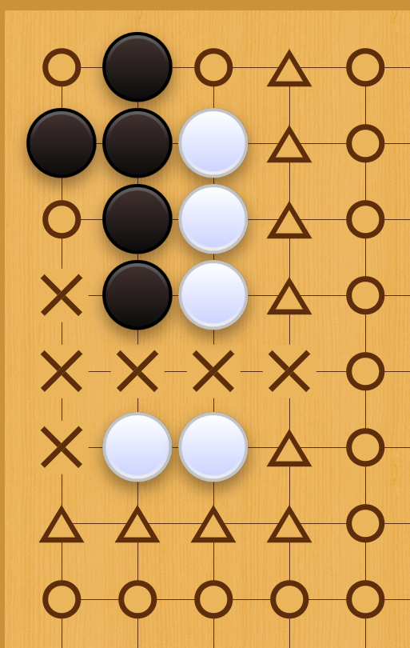
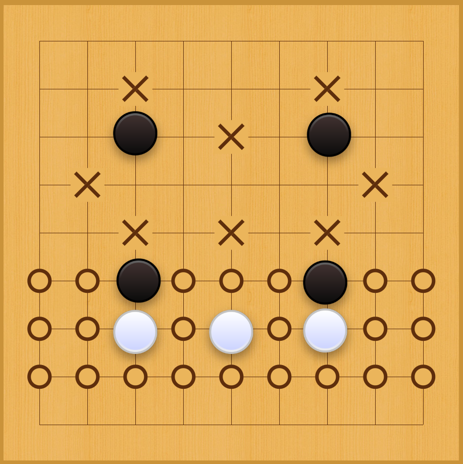

# 第三章 传统的棋类智能

与其它棋类游戏相比，计算机模拟的围棋人工智能棋力进展相对缓慢。在1997年，就有计算机可以击败世界国际象棋棋王卡斯帕罗夫，但围棋软件直到2016年才第一次真正地击败顶尖围棋棋手。国际象棋目标明确，只要杀死国王即可（中国象棋、日本的将棋状况也差不多），因此算法较为简单。但是围棋以“围”为目标，不一定需要杀死对方棋子，每一步有数百种以上的走法，因此围棋的复杂度高，又极具欺骗性，这些因素都对计算机博弈程序提出了巨大的挑战。

虽然像IBM深蓝那样的超级计算机已经能够击败世界上最好的国际象棋棋手，但在AlphaGo出现之前却有不少人能轻易击败当时的围棋软件。黄山谷有诗：“心似蛛丝游碧落，身如蜩甲化枯枝”，可见围棋给程序员们带来了许多人工智能领域里的挑战，要编写出超越初级水平的计算机围棋程序都是一件极其困难的事。

过去的传统方法一直没有能够在围棋上有所突破，但是在象棋等其他棋类上还是展现出了其强大的算法实力，了解这些内容，我觉得是有益的。现代基于神经网络的人工智能方法需要巨大的计算机算能，当我们没有足够的算能来训练出一个强大的棋类智能体时，尝试利用传统方法不失为一种变通之法。这就有点像牛顿力学与爱因斯坦相对论之间的关系，大部分时间，我们使用牛顿力学就好了。传统方法的一个致命问题是算法中带有太多人类的主观想法，在谈论细节时，我想读者会有更实际的感受。

## 3.1 极小化极大（Minimax）算法

极小化极大算法常用于棋类等由两方较量的游戏和程序，它可以追溯到中世纪，属于是一种找出失败的最大可能性中的最小值的算法。算法的基本思想是假设游戏的获利与损失总是零总和的，从当前参与博弈的角色角度来看，该角色总是在可选的选项中挑选将自己的优势最大化的选择，而对手方总是选择令自己优势最小化的方法。很多棋类游戏可以采取此算法，例如井字棋。对于交替博弈的双方而言，如果站在各自的角度来看，当前博弈方总是挑选使得自己优势能够最大化的选项。两种看上去矛盾的描述和解释，仅仅是因为我们所选择的当前博弈对象不同而已。

极小化极大算法顾名思义，就是让最大的情况最小，这里的最大一般是指最差的情况，例如游戏中最不利的情况。换个角度来理解就是说下棋时己方要时刻保证最小化对手方的最大收益。 这个算法的前提是游戏必须要满足零和博弈的条件，即两个玩家进行博弈，如果其中一方得到利益那么另一方就会失去利益，游戏利益的总和为零或者是某一个常数，如果不满足这个条件，算法就将失去意义。本质上极小化极大算法就是一个树形结构的递归算法，每个节点的子节点和父节点都是对方玩家，所有的节点被分为两类，分别是我方的极大值节点和对方的极小值节点。

极小化极大算法一般都会通过递归来实现，主要原因是递归方法在代码编写上可以做到简单明了。如果读者觉得理解递归逻辑在思维上有困难，也可以通过展开博弈树来实现算法，但是后者在代码复杂度上要远远超过前者。我们的讲解也是基于递归算法的。前面提到过算法本质上是”己方要时刻保证最小化对手方的最大收益”就属于递归的思想，也就是说，判断己方收益的方法是基于对方的收益。比如要计算A的收益，就要先计算B的收益，要计算B的收益，就要再计算A的收益，往复循环直到满足循环的结束条件，这就构成了递归的基础。这里以井字棋为例来实现一个会玩井字棋的智能程序。

井字棋是一种在三排棋盘上进行的连珠游戏，它需要两个玩家进行游戏，玩家双方轮流在三乘三的格上打自己的符号，一个负责在格子上打圈（〇），一个在格子上打叉（×），最先在横、直或斜其中任一条件下将自己的符号连成一线的玩家为胜。井字棋游戏只有765个可能局面，26830个棋局。如果将对称的棋局视作不同局，则它有255168个棋局。


假设当前井字棋游戏下到如图3-1所示的状态，现在轮到画×方落棋，显然下到右下角就能赢取胜利。要计算机程序利用极小化极大算法进行井字棋游戏，我们首先就需要为这个AI程序定义一个知道怎么在下一步获胜的函数。


```python
def findOneMoveWin(game_state,player):
    possible_moves = []        
    for candidate_move in game_state.legal_moves(player):    #1
        next_game_state = game_state.apply_move(candidate_move)    #2
        if next_game_state.is_over() and next_game_state.winner == player:
            possible_moves.append(candidate_move)    #3
    return possible_moves    #4
```


1. 遍历当前玩家所有的合法选择；
2. 得到每个选择带来的结果；
3. 如果当前选择能带来胜利，就保存起来；
4. 遍历完后返回之前保存的可以赢取棋局的落子选项。

通过以上算法就能轻易看出一个弊端，仅仅是要想知道哪一步一定能取胜，就需要遍历所有可能的选择。这种方法在象棋这种有固定棋子和固定下棋方式的游戏中或许可行，但是在围棋中实在是太困难了，这种算法所带来的计算量将是灾难性的。


但是仅仅知道怎么取胜还是远远不够的。让我们想想，双方是怎么会下到图3-1这个局面的呢？我们把游戏倒退一步，回到图3-2的样子。执×方选择了左上角和中心的位置，执〇方现在也占据了左下角。现在轮到执〇方走一步，他会很天真地认为如果自己占据了下路的中间位置就能在后一步中连成一线吗？这似乎是很可笑的，因为执×方会比他先连成一线。那么显然我们的智能程序必须要知道在自己取得胜利之前不能给对方任何获胜的机会。具体到井字棋游戏就是要占据对方能够获胜的位置，即如果己方当下不能立即赢取胜利，那么就必须要阻止对方在接下去的一步棋中获得胜利。由此我们还需要定义一个能避免自己失败行为的函数。


```python
def findMinLoseMoves(game_state,player):
    opponent = player.other()    #1
    possible_moves = []
    for candidate_move in game_state.legal_moves(player):    #2 
        next_state = game_state.apply_move(candidate_move)    #3
        opponent_winning_move = findOneMoveWin(next_state, opponent)    #4
        if opponent_winning_move is None:
            possible_moves.append(candidate_move)    #5
    return possible_moves
```


1. 初始化己方的对手；
2. 遍历自己所有的合法选择；
3. 计算执行该选择后留给对方的新局面；
4. 对方能否在这个新局面获胜；
5. 如果不能，加入己方可选项的集合内。

显然我们的程序在调用`findMinLoseMoves()`这个函数前需要先调用`findOneMoveWin()`，只有知道自己不会在下一步中取胜才去思考阻止对方胜利的选择，因为一旦胜利了，游戏也就结束了。己方既然能够找到防止对方胜利的选择，相反地，对方也会使用这种相同的策略，所以无论如何选择，对方总有应对之策。按这个逻辑，在零和游戏中单纯模拟寻找胜利的选择是没有意义的，因为算法总是能保证在对方选择必胜的行动前就已经扼杀了这个选项。


如果双方在各自的当前回合都无法必胜，我们就要继续搜寻下去，看看是不是存在对方至少要连下两步棋才可以阻止己方胜利的情形。如图3-3，如果执×方落棋到中心红色X点，那么执方〇必须同时堵住两个红色的画圈位置才可以避免执X方的胜利。根据这个想法，我们再实现一个函数`findTwoMovesWin()`，在调用该函数之后，对它返回的可选项进行筛选。


```python
def findTwoMovesWin(game_state, player):
    opponent = player.other()
    for candidate_move in game_state.legal_moves(player): 
        next_state = game_state.apply_move(candidate_move) 
        good_responses = findMinLoseMoves(next_state, opponent)    #1
        if not good_responses:    #1
            return candidate_move
    return None
```


1. 这一步是整个函数的关键，逻辑上却很简单。如果己方当前选择使得对方在下一步无法阻止己方在下下一步获胜，那么当前一步棋必然是制胜棋。

如果一方的程序能找到一步必胜棋，逻辑上对方应该已经在上一步行棋时占据了这个位置，或者提前扼杀了这种可能性。所以如果可以穷举，依照算法的逻辑，任何一局棋从一开始就已经注定了谁胜谁负。不仅是井字棋，几乎任何棋类，只要先下的一方如果不出现失误，这一局就起码是和局，也就是在一开始提到的零和。

再回顾一下上面这个算法中AI考虑的完整思路：

* 当前步能不能立即胜利，如果能就执行；
* 能不能阻止对方在下一步胜利，如果不能就认输；
* 对方下完后能不能找到自己在后续一步中立即胜利，如果能就执行；
* 查看对方是不是在下一步存在必胜的下法，如果不能就认输；
* ......
* 能不能找到自己在下一步中必胜的下法，如果能就执行；
* 查看对方是不是在下一步存在必胜的下法，如果不能就认输；
* ......

从上述的算法我们可以看出，整个算法即简单又粗暴，计算过程试图穷尽所有可能的选择，如果己方下一步不能胜利，就尝试阻止对方在下一步胜利，之后再考虑己方在下下一步能否胜利，如果不能则尝试阻止对方在下下一步的胜利，以这种逻辑不断地模拟行棋的过程，只要己方在落子时不能胜利，就将子落在能阻止对方胜利的位置，直到达到棋局终止的条件。即便是像井字棋这种非常简单，仅有9个落子位的棋类游戏，第一步行棋要搜索的空间也达到94981步，虽然对现代计算机而言这算不上是很深的深度，但如果是象棋游戏，这个数字就会变得非常可怕。以现代计算机的处理能力，这种贪婪算法所耗费的时间是不可接受的（计算一步棋大概要算上好几年）。假使换做是围棋，这个算法就会更加耗时冗长，几乎是会永无止境的运算下去。


虽然极小化极大算法在效率上不太理想，但是对于井字棋，它已经足够好了。最后为了完成这个AI程序，我们还需要使用一个小技巧，因为之前的伪代码是按照图3-4的顺序逻辑来写的，如果简单地照抄我们必须手工编写每一步判断函数。当然如果我们只考虑未来的有限步，这种方式勉强还是可行的，不过在一开始也说了，实现这种算法还得使用递归这种编程技巧，因为递归过程并不需要指定探索深度，只要计算机内存足够运行时就不会报错。在介绍这个小技巧前，我们先定义几个游戏的枚举类和一些框架性的类方法，这和在上一章所做的工作类似，定义枚举类仅仅是为了使得代码更加可读，也为了编程时方便对变量进行记忆。


```python
class GameResult(enum.Enum):    #1
    loss = 1
    draw = 2
    win = 3
class GameState(enum.Enum):    #2
    waiting=0
    running=1
    over=2

player_x=1    #3
player_o=-1
```


1. 井字棋的结局存在胜、负与和棋3种结果。为了后面对棋局优劣的判断方便，对枚举值的赋值按输到赢，数值安排由小到大，这样安排的便利性将在后面实际编程中体现；
2. 定义游戏的状态，主要是为了方便AI知道游戏什么时候结束；
3. 为了编程方便，没有为执棋的双方再定义一个枚举类，而是直接为其赋了变量值，这在实践上并不是一个好的习惯，但是目前在我们的演示中这不会是一个问题。

和大部分棋类一样，我们把下棋这件事拆分成3个主要的对象类。棋盘和下棋的人是显而易见的实体，而棋局的状态属于一个比较抽象的概念，简单来说，将它实例化后就可以代表一局棋。现实生活中当我们有了棋盘有了下棋的人，剩下的事情就是下棋了。我们下第一局，第二局，第三局等等直到厌烦，而这每一个具体的局棋就看作是棋局状态类的一个实例。我们还可以额外定义一个裁判类，不过由于井字棋规则简单，这里就不再额外定义这个类了，仅是把裁判的功能放在棋局的状态类里实现。

先来看一下抽象后的棋盘：


```python
class Board:
    def __init__(self):    #1
        self.board=np.zeros((3,3))
    def printBoard(self):    #2
        for i in range(3):
            line='|'
            ele=[]
            for j in range(3):
                if self.board[i,j]==-1:
                    ele.append('_O_')
                elif self.board[i,j]==1:
                    ele.append('_X_')
                else:
                    ele.append('___')
            print(line.join(ele))    #3
```


1. 将井字棋的棋盘初始化为一个3×3的全零numpy数组，用1表示画X，-1表示画O；
2. 定义一个打印棋盘的方法，方便人机交互；
3. 按行来打印棋盘。

面向对象的编程有个特点，每个人都可以对要实现的事情有各自不同的认识与抽象结果。这里我把Board类抽象的很简单，就是一个棋盘，我们能做的就是通过打印方法去查看它，这也与实际生活相符，如果你愿意，也可以给它加上落子的方法来更新`Board.board`的盘面，但是我打算把更新`Board.board`这件事交给别的类来做。

和智能算法无关的事情，我打算都交给记录棋局的状态类来完成，接着我们来看看这个类需要做些什么：


```python
class Game:
    def __init__(self, board, player=player_x,game_state=GameState.waiting):
        self.board=board    #1
        self.player=player    #2
        self.winner=None
        self.state=game_state
        self.bot1=None
        self.bot2=None

    def getResult(self):    #3                   
        ...
    def run(self,mode='hvh',bot1_mode='r',bot2_mode='r'):    #4
        ...
    def applyMove(self,move):    #5
        ...
    def simuApplyMove(self,move):    #6
        ...
    def isLegalMove(self,move):    #7
        ...
    def getLegalMoves(self):    #8
        ...
```


1. 把棋局和棋盘挂钩，表示某一局棋下在哪副棋盘上；
2. 记录当前回合属于哪一方；
3. 判断当前棋局状态，这个方法将返回之前定义的枚举类`GameState`的值；
4. 用`run`这个方法来启动游戏，执棋双方在这个方法中轮流下棋，其中mode用来提示下棋模式，游戏可以支持人与人的对战，人与AI的对战以及AI和AI之间的对战；
5. `applyMove`用来更新棋盘，读者也可将这个方法放在Board类中；
6. `simuApplyMove`做的事情和`applyMove`类似，只不过一个是真的在棋盘上落子，一个只是模拟AI在思考时的虚拟落子。`simuApplyMove`这个方法会额外返回一个Game实例，因为我们不能在原棋盘上更新思考时假想的落子，这一点和人类在下棋时的行为是类似的；
7. 判断落子是否合法。井字棋游戏不允许在已经下过的位置再下棋，一般也可以为这种游戏规则的校验再额外设置一个裁判类，使得逻辑抽象和分工更加明确；
8. 这个类返回当前棋局状态下所有合法的选择，这个方法也可以放在Agent类中实现，但是为了保持风格一致，我选择了尽量简化另外两个类。

上面这些方法都和本章的智能主题不太相关，所以具体的实现可以访问myGO在github上的源码，源码里有更详细的注解，这里就不再赘述了。

和棋盘类一样，我不想把下棋的人这件事情抽象的过于复杂，AI程序只需要能根据棋盘的当前状态给出下一步出棋就行了。


```python
class Agent:
    def __init__(self,game,player,mode='r'):     
        self.game=game    #1
        self.player=player    #2
        self.mode=mode    #3    
    def chooseMove(self):
        if self.mode=='r':    #4                       
            moves=self.game.getLegalMoves()
            return random.choice(moves)            
        if self.mode=='ai':    #4
            ...
```


1. 把AI和具体的游戏实例挂钩，相当于告诉AI，它在下哪盘棋；
2. 给AI分配角色，告诉它是执X方还是执O方；
3. AI可以有很多不同的智能算法，我们用mode来告诉它应该使用哪种算法；
4. 定义出棋的方法，这里我们先提供两种方法，‘r’表示随机落子法，‘ai'表示采用极小化极大算法。

随机方法的棋力非常弱，它从所有合法的选项中随机挑选出一个选择，专门实现随机方法这件事的目的是为了给后面的极小化极大算法提供一个参考对手，我们后面会看到贪婪算法与随机算法在棋力方面的差距。我们先来着重看一下极小化极大算法在实际中的是如何实现的。


```python
        if self.mode=='ai':
            moves=self.game.getLegalMoves()    #1
            win_moves=[]    #2
            loss_moves=[]    #2
            draw_moves=[]    #2
            for move in moves:
                new_game=self.game.simuApplyMove(move)    #3
                op_best_outcome=bestResultForOP(new_game)    #4
                my_best_outcome=reverse_bestResultForOP(op_best_outcome)    #5
                if my_best_outcome==GameResult.win:
                    win_moves.append(move)
                elif my_best_outcome==GameResult.loss:
                    loss_moves.append(move)
                else:
                    draw_moves.append(move)
            if win_moves:
                return random.choice(win_moves)
            elif draw_moves:
                return random.choice(draw_moves)
            else:
                return random.choice(loss_moves)
```


1. 仅考虑所有符合游戏规则的落子选项；
2. 设置变量存放搜索出的必胜步、和局步和必输步；
3. 模拟当前选项在当前局面后的效果，之前提过，这个行为就是类似于人类选手在头脑中思考当前走某一步后的可能结果；
4. 这一步是极小化极大算法的核心，调用`bestResultForOP()`获取当前选项落子后，对手能得到的最好结果。这个和之前伪代码`findMinLoseMoves()`中的`opponent_winning_move = findOneMoveWin(next_state, opponent)`有异曲同工之妙；
5. 对手下一步能达到的最好结果的相反面就是己方当前局面可以取得的最好结果；

我们在编写极小化极大算法没有站在己方的角度来思考，而是站在了对方的角度来对棋局进行评价。正是这个技巧使得整个算法采用递归来实现变得具有可行性，否则我们只能采用像图3-4那样的循序逻辑来手工编写每一步落棋判断直到棋局结束。进入到`bestResultForOP()`内部查看源码会发现这个函数会调用`bestResultForOP()`本身，这也是递归写法的一个典型特征。如果己方要知道当前状态的最好结果就要查看对方在下一步情形下的最好结果，而对手想知道自己的最好结果就又要再看己方下下一步能够获得最好结果，如此往复循环直至游戏结束，即有一个明确的胜负或者和局的结果。


```python
def bestResultForOP(game):
    if game.state==GameState.over:    #1
        if game.winner==game.player:
            return GameResult.win
        elif game.winner==None:
            return GameResult.draw
        else:
            return GameResult.loss
    best_so_far=GameResult.loss    #2
    for move in game.getLegalMoves():
        new_game=game.simuApplyMove(move)    #3
        op_best_outcome=bestResultForOP(new_game)    #4
        my_best_outcome=reverse_bestResultForOP(op_best_outcome)
        if best_so_far.value < my_best_outcome.value:    #5
            best_so_far=my_best_outcome
        if best_so_far==GameResult.win:    #6
            break
    return best_so_far
```


1. 如果当前游戏状态已经结束了，则返回游戏的结果，递归的终止条件依赖这个判断；
2. 初始化当前局面能够获得的最好结果；
3. 模拟当前选项产生的新棋局。这个我们已经在外层的方法中看到过了，显然这是准备开始递归了。游戏的状态`state`在这个方法中更新，这个值控制着`bestResultForOP()`停止递归；
4. 递归调用`bestResultForOP()`查看对手的最佳结果；
5. 如果当前最佳结果有提升则更新该值；
6. 胜利是棋局的最佳结果，一旦找到了这步棋就可以退出查找了。

## 3.2 Alpha-beta剪枝算法

根据前面的介绍可以发现，极小化极大算法会遍历所有的可能性，但是常识告诉我们，并不是所有的选项都需要进行深入的考虑，存在着某些明显不利的选项，当出现这种选项时就可以换一种思路进行考虑了。Alpha-beta剪枝算法的出现正是为了减少极小化极大算法搜索树的节点数。1997年5月11日，击败加里·卡斯帕罗夫的IBM”深蓝“就采用了这种算法。


以井字棋为例，我们先来看看在下棋的过程中是否有优化空间。参考图3-5，此时轮到画〇方，如果不在虚线圈上落棋，下一步画×方画在虚圈处，游戏就结束了。当发现这类问题时，再去思考其它五个位子的落子收益其实是没有意义的，白白浪费了计算资源。

再来看个象棋的例子。如图3-6，此时轮到红方走子。将炮横在中路是一个非常具有杀伤力的下法，后续可能可以配合自己的马走出“马后炮”的杀招。但是如果走了这一步，自己的马将会被对方的车立即吃掉，这一损失实在是太大了，所以面对此局面，实战时基本我们只考虑如何走马以避免被车吃掉，其它的走子都不会再深入考虑的。


在行棋的过程中，当发现己方会出现极大损失或者极大获利时，我们仅考虑这些收益显著的情况而忽略掉其它可选项的行为就是剪枝算法的基本思想，而Alpha-beta剪枝算法就是专门设计用来减少极小化极大算法搜索树节点数的搜索算法。它的基本思想是根据上一层已经得到的当前最优结果，决定目前的搜索是否要继续下去，当算法评估出某策略的后续走法比之前策略的还差时，就会停止计算该策略的后续发展。Alpha-beta剪枝算法将搜索时间用在“更有希望”的子分支上，继而提升搜索深度，则同样时间内搜索深度平均来说可达极小化极大算法的两倍多。

根据介绍会发现如果要使用Alpha-beta剪枝算法会额外需要一套价值评估系统，对于那些采用Alpha-beta剪枝算法的人工智能程序它们之间的实力差距就是由价值评估系统产生的。由于价值评估系统带有很强的主观性，对于如何评估棋局的价值有点像莎士比亚说的，"一千个观众眼中有一千个哈姆雷特" 。下面继续使用井字棋来演示Alpha-beta剪枝算法。

一般在搜索选项时我们会安排棋盘局面上的可落子顺序进行搜索。如果碰巧在一开始就找到了一个最好的选项，在搜索其它后续选项时会由于剩下的选项收益较低而被迅速地剪枝剪掉，如果运气不好，最好的选项在最后才被搜索到，那么Alpha-beta剪枝算法的速度并不会比极小化最大算法快。但是数学期望上，Alpha-beta剪枝算法的消耗时间会是极小化最大算法的一半。

## 3.3棋类局势评估

当博弈比较简单，博弈树较小，可以完全展开时，每个子节点的价值都可以通过胜负结果来确定。对于稍微复杂一些的博弈棋类游戏，博弈树很大，不能够被完全展开，即便采用了剪枝算法缩小了博弈树上的搜索规模，我们依然无法做到在有限的时间内完成全部分支的搜索，因此子节点通过胜负结果来确定变得不切实际。通常的做法是限制搜索树的深度，当搜索到达一定深度时，博弈树的子节点价值就需要通过评估函数来计算。“深蓝”使用了超过12层深度的搜索，12层以外使用了静态评估函数。

以象棋为例，由于游戏规则的限制，不同的棋子具有不同的价值。在数学模型上，我们可以为不同的棋子赋予不同的数值以表示其价值。我们用子力这个术语来表示棋盘上所有棋子价值的数值和。信息论的开山鼻祖香农博士曾经对国际象棋的棋子间相互博弈进行过分析，并给出了不同棋子的近似相对价值。

| 王\(K\) | 后\(Q\)  | 车\(R\)  | 象\(B\)  | 马\(N\)  | 兵\(P\) |
| :---: | :---: | :---: | :---: | :---: | :---: |
| 200 | 9 | 5 | 3 | 3 | 1 |

根据表中的数值，我们可以得到棋盘当前子力的公式为：

$$
S=200(K-K')+9(Q-Q’)+5(R-R’)+3(B-B’)+3(N-N’)+(P-P’)
$$

其中K、Q、R、B、N和P表示白方的王、后、车、象、马和兵的个数，相对地，K‘、Q’、R‘、B’、N‘和P’表示黑方王，后、车、象、马和兵的数目。 仿照香农的做法，国人也给出了中国象棋棋子的近似相对价值。

| 将帅 | 车 | 马 | 炮 | 仕 | 相 | 兵 |
| :---: | :---: | :---: | :---: | :---: | :---: | :---: |
| ∞ | 1000 | 450 | 450 | 170 | 160 | 60 |

围棋无法仿照象棋那样计算出子力，围棋的每个子本身都是一样的，每个子存在的价值取决于它和其它棋子之间的位置关系，很难通过象棋那种静态的方法对围棋的子力进行分析与评估。但存在有一些动态评估的方法，我们后面会谈到。

棋子处于棋盘的不同位置，它的作用会差别很大。比如中国象棋里，中路车、过河兵与卧槽马都是指占据重要进攻位置的下法，具有很强的威胁性。而窝心马、沉底兵则都是指棋子处在了不理想的位置，导致棋子本身的价值被削弱了，无法发挥出来。所以仅考虑棋子本身的价值显然是不足的。在评估子力的时候，引入棋子的位置来对子力进行动态评估是很必要的。对于围棋那种每个子都一样的游戏而言，这一点就凸显地特别重要。

很多棋类游戏中，根据棋子相克的规则，我们可以把棋盘划分成多个不同的控制区域，包括本方控制区域、对方控制区域与公共区域。中国象棋在一开盘，就以楚河汉界为分界，将棋盘划分成两个势力范围。随着棋盘双方博弈的进程发展，控制区域也会随着发生变化。落入对方控制势力范围内的棋子将暂时失去价值。围棋本身以控制区域为行棋目的，势力范围的概念则更为明显。很多围棋动态评估的方法就是以控制区域为理论基础的。

象棋在棋盘上的子是灵活机动的，每个子的合法着法数目决定了它的机动性。例如中国象棋对马和象都有蹩腿的规则，所以它们的合法着法个数会跟着棋局的变化而减少。着法减少，机动性也就变低了。机动性越大，能控制的点就越多，影响就越大，选择有利己方局势的概率也就越大。围棋的棋子虽然落定后不能移动，但是如果棋子周围有比较开阔的空间，或者可以方便的和己方另外棋子相连，那么己方就可以比较方便的对外扩张，我们就认为其机动性较高；反之，如果一块棋被对方包围住，其对外延展被限制，我们就认为其机动性较小，能否存活就要取决于是否可以在有限的空间内做活。

一些对抗游戏的形势可能取决于着法的节拍或者游戏内容的数量关系。比如星际争霸这类RTS对抗类游戏，出招（有效点击鼠标）的频率大大影响着局势的发展。又或者是取豆子游戏，谁先拿到最后一个豆子的为胜。这类特征在围棋中展现的不是很明显，但是在一些其它的对抗博弈游戏中可能会需要考虑。

象棋中，如果本方的将帅已经在对方的威胁之下，评估其它棋子的实力意义已经不大，因为游戏规则逼迫必须响应对方。逼迫对方响应自己的下法是非常具有价值的，它使得对方仅有招架之功，并无还手之力。威胁在围棋中最明显的体现是打劫，在打劫的过程中，双发必须不断的找劫财，以免失去局部利益。

围棋形状的好坏，往往是围棋博弈胜败的决定性因素。良好的形状有利于己方扩张地盘，有助于做活与连接。为了评估围棋棋形的好坏，人们发明了一些棋形提取算法与评估法，后面也会做简单介绍。

一个好的评价函数会综合考虑前面讲到的这些内容，目前看来，象棋游戏已经能够有一个比较好的评估函数来综合考虑以上内容。但是对于围棋而言，按照评估函数的方法似乎没有取得好的效果，这可能存在两种可能，一种是我们对评估函数的设计有问题，可能得到的评分是错误的，围棋需要考虑的因素要比其它棋类更多，仅仅前面谈到的几点还远远不足以给出一个有效的评估。另外一种可能是评估函数对围棋游戏并不起作用，因为围棋总是存在扭转局势的着法。无论真相是哪种现在看起来都已经不重要了，事实证明利用蒙特卡洛方法进行局面评估比人工编辑特征来得更有效。

当博弈比较简单，博弈树较小，可以完全展开时，每个子节点的价值都可以通过胜负结果来确定。

## 3.4 蒙特卡洛方法

### 3.4.1蒙特卡洛算法

蒙特卡洛方法是科学家冯·诺伊曼、斯塔尼斯拉夫·乌拉姆和尼古拉斯·梅特罗波利斯在洛斯阿拉莫斯国家实验室为核武器计划工作时发明的一种以概率统计理论为指导的数值计算方法。它是一种使用随机数来解决计算问题的统计模拟方法。

很多实际的问题中，我们无法得到精确的数值解，工程中往往可以接受在误差允许范围内的结果。例如虽然我们知道圆的面积公式是：

$$
S=\pi*r^2
$$

但是π是一个无理数，在处理实际问题时我们总是根据实际情况，截取小数点后满足要求的位数。比如劳动人民小明想要通过共享经济出租自己房屋的一个圆形淋浴房，淋浴房的半径是45厘米，共享App上规定出租价格必须按淋浴房的实际面积来算，小明的房屋位置靠近CBD区，可以按一平方米20元的价格计算每次的出租价格，他能以什么价格出租呢？


根据圆形的面积公式，小明的淋浴室占地0.6361725123519332平方米，按App里的约定，可以每次以12.723450247038663元出租。人民币的最小单位是分，四舍五入，小明每次出租后可以拿到12.72元。以这个价格反向推算出小明的淋浴室面积是0.636平方米，和理论值的误差接近0.027%。


如果圆的面积公式从未被发现，将淋浴房设计成圆形的小明是否就无法出租自己的淋浴房呢？非常幸运，蒙特卡洛方法可以帮助小明。通过设计某种统计模拟，就可以近似地计算圆的面积。如果计算得到的精度误差也在0.027%左右，那么在实际的日常生活中就可以用这种模拟来作为圆面积的计算方法。

半径为0.45米的圆一定外切一个边长为0.9米的正方形。我们设计一个随机数生成器，它的作用就是随机输出这个边长为0.9米的正方形中点的位置。我们可以用圆中包含点的数量占正方形中点的总数的比例来近似评估圆形面积在正方形面积中的占比。


根据算法，我们设计了下面这个小工具，建议读者自行调整其中随机数产生的次数，以观察随机次数对最终结果的影响。


```python
import numpy as np
from numpy import linalg as LA
r=0.45 #半径
side_len=2*r #正方形边长
square_area=side_len**2 #正方形面积
class area_machine:
    def __init__(self,times,r):
        self.times=times #随机生成次数
        self.len=r #圆形的半径
    def isInsideCycle(self,gen):
        return LA.norm(gen,axis=1)<self.len
    def random_generator(self,times):
        return (-1+2*np.random.rand(times,2))*self.len #在正方形中随机生成点
    def run(self):
        dots=self.random_generator(self.times)
        dots_in_cycle=self.isInsideCycle(dots) #查找在圆内的点
        dots_in_cycle_n=np.sum(dots_in_cycle)
        return (dots_in_cycle_n/self.times)*square_area #返回圆的面积

times=[100,1000,10000,100000,1000000,10000000] #请尝试修改这里的数字
np.random.seed(2020)
print([area_machine(i,r).run() for i in times])
```


通过小工具的计算，可以得到半径为0.45米的圆面积为：

| 随机次数 | 100 | 1000 | 10000 | 100000 | 1000000 | 10000000 |
| :--- | :--- | :--- | :--- | :--- | :--- | :--- |
| 圆的面积 | 0.5994 | 0.63828 | 0.639171 | 0.6363117 | 0.63647127 | 0.636210045 |

当随机10000次后，我们得到的面积就已经可以在实际应用中使用了。从结果中也可以看出，随着随机次数的增加，我们得到的结果和实际值越接近（0.6361725123519332）.但是也可以看到，随机一百万次得到的结果反而精度没有随机十万次高，这主要是由于电脑产生的随机数方法属于伪随机，并不是真正的随机。但是只要随机次数足够多（比如一千万次），总是可以得到令人满意的精度。在一些精度要求不高的应用场景下，随机一千次以后得到的值就已经比较准确了（误差0.33%）。我们也观察到，随着采样次数的增加，蒙特卡洛方法需要更多的时间用于生成模拟数据。如果想要节约时间，可行的一种方案是采用并行计算。但是数值精度和计算资源消耗之间总是会构成一对矛盾。蒙特卡洛方法的优点是简单易用，只需正确地构造概率过程，就可以建立目标估计量，但是对于高精度的要求会导致计算资源消耗线性增加，因此这也成为该方法一个为人诟病的缺点。

### 3.4.2蒙特卡洛搜索树

1987年，布鲁斯·艾布拉姆森在他的博士论文中率先探索了蒙特卡洛方法在棋类中的运用。1992年，B·布鲁格曼首次将其应用于对弈智能程序，但当时并没有受到重视。2006年， 雷米·库洛姆在其2007年的一篇论文中描述了蒙特卡洛方法在游戏树搜索的应用，并将其命名为蒙特卡洛树搜索。之后列文特·科奇什和乔鲍·塞派什瓦里将蒙特卡洛树搜索方法与UCB公式结合，开发了UCT算法。MoGo、Fuego等软件基于UCT算法，可以在九路围棋中击败了人类业余棋手。

下棋时，棋手需要根据当前局面情况选择对自己最有利的落子点，人类选手会采用类似于Alpha-beta算法的思维策略，蒙特卡洛搜索树方法则采用另外一种策略，通过随机的模拟双方落子，最后汇总找出胜率最高的落子位。通常如果模拟的次数达到一定数量，算法总可以返回一个差不多理想的结果，如果模拟的次数足够多，算法结果会非常逼近实际的最优值。本质上，蒙特卡洛搜索树通过多次实施弱算法，用类似投票的制度对结果进行评价，从而形成一个强效的算法。


以井字棋为例，当执X方落子后，执O方有8个选择，单纯的蒙特卡洛算法不对局面进行评判，为了确认哪个选择更有利，算法随机选择一处O方落子后开始仿真双方落子，直到游戏结束，这样就完成了一次随机采样过程。每一步落子都是随机的，算法每随机仿真一步就会产生一个子树枝节点，每仿真完一局棋局，就会在根节点上产生一条完整的树干。模拟的棋局越多，树枝就会越繁茂。

仿真完一局后，算法需要记录棋局结果，为了使每次仿真的数据能够被最大化利用，结果不仅是保留在当前可选的树枝节点上，所有被仿真到的节点都应该记录本节点此次仿真的胜负结果。一种简单的策略是从最末的节点开始更新，顺序更新搜索路径上对应的父节点，反向传播直到当前节点为止。更新时，可以采用赢一局计一分，输一局减一分，平局不得分的简单记法。


当仿真了足够多的棋局后，蒙特卡洛算法总是选择得分最高的节点作为最优节点的估计。图示中，蓝色节点代表游戏对手执X方实际的落子点，红色节点代表执O的己方根据蒙特卡洛算法选择的落子点。己方作为后手一开始面对的是对手落子X0后的局面，根据算法仿真的结果，己方选择O1点作为自己的落子，此时己方可以先维持住当前的搜索树，直到对手下出X1的局面。当对手落子X1后，与O1节点并列的其它兄弟节点就失去了价值，因为他们所代表的落子顺序已不会再在棋局中出现。算法可以将X1局面及其下面的枝叶剪出，作为一个全新的搜索树来对待，这样己方之前在这个局面下做过的计算可以保留。如果计算能力足够，也可以每个局面都作为一个全新的搜索树来对待，这样做的好处是程序易于实现，但是抛弃了历史的仿真记录，计算资源的浪费比较严重。有些时候，由于实际环境的限制，模拟的次数可能无法覆盖全部可选项。比如对方下出X2的局面，这个情况之前并没有模拟到，算法可以选择将其看作一个全新的节点，剪切出去后，抛弃所有的历史数据。

归结起来，算法做了这么几件事情：


```python
class Agent:

    ...

    def chooseMove(self): 

        ...

        if self.mode=='mt': 
                try_times=1000 #1                
                if self.game.last_move is not None:    #2    
                        node_tmp=self.tree.findNextNodeByMove(self.tree.tree_root, \
                    self.game.last_move) #3
                        if node_tmp==None: #4
                                self.tree.node_name+=1
                                self.tree.tree_root=Node(str(self.tree.node_name), \
                        parent=self.tree.tree_root,move=self.game.last_move, \
                        loss=0,win=0,draw=0,player=-1*self.player)
                        else:
                                self.tree.tree_root=node_tmp
                node_point=self.tree.tree_root #5
                for i in range(try_times): #6
                        board_=copy.copy(self.game.board.board)    
                        node_start=node_point
                        move_records,game_result=easySimuGame(board_,self.player)
                        for move in move_records:
                                node_start=self.tree.updateLeaf(node_start, \
                        move,game_result) #7
                all_next_leaves=self.tree.getNodeLeaves(node_point)
                all_rates=[(node.loss/(node.loss+node.win+node.draw)) \
                for node in all_next_leaves]
                all_rates=np.array(all_rates)
                pick_move_index=int(random.choice(np.argwhere( \
                all_rates==min(all_rates)))) #8
                self.tree.tree_root=all_next_leaves[pick_move_index] #8
                return all_next_leaves[pick_move_index].move
```


1. 设置模拟对弈局数；
2. 判断是不是刚开始下棋；
3. 查找当前局面是否在过去的仿真中出现过；
4. 如果第一次见到此局面则将其添加到完整的树结构中；
5. 根据当前局面从搜索树中剪出需要的树枝，抛弃不相关的分支；
6. 采用随机策略多次仿真当前局面下双方落子；
7. 根据仿真结果更新各节点得分信息；
8. 选择得分最高的节点作为当前局面下的最优估计。

鼓励读者尝试在ttt.py中选择不能的智能AI，观察一下对战结果。使用蒙特卡洛的智能程序在每步模拟1000次的情况下，棋力基本上就极小化极大和使用算法的智能程序一样了，而且在计算耗时上更平滑，初始几步的耗时要明显优于极小化极大算法。

### 3.4.3蒙特卡洛算法改进

蒙特卡洛搜索树对模拟采样的要求较高，越多的模拟代表消耗更多的计算资源，但是对于对弈游戏来说，很多时候一些落子位是明显没有意义的。井字棋为例，对于人类选手，一眼就会看出图中★标注的位置是无论如何不能落子的。而对于单纯的蒙特卡洛算法，由于没有关于游戏的先验知识，算法会把这些★的位置一并纳入随机采样中，这不仅是对计算资源的浪费，同时也会给游戏的对弈体验带来负面影响，因为AI计算耗费的时间并没有和它的棋力对等。


在围棋这种有很大的分支系数的对弈游戏中，为了提高蒙特卡洛算法的搜索效率，我们可以增加一些辅助算法来限制搜索的范围，辅助算法需要帮助改进：

* 不要搜索没有意义的节点，尽可能把计算资源放在搜索价值大的节点
* 在有限的时间里进行更多的仿真模拟

在处理围棋的死活时：



执黑的人类棋手为了做活黑子，对画〇 的位置几乎是不会考虑的。另外和▲的位置相比，人类棋手会更倾向于先思考画✖的位置，因为这些位置从表面上看起来对活棋更有利。以模拟人类下棋思考模式的角度出发，我们为算法增加一个局面评估函数v=F\(x\)，函数的输入是当前棋局，输出是各落子点的潜在价值。函数的作用是辅助算法缩小仿真的范围。


如何得到评估函数v=F\(x\)？一般是由专家根据经验手工编辑各种特征规则，函数将输入的局面去匹配这些特征规则后给出评分。如果没有专家，也可以通过机器学习，根据大数据样本学习出特征规则。需要注意，评估函数仅仅是辅助作用，它输出高评分的落子位置并不代表这个落子点一定是好的。参考评估函数给出各落子点的得分，蒙特卡洛算法优先选择得分高的点开始仿真。

很少有人类棋手对弈会下到最后不能落子了才投子结束棋局，大部分的围棋在下到中盘时就已经分出了胜负。采用蒙特卡洛算法的AI智能算法非常依赖仿真的次数，在有限的时间内，我们总是希望可以仿真更多的棋局。自然地，我们希望仿真算法也可以不用下完整盘棋，在差不多中盘的时候就提前评估棋局的输赢。

针对围棋，有一个很意思的评估方法叫做“动态系统局面评估”。这种评估方法是把黑白棋子看作类似正负电荷一样的物质，棋子对四周“辐射”自己的影响力，相同的棋子可以叠加自己的的影响力场，不同的棋子则相互抵消。动态评估试图在围棋棋盘上建立自己的物理法则，用来确定棋盘上每个棋子的势力范围，在Alpha-Go问世以前，很多主流的围棋AI程序都有使用这种思想。


围棋的目的就是占领比对方更多的棋盘领地。利用动态局面评估机制，我们可以评估当前局面各方的势力范围，据此计算机程序就能粗略地判断棋盘的输赢。通常，我们为动态评估建立一个函数J=F\(x\)。F\(x\)输出局面的输赢以及对局面判断的置信度。和评估函数v=F\(x\)类似，动态评估的函数机制也可以人为编制。随着计算机大数据处理能力的增强，采用机器学习的方法获取J=F\(x\)会比人为设立规则更轻松简便。

为了得到样本棋局每一回合的胜负置信度，我们引入参数退化参数R\(0&lt;R&lt;1\)。当样本局结束时，胜负判断的置信度W为100%。之前的每一回合通过参数R反向传递置信度，可以得到：

$$
R=1/n   (n=当前棋局的回合数)
$$

$$
W(T-1) = W(T)-R
$$


可以人为设置一个置信度阀值，当J=F\(x\)超过这个阀值时，则提前判定胜负，结束一次仿真。

有了辅助函数v=F\(x\)和J=F\(x\)，蒙特卡洛搜索树不仅可以控制搜索范围，还可以限制单次仿真的搜索深度，采用这种启发式的方法，算法可以在有限时间里把计算资源尽可能地用于计算有价值的落子选择，对最有可能胜利的落子范围进行仿真。如果您读过金庸先生的《[天龙八部](http://ds.eywedu.com/jinyong/tlbb/mydoc032.htm)》就会知道，在围棋的世界里，表面看上去占优势的下法未必会赢，而前期劣势的下法可能会在后期转化为巨大的优势，如果只根据评估函数一味地考虑优势下法可能并不是一个好的选择。比如下图这个局面：



对于白棋而言，评估函数如果偏重考虑做活自己的区域，标〇的位置会得到比较高的评分。虽然白棋在这些区域落子后可以大概率将下半部分棋盘纳入自己的势力范围，但是对于全局而言，黑棋则有机会占领更多的上半部分棋盘，最终由于白棋在下路下的太厚，导致输掉这盘棋。如果白棋在评估函数以外，能考虑到画✖的位置，破坏黑棋独占上半路棋盘的趋势，则会有更大概率赢得这盘棋。

蒙特卡洛搜索树的改进UCT算法出现的目的，就是在树搜索的深度与广度之间找到一个平衡。2006年秋季，两位匈牙利研究人员列文特·科奇什和乔鲍·塞派什瓦里开发了UCT算法，使得围棋智能程序的胜率比当时的最佳算法提高了5%，并且能够在小棋盘的比赛中与人类职业棋手抗衡。



在评估函数的辅助下，搜索算法总是企图从价值最高的点开始模拟，这会导致算法偏重评估某几个节点，忽略了一些潜在选择项。对于围棋而言，一些落子点的效果很可能要延迟很多回合后才会发挥威力，这些位置的价值在一开始不能通过固定的特征值组合判断出来。所以搜索树在仿真时不能一味地沿着黑色节点前进，并且只考虑评估得分高的灰色节点作为继续的仿真对象。对评估价值低的点也应当偶尔提供计算资源。我们使用UCT公式来平衡搜索深度与广度之间的关系：

$$
v'=ω+c\sqrt{\frac{logN}{n}}
$$

ω是原始的价值函数v=F\(x\)，N是本次AI计算时计划仿真的总次数，n是当前被考虑的节点计划仿真的次数，c是人为选择的一个平衡参数。新的价值函数v'用来代替原始的价值函数，搜索仿真依照新的各节点得分来进行选择。当人为参数c选的比较大时，评估函数偏重将计算资源投入到原本价值不高的节点上，c比较小时，仿真则会偏向从评估价值高的节点上开始。



根据上图的计算，在使用新的价值函数后，原本被忽略的节点反而被重点考量。超参c应该如何选择才能达到好的效果可能仁者见仁智者见智。需要注意，由于算法调整了原始的评估价值，对应的仿真次数也应重新分配。在总仿真次数固定的情况下，根据评分归一化后均匀分配仿真次数是可行的方案之一。如果计算资源充裕，采用动态分配也是理想的方法。

蒙特卡洛算法默认采用随机采样作为缺省的仿真策略。随机策略保证了采样的均匀性，但是在实际应用中，仿真有时间限制，采用随机策略的围棋AI往往棋力不高，为了进一步提高仿真的有效性，可以考虑使用更复杂的仿真策略，比如策略中可以考虑气 、形 、定式 、攻击模式 、防守模式等一些重要的围棋基本概念。比如在搜索策略中考虑引入常见棋形的固定下法，人类选手在评估棋力的时候，能记住多少围棋定式也是衡量标准之一。


关于实现更复杂的仿真策略，读者可以参考开源的围棋AI引擎，[Gnu Go](https://www.gnu.org/software/gnugo/)、[Fuego](http://fuego.sourceforge.net/)和[Pachi](http://pachi.or.cz/)是其中的佼佼者。

### 3.4.4需要注意的问题

对一个可能有希望的落子点随机仿真10次后有7次赢得棋局，我们有多大的信心认为这个落子点是一步好棋呢？答案是：并不乐观。假使实际上这个落子点对胜负的影响是平衡的（无影响的），通过随机的方法我们也会有30%的机会得到7胜3负的结果。但是如果是100局仿真中有70次胜利呢？这种情况下，我们可以很自信地相信当前仿真的落子点是一步好棋。由于围棋的分支实在太多，对当前局面的下一步棋来说，一般需要仿真近千次才会有一些自信判断是否是一步好棋。通常留给计算AI程序思考的时间有限，而在一回合内至少需要仿真一万次以上才能基本上满足算法给出最优判断，此种情况下程序实现需要尽可能的优化，如果仿真一局都要耗时好几秒钟，即使算法再好，其实用性也会大打折扣。从提升性能的角度出发，如果仿真程序在每一回合都要对所有可选分支进行价值评估也是一笔不小的计算开支。如果仿真策略不使用随机策略，而是采用人工编制的高级策略，可以考虑不用每一步都计算各节点的评价得分，对于自信度高的下法可以跳过计算评估的动作。但是无论如何优化和改进，UCT算法只能在分支少的小棋盘上赶上人类选手，在19路围棋棋盘上依然还是初级选手的水平。

## 3.4 监督学习

监督式学习是机器学习的一种方法，它可以让系统由训练数据中学到或建立一个模式，并依此模式推测新的实例。训练数据包括一套训练实例集，其中每个实例都是由一个输入的样本和一个预期输出标签所组成。监督学习算法就是分析该训练数据实例集，并使得系统可以逐步拟合出样本和标签间的映射关系。如果把系统用函数来表示，这个函数的输出可以是一个连续的值，或是预测一个分类标签。通俗地来讲，监督学习就像是老师指导学生学习知识。老师负责出题，并告诉学生给出答案是对是错。学生在学习过程中借助老师的提示获得经验，逐渐调整自己的认知，最后对没有学习过的问题也可以做出正确的解答。

在监督学习中，我们只需要给定输入样本集，机器就可以从中推演出指定目标变量的可能结果。机器只需从输入数据中预测合适的模型，并从中计算出目标变量的结果。要实现的目标是“对于输入数据X能预测变量Y”。几乎所有的回归算法和分类算法都属于监督学习。传统上属于监督学习的算法有：K-近邻算法、决策树、朴素贝叶斯和逻辑回归。

目前神经网络已经成为最为热门的监督学习算法，本书也采用神经网络算法作为基础来实现超越人类水平的围棋智能程序。在围棋这个主题上，单纯地使用神经网络似乎很难在棋力上取得突破。这可能和它的复杂程度有关。关于使用神经网络来进行监督学习的内容将放在下一章进行详细的介绍。在此之后我们还将通过传统的监督学习来实现一个具备一定棋力的神经网络。

## 3.5传统方法的讨论

在国际象棋更加流行的西方，人工智能的研究在开创之初，就有人考虑如何制作一个能够下国际象棋的机器。20世纪80年代初，贝尔实验室的工程师们开发出了历史上第一个具有人类大师级水平的国际象棋机器“Belle”。Belle 由三个主要部分组成：移动生成器，评估器和变换表。移动生成器识别出遭受攻击的最高价值部分和最低价值部分，并根据该信息对潜在的移动行为进行排序。评估器会注意到国王在比赛的不同阶段的位置及其相对安全性。变换表包含了潜在移动的内存缓存，它可以使评估更加有效。Belle 采用了暴力的方法。它查看了玩家用当前配置的棋盘可能做出的所有动作，然后考虑了对手可以做出的所有动作。在国际象棋中，一名玩家移动一个棋子称为一层。最初，Belle 可以计算 4 层深度的移动。当 Belle 于 1978 年在计算机协会北美计算机国际象棋锦标赛上首次亮相时，它的搜索深度为 8 层，并夺得了冠军。

在 Belle 统治计算机国际象棋世界多年之后，它的明星效应开始褪色。80年代末，卡内基梅隆大学的许峰雄博士在 “Bella”的思路基础上进一步改进，研制出了第一个特级大师水平的国际象棋机器，取名“深思”。随后，许博士加入IBM研究院，在那里他和其他几个团队成员一起研制出了实力更强的弈棋机器“深蓝”，并最终于1997年的一场历史性的人机大战中以3.5：2.5的比分战胜了人类国际象棋冠军卡斯帕罗夫。深蓝并没有对传统的暴力算法进行太多的改进，客观地来说，深蓝不是基于AI技术构建的，它是一组专门为国际象棋而设计的CPU集群。深蓝也有棋类游戏智能软件常见的配置：开局库、着法生成器、评价函数、剪枝算法等。为了追求极致的搜索速度，它没有通过软件方式来实现，而是依靠专门为国际象棋设计的计算芯片，通过每秒计算两亿步的恐怖算能把人类甩了在后面。

2000年开始，随着计算机硬件技术的发展和研究者对Alpha-beta算法进一步的研究和优化，越来越多的棋类对弈软件开始逐步超越人类。国际象棋的智能软件已经不再依赖专用象棋芯片就可以轻易战胜人类特级大师。国人制作的中国象棋软件也同样达到了无人匹敌的地步。这些弈棋计算机AI的基本“思考模式”很简单，就是对当前局面下的每一种合法走法所直接导致的局面进行评估，然后选择“获胜概率”最高的局面所 对应的那个走法。可以说，计算机的基本策略是所有“人类有可能采用”的策略中最原始最简单的一种。这些弈棋AI只关心 一个问题，就是按照“胜”的基本定义来赢得比赛。“在当前局面下，我走哪一步能赢”，计算机就是通过不停地重复问自己这个问题来完成对弈 的。

对计算机而言，从给定盘面开始的局势变化的复杂度是随考虑的步数呈指数级增长的。对于包括围棋和象棋的绝大多数复杂棋类运动而言，这意味着从原则上不存在准确计算盘面的最优结果的有效方法。下表列出了常见棋类的状态空间复杂度和博弈树复杂度。状态空间复杂度排除了不符合游戏规则的情况，但是实际在计算机AI搜索策略时，需要面对的是博弈树展开后的复杂度。

| 游戏名称 | 状态空间复杂度 | 博弈树复杂度 |
| :--- | :--- | :--- |
| 西洋跳棋 | 10^21 | 10^31 |
| 国际象棋 | 10^46 | 10^123 |
| 中国象棋 | 10^48 | 10^150 |
| 围棋 | 10^172 | 10^360 |
| 黑白棋 | 10^28 | 10^58 |
| 将棋 | 10^71 | 10^226 |

可以看出，跳棋这种规则简单，步数有限的棋类游戏，其合法的状态空间复杂度都有10的21次方之巨。对于弈棋AI的设计者来说，“不可能对局势变化的所有可能性进行有效计算”意味着想做得比对手更好需要从原理上解决两个关键问题： \(1\)决定一个“筛选策略”，从所有从当前盘面出发有可能导致的变化中选择一部分作为“我们实际考虑的那些局面变化”；\(2\)决定一个“汇总策略”，把所有实际考虑的变化的静态评估结果综合起来，对当前盘面的胜率完成评估。

归根结底，传统算法的目的就是尽可能正确的”打分“和尽可能多的”穷举“。无论是国际象棋、中国象棋、围棋、或者其他如西洋跳棋、黑白棋，所有棋类程序在Alpha-Go出现以前，都围绕着这两点来进行基本框架的搭建。它们之间的区别仅在于使用的具体策略不同，以及针对不同的策略采用不同的优化手段。传统的方法在搜索复杂度不是特别高的情况下可以工作的很好。比如中国象棋和国际象棋的AI程序早在十几年前就已经赶超了人类最顶尖的选手。不知道为什么，同样的策略作用在围棋软件上效果却泛善可陈。也许是围棋规则太过简单，又或者是在下围棋的时候并不是时时刻刻都要秉承着其最终胜利的原则。 汉代扬雄在其《法言·君子》中提到：“昔乎颜渊以退为进，天下鲜俪焉”，意思是：以谦让取得德行的进步，以退让的姿态作为进取的手段。传统方法时时刻刻都在基于“胜”的定义进行思考，也许可能太过激进。

Alpha-Go背后的强化学习策略一改传统的设计思路。 它不是一开始就奔着设计出一个强大的AI程序为目的，强化学习只教给AI程序基本的游戏规则，然后让程序自己在游戏中学习， 这种方法目前看起来更贴近人类的学习的路径，效果也更好。

